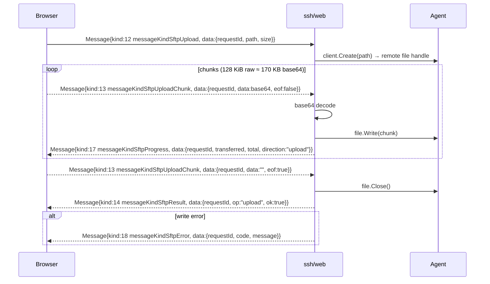

# Web SFTP Client — Architecture

> **Summary.** This document describes the end-to-end architecture of the ShellHub visual Web SFTP client: a browser-based file manager (list / stat / mkdir / rename / remove / download / upload) rendered as a floating window mirroring the existing web terminal. It grounds every layer in the code that already ships today — the agent's `pkg/sftp` server, the SSH gateway's transparent subsystem forwarding, and the `ssh/web` WebSocket credential broker — and explains the **Option A** decision (a gateway-side Go `sftp` client exposing a high-level JSON file API to the browser) with concrete justification. The remaining docs in this set expand each slice: the wire format (`02-protocol.md`), the Go backend (`03-backend.md`), the React frontend (`04-frontend.md`), and the security/session model (`06-security-and-sessions.md`).
>
> **Scope / non-goals.** This doc covers the *shape* of the system: layers, data flow, sequence diagrams, the proxy mechanics, and the concurrency/lifetime model. It does **not** enumerate the full wire schema (see `02-protocol.md`), give file-by-file code plans (see `03-backend.md` / `04-frontend.md`), or decide sandboxing/billing policy (see `06-security-and-sessions.md`). Connector-mode devices are out of scope end-to-end — `agent/server/modes/connector/sessioner.go` returns an error for SFTP, so the feature targets **host-mode** agents only.

---

## 1. System context

Four layers sit between the user and the device filesystem. The browser never speaks SFTP wire packets; it speaks a small JSON envelope. The gateway is the only party that runs an actual SFTP protocol client, and it does so over the exact same subsystem tunnel native `sftp(1)` clients already use.

```mermaid
flowchart LR
    subgraph Browser["Browser — file-browser UI"]
        UI["SftpInstance.tsx<br/>FileTable / Breadcrumb / TransferList<br/>sftpClient.ts (WS + promises)"]
    end

    subgraph Web["ssh/web — WebSocket bridge"]
        WS["/ws/sftp handler (web.go)<br/>newSftpSession (session.go)<br/>dispatch loop (sftp.go)<br/>*sftp.Client"]
    end

    subgraph Gateway["ssh gateway — channel proxy (localhost:2222)"]
        CH["DefaultSessionHandler<br/>SubsystemRequestType forward + pipe()"]
    end

    subgraph Agent["agent — pkg/sftp server"]
        AG["sftpSubsystemHandler → mode.SFTP<br/>re-exec: /proc/self/exe sftp<br/>sftp.NewServer().Serve()"]
    end

    UI -- "①  JSON Message{kind,data}<br/>over ws(s)://host/ws/sftp?token=…<br/>+ binary WS frames (downloads)" --> WS
    WS -- "②  ssh.Dial localhost:2222<br/>RequestSubsystem(\"sftp\")<br/>raw SFTP packets over stdin/stdout" --> CH
    CH -- "③  SubsystemRequestType forwarded verbatim<br/>bidirectional pipe() byte tunnel" --> AG
    AG -- "④  setuid/chdir HOME, in-process<br/>github.com/pkg/sftp server" --> AG
```

| Hop | From → To | Transport | Owner file(s) |
|-----|-----------|-----------|---------------|
| ① | Browser → ssh/web | WebSocket: JSON `Message` envelopes + untagged binary frames for download bytes | `ui/.../api/sftpClient.ts`, `ssh/web/web.go`, `ssh/web/conn.go` |
| ② | ssh/web → Gateway | `ssh.Dial("tcp","localhost:2222")` then `RequestSubsystem("sftp")`; raw SFTP packets on the session's stdin/stdout pipes | `ssh/web/session.go:177`, `ssh/web/sftp.go` (new) |
| ③ | Gateway → Agent | SSH channel; `subsystem` request forwarded verbatim, then a bidirectional byte `pipe()` | `ssh/server/channels/session.go:282`, `ssh/server/channels/utils.go:72` |
| ④ | Agent → filesystem | Re-exec `/proc/self/exe sftp`, drop privileges, run `sftp.NewServer(piped).Serve()` | `agent/server/subsystem.go:9`, `agent/sftp.go:95` |

---

## 2. What already exists vs what is genuinely new

The value of Option A is that **three of the four layers already exist and are untouched.** Per canonical spec §2:

| Layer | Status | Evidence |
|-------|--------|----------|
| Agent SFTP server | **Exists — do not rebuild** | `agent/server/server.go:119` registers `SubsystemHandlers{ SFTPSubsystemName: server.sftpSubsystemHandler }`; `agent/server/subsystem.go:9` calls `s.mode.SFTP(session)`; host mode re-execs and runs `sftp.NewServer(piped, …).Serve()` at `agent/sftp.go:95,102`. `pkg/sftp` is pinned at `v1.13.10` in `agent/go.mod`. |
| Gateway subsystem forwarding | **Exists — do not rebuild** | `ssh/server/channels/session.go:282` handles `ExecRequestType, SubsystemRequestType`; `:366` triggers `oncePipe()`, which runs `pipe()` (`ssh/server/channels/utils.go:72`). SFTP is already an opaque byte tunnel for native clients. |
| Web credential/token broker | **Exists — reuse verbatim** | `ssh/web/web.go:42` `NewSSHServerBridge`: POST stores RSA-encrypted `Credentials` under a JWT token; GET upgrades the WebSocket. `getAuth` + `Signer` at `ssh/web/session.go:65,110`. |
| UI SFTP badge | **Exists** | `ui/apps/console/src/utils/session.ts` + `SessionTypeBadge.tsx` already map `subsystem` → `sftp`. |
| Connector-mode SFTP | **Unsupported by design** | `agent/server/modes/connector/sessioner.go` returns an error; the UI must gate on host mode. |

**Genuinely new** (per spec §1, §4, §5):

- A dedicated route **`/ws/sftp`** with `const WebsocketSFTPBridgeRoute = "/ws/sftp"` and a `NewSFTPServerBridge(router, cache)` in `ssh/web/web.go` — a sibling to `NewSSHServerBridge`, reusing the credential→token→manager flow but **without** `getDimensions`.
- `newSftpSession(...)` in `ssh/web/session.go` — a fork of `newSession` that stops before `RequestPty`/`Shell` and instead calls `sess.RequestSubsystem("sftp")` + `sftp.NewClientPipe(stdout, stdin)`.
- A new dispatch loop file `ssh/web/sftp.go` holding the single `*sftp.Client` and the per-op handlers.
- SFTP `messageKind` constants (values **6–18**) appended in `ssh/web/messages.go`, plus a per-`Conn` `readLimit` in `ssh/web/conn.go`.
- The entire browser file-browser UI under `ui/apps/console/src/components/sftp/` + `api/sftpClient.ts` + `stores/sftpStore.ts`.
- `require github.com/pkg/sftp v1.13.10` added to `ssh/go.mod` (reusing the version already resolved in `agent/go.mod`).

---

## 3. Chosen architecture — Option A vs Option B

### The two options

- **Option A (chosen).** The gateway (`ssh/web`) runs a `github.com/pkg/sftp` **client** via `sftp.NewClientPipe(stdout, stdin)` over the subsystem tunnel, and exposes a **high-level JSON file API** (list / stat / mkdir / rename / remove / download / upload) to the browser over `/ws/sftp`.
- **Option B (rejected).** Tunnel raw SFTP binary packets straight through to a JavaScript SFTP implementation in the browser, making the gateway a dumb relay.

### Why Option A wins

**1. The inbound browser→gateway leg is JSON-only.** `Conn.ReadMessage` (`ssh/web/conn.go`) unmarshals every inbound frame into a `Message{ Kind messageKind, Data any }` and rejects anything it cannot parse into that envelope — there is no code path that accepts an opaque inbound binary SFTP packet. Option B would require inventing a second inbound transport (raw binary framing + demux) purely to carry SFTP packets the gateway would not even inspect. Option A rides the existing JSON envelope: we only *append* message kinds 6–18 to the `switch message.Kind` and skip the 4096-rune input cap for them (spec §3.4). Note the terminal already emits **outbound** binary via `Conn.WriteBinary` (see `redirToWs` at `ssh/web/session.go:367`), so the download path (kinds 15–17) reuses a proven outbound binary channel; only uploads need new inbound handling, and those are base64-in-JSON (kind 13) — no new inbound binary path at all.

**2. `pkg/sftp` is already a first-class dependency.** The agent pins `github.com/pkg/sftp v1.13.10` in `agent/go.mod` and runs its **server** (`agent/sftp.go:95`). Adding the same version's **client** to `ssh/go.mod` reuses vetted, already-in-tree `go.sum` entries and a protocol implementation the project already trusts on the other end of the wire. `sftp.NewClientPipe` is the natural symmetric peer to the agent's `sftp.NewServer(piped)`.

**3. No viable browser SFTP library.** Option B needs a maintained, correct JS SFTP client running over a WebSocket-framed byte stream — a large new, security-sensitive surface with no obvious dependency. Option A keeps all protocol logic in Go on the server, and the browser handles only a tiny promise-keyed JSON API.

**4. Server-side control point.** Because the gateway parses each operation, it is the place to later add policy (read-only mode, path jails, audit events — see `06-security-and-sessions.md`) without touching the agent or the browser.

---

## 4. End-to-end data flow — "open + list home"

A single user action ("Browse Files" → the window lists `$HOME`) crosses all four layers:

1. **Browser (POST).** `sftpClient.ts` POSTs the `Credentials` JSON (username + password or public-key fingerprint) to `/ws/sftp`. `NewSFTPServerBridge`'s POST handler RSA-encrypts the password with `magickey.GetReference()`, mints a `token.NewToken`, saves the creds in the `manager` TTL store, and returns `{ token }` — byte-for-byte the flow at `ssh/web/web.go:48-90`.
2. **Browser (WS upgrade).** `sftpClient.ts` opens `ws(s)://host/ws/sftp?token=TOKEN`. The GET handler resolves `getToken`/`getIP`, looks up the creds via `manager.get`, wraps the socket in `NewConn` (with the larger SFTP read limit), starts `conn.KeepAlive()`, decrypts the password, and calls `newSftpSession(ctx, cache, conn, creds, Info{IP})` — the SFTP analogue of `web.go:148`, minus `getDimensions`.
3. **ssh/web → Gateway (dial + auth).** `newSftpSession` reuses `getAuth` (`session.go:65`). For public-key auth the `Signer` (`session.go:110`) relays the challenge to the browser as `messageKindSignature` (kind 3) and waits for the signed reply — identical to the terminal. It then `ssh.Dial("tcp","localhost:2222", …)` (as at `session.go:177`), relays the `session-uid@shellhub.io` UID back as `messageKindSession` (kind 5), and opens a session channel.
4. **Subsystem request.** Instead of `RequestPty`+`Shell`, `newSftpSession` calls `sess.RequestSubsystem("sftp")`, then `sftp.NewClientPipe(stdout, stdin)` over the session's `StdoutPipe`/`StdinPipe`. On the gateway side this is the `SubsystemRequestType` case (`session.go:282`) that forwards the request verbatim and starts `pipe()`; the agent's `sftpSubsystemHandler` re-execs and serves.
5. **First op.** The dispatch loop in `ssh/web/sftp.go` reads a `messageKindSftpList` (kind 6) `{ requestId, path:"." }`, calls `client.ReadDir(path)`, maps each entry to a `FileEntry` (spec §3.2), and writes back `messageKindSftpResult` (kind 14) `{ requestId, op:"list", ok:true, entries:[…] }`.
6. **Browser render.** `sftpClient.ts` resolves the promise keyed by `requestId`; `SftpInstance.tsx` renders the `FileTable`.

---

## 5. Sequence diagrams

Actors: **Browser** (`sftpClient.ts` / `SftpInstance.tsx`), **ssh/web** (`web.go` / `session.go` / `sftp.go` + `*sftp.Client`), **Gateway-channels** (`DefaultSessionHandler` + `pipe()`), **Agent** (`sftp.NewServer`).

### (a) Connect + auth handshake (public-key challenge)

```mermaid
sequenceDiagram
    participant Browser
    participant Web as ssh/web
    participant GW as Gateway-channels
    participant Agent

    Browser->>Web: POST /ws/sftp {Credentials}
    Web->>Web: encryptPassword(magickey), token.NewToken, manager.save
    Web-->>Browser: 200 {token}

    Browser->>Web: GET /ws/sftp?token=TOKEN (WS upgrade)
    Web->>Web: manager.get(token), NewConn(limit), KeepAlive
    Web->>Web: newSftpSession → getAuth (public key)

    Note over Web,Browser: public-key auth via Signer
    Web-->>Browser: Message{kind:3 messageKindSignature, data: base64(challenge)}
    Browser->>Browser: sign challenge with in-memory key
    Browser-->>Web: Message{kind:3 messageKindSignature, data: base64(signature)}

    Web->>GW: ssh.Dial localhost:2222 (User=user@uuid, PublicKeys(Signer))
    GW-->>Web: authenticated
    Web->>GW: SendRequest("session-uid@shellhub.io")
    GW-->>Web: reply(sessionUID)
    Web-->>Browser: Message{kind:5 messageKindSession, data: sessionUID}

    Web->>GW: NewSession + RequestSubsystem("sftp")
    GW->>Agent: forward SubsystemRequestType "sftp"; start pipe()
    Agent->>Agent: re-exec /proc/self/exe sftp; setuid; sftp.NewServer.Serve
    Web->>Web: sftp.NewClientPipe(stdout, stdin) → *sftp.Client ready
    Note over Web,Browser: dispatch loop begins reading SFTP kinds 6–13

    alt any failure (auth / dial / subsystem)
        Web-->>Browser: Message{kind:4 messageKindError, data: reason}
    end
```

> Password auth skips the two `messageKindSignature` exchanges: `getAuth` returns `ssh.Password(creds.Password)` directly (`session.go:66`).

### (b) List a directory

```mermaid
sequenceDiagram
    participant Browser
    participant Web as ssh/web
    participant Agent

    Browser->>Web: Message{kind:6 messageKindSftpList, data:{requestId, path}}
    Web->>Agent: client.ReadDir(path)  (SFTP over subsystem tunnel)
    Agent-->>Web: []os.FileInfo
    Web->>Web: map → []FileEntry (name,path,size,mode,modeBits,mtime,isDir,isLink,linkTarget)
    Web-->>Browser: Message{kind:14 messageKindSftpResult, data:{requestId, op:"list", ok:true, entries}}
    Browser->>Browser: resolve promise[requestId]; render FileTable

    alt path error (e.g. permission denied)
        Web-->>Browser: Message{kind:18 messageKindSftpError, data:{requestId, code, message}}
    end
```

### (c) Download a file

```mermaid
sequenceDiagram
    participant Browser
    participant Web as ssh/web
    participant Agent

    Browser->>Web: Message{kind:11 messageKindSftpDownload, data:{requestId, path}}
    Web->>Agent: client.Open(path); Stat
    Agent-->>Web: file handle + FileInfo
    Web-->>Browser: Message{kind:15 messageKindSftpDownloadBegin, data:{requestId, name, size, mode, mtime}}

    loop until EOF (32 KiB read buffer)
        Web->>Agent: file.Read(buf)
        Agent-->>Web: bytes
        Web-->>Browser: BINARY WS frame (Conn.WriteBinary, raw — not redirToWs)
        Web-->>Browser: Message{kind:17 messageKindSftpProgress, data:{requestId, transferred, total, direction:"download"}}
    end

    Web-->>Browser: Message{kind:16 messageKindSftpDownloadEnd, data:{requestId}}
    Browser->>Browser: assemble Blob from binary frames; trigger save

    alt read error mid-stream
        Web-->>Browser: Message{kind:18 messageKindSftpError, data:{requestId, code, message}}
    end
```

> **Binary frames are untagged** (they carry no `requestId`), so the browser client must serialize downloads: at most **one download in flight per WebSocket** (spec §3.3). `Conn.WriteBinary` is used raw — *not* `redirToWs`, whose UTF-8 rune-trimming (`session.go:310-381`) would corrupt binary content.

### (d) Upload a file



> Uploads need no inbound binary path: chunks are base64 inside the JSON envelope. This is why the `/ws/sftp` `Conn` needs a **larger `readLimit`** (recommended 256 KiB) — a 128 KiB raw chunk is ~170 KB once base64-encoded, plus the JSON envelope (spec §3.4).

---

## 6. How the gateway proxies the subsystem today

The gateway needs **no changes** for M1–M4; SFTP already flows through it transparently. The relevant machinery in `ssh/server/channels/session.go` `DefaultSessionHandler`:

```go
// ssh/server/channels/session.go:282
case ExecRequestType, SubsystemRequestType:
    session.Event[models.SSHCommand](sess, req.Type, req.Payload, seat)

    sess.Type = ExecRequestType   // ← note: subsystems are typed as exec
```

The request is then forwarded verbatim to the agent channel and, once forwarded, the bidirectional pipe is started exactly once:

```go
// ssh/server/channels/session.go:351
ok, err := agent.Channel.SendRequest(req.Type, req.WantReply, req.Payload)
// …
// ssh/server/channels/session.go:364
switch req.Type {
case PtyRequestType, ExecRequestType, SubsystemRequestType:
    oncePipe()   // ← guarded by sync.OnceFunc at :148
}
```

`oncePipe` (defined `session.go:148`) launches `pipe(sess, client.Channel, agent.Channel, seat, done)` from `ssh/server/channels/utils.go:72`, which runs two `io.Copy` goroutines (client→agent and agent→client) wrapped in `deadReadGuard`. For our gateway-side client, the "client" side of this pipe **is** our `ssh.Dial` connection from `ssh/web` — the SFTP packets our `*sftp.Client` emits are copied straight to the agent's SFTP server, and its replies come back the same way.

> **Where the exec-close hack lives.** Because `sess.Type = ExecRequestType` is set for subsystems, the agent-close branch in `pipe()` fires for old agents:
>
> ```go
> // ssh/server/channels/utils.go:130
> if ver.LessThan(semver.MustParse("v0.9.3")) && sess.Type == ExecRequestType {
>     agent.Close()          // may truncate an in-flight transfer
> } else {
>     agent.CloseWrite()     // graceful half-close
> }
> ```
>
> Against pre-0.9.3 agents this `agent.Close()` can truncate a transfer. Mitigation — a first-class `"sftp"` `sess.Type` that splits this shared case — is an **optional M5** refinement; see spec §7.1 and `06-security-and-sessions.md`. It must be verified empirically during M2 (download).

### Where `newSftpSession` plugs in

`newSftpSession` is the `ssh/web`-side peer, structurally parallel to the terminal's `newSession` (`ssh/web/session.go:146`). The two diverge only after the `session-uid@shellhub.io` relay (`session.go:211`):

| Step | `newSession` (terminal) | `newSftpSession` (new) |
|------|-------------------------|------------------------|
| Auth | `getAuth` + optional `Signer` | **same** — reused verbatim |
| Dial | `ssh.Dial("tcp","localhost:2222", …)` (`:177`) | **same** |
| Session UID relay | `SendRequest("session-uid@shellhub.io")` → `messageKindSession` (`:211`) | **same** |
| Pipes | `StdinPipe`/`StdoutPipe`/`StderrPipe` (`:226-240`) | `StdinPipe`/`StdoutPipe` (stderr not needed) |
| Program start | `RequestPty` (`:247`) + `Shell` (`:257`) | `sess.RequestSubsystem("sftp")` |
| Protocol | raw byte relay: read loop (`:266`) + `redirToWs` (`:300`) | `sftp.NewClientPipe(stdout, stdin)` → dispatch loop in `ssh/web/sftp.go` |
| Dimensions | `Dimensions{cols,rows}` | none (no PTY) |

`(*ssh.Session).RequestSubsystem` is available in `golang.org/x/crypto/ssh v0.53.0`, already in `ssh/go.mod` (spec §4).

---

## 7. Concurrency and lifetime model

| Concern | Rule | Rationale / enforcement |
|---------|------|-------------------------|
| Client lifetime | **One `*sftp.Client` per WebSocket** | SFTP is stateful (open handles, cwd semantics). Created in `newSftpSession` after `RequestSubsystem`, owned by the `ssh/web/sftp.go` dispatch loop (spec §1.5, §4). |
| Op concurrency | Dispatch loop processes one inbound `Message` at a time | Reads sequentially via `Conn.ReadMessage` in a single goroutine, mirroring the terminal read loop at `session.go:266`. `pkg/sftp`'s client is safe for the sequential request/response pattern used here. |
| Downloads | **At most one in flight per socket** | Binary WS frames are **untagged** (no `requestId`), so two concurrent downloads would interleave indistinguishably. The browser client (`sftpClient.ts`) serializes downloads; the backend streams one `DownloadBegin → binary frames → DownloadEnd` sequence to completion before servicing the next (spec §3.3). |
| Uploads | Chunks are self-tagged with `requestId` | Uploads carry `requestId` on every `messageKindSftpUploadChunk`, so they are not subject to the single-in-flight rule the way downloads are; still processed in dispatch-loop order. |
| Keep-alive | `go conn.KeepAlive()` per socket | Same as terminal (`web.go:144`); prevents idle WS teardown. |
| Teardown | On socket close, tear down everything | Read loop returns on `io.EOF` (as at `session.go:270`); deferred closes release the `*sftp.Client`, the `*ssh.Session`, and the `ssh.Dial` connection (`defer connection.Close()` at `session.go:207`). The agent side unwinds when `pipe()` sees the channel close and `conn.Wait()` fires `sess.Finish()` (`session.go:94`). |

There is deliberately **no** cross-socket sharing: each browser window owns an independent WebSocket, token, `ssh.Dial`, subsystem channel, and `*sftp.Client`. Multiple concurrent SFTP windows (spec §1.3) are simply multiple independent instances of this stack.

---

## 8. Cross-references

| Topic | Document |
|-------|----------|
| Full wire protocol — every `messageKind` (6–18), `FileEntry`, correlation/transfer framing, chunk sizes | `02-protocol.md` |
| Backend implementation — `ssh/web/web.go`, `session.go`, `sftp.go`, `conn.go`, `messages.go`, `errors.go`, `go.mod` | `03-backend.md` |
| Frontend implementation — `sftpClient.ts`, `sftpStore.ts`, `SftpManager`/`SftpInstance`, `ConnectDrawer`, window manager | `04-frontend.md` |
| Milestone breakdown (M1 read-only → M5 polish) | `05-milestones.md` |
| Auth reuse, sandboxing, connector gating, session typing, recording/auditing, billing | `06-security-and-sessions.md` |
| Test strategy per milestone | `07-testing.md` |
| Risks (exec-close hack, throughput, path jail) + open questions | `08-risks-and-open-questions.md` |
