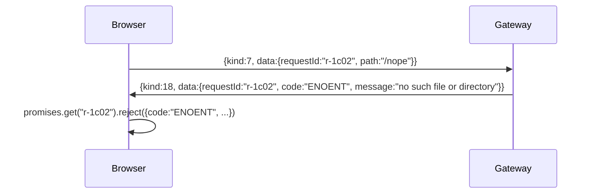
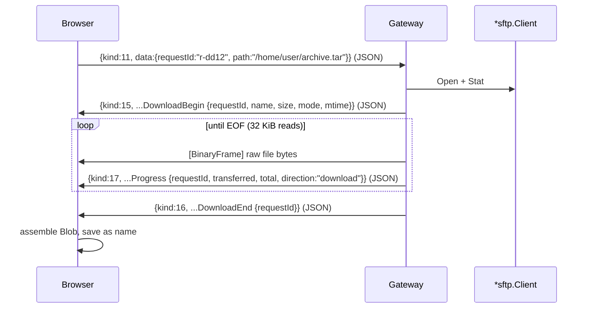
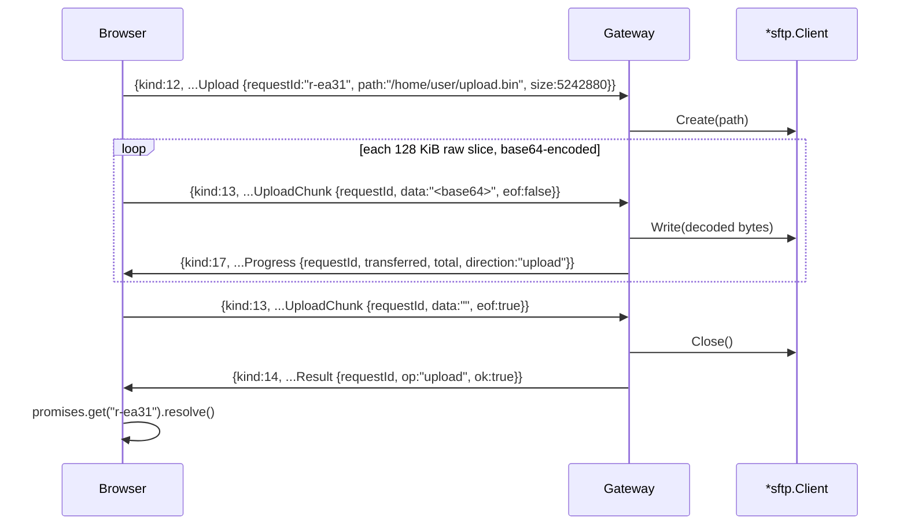

# 02 — Wire Protocol

This document is the full, implementation-ready specification of the WebSocket wire
protocol that the browser SFTP client and the SSH gateway speak over the dedicated
`/ws/sftp` route. It expands section 3 of the canonical spec into on-the-wire JSON
examples, correlation rules, transfer framing, error handling, and buffer sizing —
grounded in the real envelope and connection code in `ssh/web/`. The transport
envelope `Message{Kind, Data}` (`ssh/web/messages.go:28`) is **unchanged**, and the
five existing `messageKind` values (1–5) keep their numeric values so the auth, error,
and session-relay paths remain byte-for-byte compatible with the terminal.

## Scope / non-goals

- **In scope:** the JSON message envelope, the full `messageKind` table (values 1–18),
  per-kind request/response examples, the `FileEntry` shape, `requestId` correlation,
  download binary framing, upload base64 chunk framing, error taxonomy, and the
  buffer/chunk sizing decisions.
- **Non-goals:** backend handler wiring and the `*sftp.Client` lifecycle (see
  `03-backend.md`), the browser promise client / Zustand store / window UI (see
  `04-frontend.md`), auth/credential brokering internals (see `06-security-and-sessions.md`),
  and milestone sequencing (see `05-milestones.md`). This document does **not** change
  the agent-side SFTP server or the gateway subsystem tunnel.

---

## 1. Summary and scope of the protocol change

The gateway already exposes a JSON message stream to the browser over `/ws/ssh` via
`ssh/web/conn.go`. Every frame is a single JSON object:

```go
// ssh/web/messages.go:28
type Message struct {
	Kind messageKind `json:"kind"` // uint8, ssh/web/messages.go:3
	Data any         `json:"data"`
}
```

The SFTP feature **reuses this envelope verbatim**. It adds thirteen new `messageKind`
values (6–18) appended after `messageKindSession`, and it adds a second WebSocket route
`/ws/sftp` whose `Conn` carries a larger read limit. Nothing about the existing kinds
changes:

- Values **1–5** (`messageKindInput`, `messageKindResize`, `messageKindSignature`,
  `messageKindError`, `messageKindSession`) keep their numeric values
  (`ssh/web/messages.go:5-20`). `messageKindSignature` (3), `messageKindError` (4), and
  `messageKindSession` (5) are **reused unchanged** by the SFTP path for pubkey-auth
  challenge/response, transport/auth errors, and the session-UID relay respectively.
- The `Message.Data` field stays `any`; SFTP payloads are plain JSON objects (or a
  base64 string, for upload chunks), so no envelope schema migration is required.

`messageKind` is a `uint8`, so 18 values are comfortably in range. The constants are
declared with `iota + 1` (`ssh/web/messages.go:7`), so appending in order preserves the
values in the table below.

---

## 2. The `messageKind` table (values 1–18)

Values are **LOCKED**. Direction: `c→s` = browser to gateway, `s→c` = gateway to browser.

| Value | Constant | Dir | Data payload |
|------:|----------|:---:|--------------|
| 1 | `messageKindInput` | c→s | existing (terminal only) — UTF-8 string |
| 2 | `messageKindResize` | c→s | existing (terminal only) — `{ cols, rows }` |
| 3 | `messageKindSignature` | both | existing — pubkey auth challenge/response (REUSED) |
| 4 | `messageKindError` | s→c | existing — transport/auth error string (REUSED) |
| 5 | `messageKindSession` | s→c | existing — server session UID string (REUSED) |
| 6 | `messageKindSftpList` | c→s | `{ requestId, path }` |
| 7 | `messageKindSftpStat` | c→s | `{ requestId, path }` |
| 8 | `messageKindSftpMkdir` | c→s | `{ requestId, path }` |
| 9 | `messageKindSftpRename` | c→s | `{ requestId, from, to }` |
| 10 | `messageKindSftpRemove` | c→s | `{ requestId, path, recursive }` |
| 11 | `messageKindSftpDownload` | c→s | `{ requestId, path }` |
| 12 | `messageKindSftpUpload` | c→s | `{ requestId, path, size }` (begin) |
| 13 | `messageKindSftpUploadChunk` | c→s | `{ requestId, data (base64), eof }` |
| 14 | `messageKindSftpResult` | s→c | `{ requestId, op, ok, entries?, stat? }` |
| 15 | `messageKindSftpDownloadBegin` | s→c | `{ requestId, name, size, mode, mtime }` |
| 16 | `messageKindSftpDownloadEnd` | s→c | `{ requestId }` |
| 17 | `messageKindSftpProgress` | s→c | `{ requestId, transferred, total, direction }` |
| 18 | `messageKindSftpError` | s→c | `{ requestId?, code, message }` |

Enum constraints:

- `op` in `messageKindSftpResult` ∈ `"list" | "stat" | "mkdir" | "rename" | "remove" | "upload"`.
- `direction` in `messageKindSftpProgress` ∈ `"download" | "upload"`.

Inbound SFTP kinds are **6–13** (the ones the gateway must accept in
`Conn.ReadMessage`); outbound-only kinds are **14–18**. This split matters for
`ssh/web/conn.go`: only 6–13 need a decode case added to the read path (see
`03-backend.md`), while 14–18 are produced with `Conn.WriteMessage` /
`Conn.WriteBinary`.

Go declaration to append after `messageKindSession` (`ssh/web/messages.go:19`):

```go
const (
	// messageKindSftpList requests a directory listing. Data: { requestId, path }.
	messageKindSftpList messageKind = iota + 6
	messageKindSftpStat         // 7  — { requestId, path }
	messageKindSftpMkdir        // 8  — { requestId, path }
	messageKindSftpRename       // 9  — { requestId, from, to }
	messageKindSftpRemove       // 10 — { requestId, path, recursive }
	messageKindSftpDownload     // 11 — { requestId, path }
	messageKindSftpUpload       // 12 — { requestId, path, size }
	messageKindSftpUploadChunk  // 13 — { requestId, data, eof }
	messageKindSftpResult       // 14 — { requestId, op, ok, entries?, stat? }
	messageKindSftpDownloadBegin // 15 — { requestId, name, size, mode, mtime }
	messageKindSftpDownloadEnd  // 16 — { requestId }
	messageKindSftpProgress     // 17 — { requestId, transferred, total, direction }
	messageKindSftpError        // 18 — { requestId?, code, message }
)
```

> Note: the existing block ends at value 5 (`iota + 1` starting at
> `messageKindInput`). Starting a **new** `const` block at `iota + 6` yields 6…18 as
> shown. Keep the two blocks separate so the terminal values are never perturbed.

---

## 3. New SFTP kinds (6–18): on-the-wire examples

All examples show the exact JSON object placed on the WebSocket as one frame. The
gateway reads it through `Conn.ReadMessage` (`ssh/web/conn.go:67`) and writes replies
through `Conn.WriteMessage` (`ssh/web/conn.go:118`). `requestId` is a client-generated
opaque string (see §5).

### 3.1 `messageKindSftpList` (6) → `messageKindSftpResult` (14, `op:"list"`)

Request:

```json
{ "kind": 6, "data": { "requestId": "r-8f3a", "path": "/home/user" } }
```

Response (entries elided — see §4 for the `FileEntry` shape):

```json
{
  "kind": 14,
  "data": {
    "requestId": "r-8f3a",
    "op": "list",
    "ok": true,
    "entries": [
      { "name": "docs", "path": "/home/user/docs", "size": 4096,
        "mode": "drwxr-xr-x", "modeBits": 2147484141, "mtime": 1751846400,
        "isDir": true, "isLink": false, "linkTarget": "" },
      { "name": "notes.txt", "path": "/home/user/notes.txt", "size": 812,
        "mode": "-rw-r--r--", "modeBits": 420, "mtime": 1751846700,
        "isDir": false, "isLink": false, "linkTarget": "" }
    ]
  }
}
```

### 3.2 `messageKindSftpStat` (7) → `messageKindSftpResult` (14, `op:"stat"`)

Request:

```json
{ "kind": 7, "data": { "requestId": "r-1c02", "path": "/home/user/notes.txt" } }
```

Response (`stat` carries a single `FileEntry`):

```json
{
  "kind": 14,
  "data": {
    "requestId": "r-1c02",
    "op": "stat",
    "ok": true,
    "stat": { "name": "notes.txt", "path": "/home/user/notes.txt", "size": 812,
      "mode": "-rw-r--r--", "modeBits": 420, "mtime": 1751846700,
      "isDir": false, "isLink": false, "linkTarget": "" }
  }
}
```

### 3.3 `messageKindSftpMkdir` (8) → `messageKindSftpResult` (14, `op:"mkdir"`)

Request:

```json
{ "kind": 8, "data": { "requestId": "r-77b1", "path": "/home/user/new-folder" } }
```

Response (no `entries`/`stat`; just an ack):

```json
{ "kind": 14, "data": { "requestId": "r-77b1", "op": "mkdir", "ok": true } }
```

### 3.4 `messageKindSftpRename` (9) → `messageKindSftpResult` (14, `op:"rename"`)

Request:

```json
{ "kind": 9, "data": { "requestId": "r-4d5e",
  "from": "/home/user/old.txt", "to": "/home/user/new.txt" } }
```

Response:

```json
{ "kind": 14, "data": { "requestId": "r-4d5e", "op": "rename", "ok": true } }
```

### 3.5 `messageKindSftpRemove` (10) → `messageKindSftpResult` (14, `op:"remove"`)

Request (`recursive:true` removes a non-empty directory tree; `false` removes a single
file or empty directory):

```json
{ "kind": 10, "data": { "requestId": "r-9a0f",
  "path": "/home/user/scratch", "recursive": true } }
```

Response:

```json
{ "kind": 14, "data": { "requestId": "r-9a0f", "op": "remove", "ok": true } }
```

### 3.6 `messageKindSftpDownload` (11)

Request:

```json
{ "kind": 11, "data": { "requestId": "r-dd12", "path": "/home/user/archive.tar" } }
```

The download does **not** reply with a `messageKindSftpResult`. It replies with a
`messageKindSftpDownloadBegin` (15), then raw binary frames, interleaved
`messageKindSftpProgress` (17), and a terminating `messageKindSftpDownloadEnd` (16).
The full exchange is in §6.

### 3.7 `messageKindSftpUpload` (12) — begin

Request (announces the target path and total byte count):

```json
{ "kind": 12, "data": { "requestId": "r-ea31",
  "path": "/home/user/upload.bin", "size": 5242880 } }
```

The gateway opens the remote file for writing but does **not** ack the begin frame on
its own; the final `messageKindSftpResult{op:"upload"}` (14) acks the whole transfer.
The full exchange is in §7.

### 3.8 `messageKindSftpUploadChunk` (13)

Request (each chunk carries a base64-encoded slice of the file; the last chunk sets
`eof:true` and may carry an empty `data`):

```json
{ "kind": 13, "data": { "requestId": "r-ea31",
  "data": "iVBORw0KGgoAAAANSUhEUg...", "eof": false } }
```

Final chunk:

```json
{ "kind": 13, "data": { "requestId": "r-ea31", "data": "", "eof": true } }
```

### 3.9 `messageKindSftpResult` (14)

Emitted by the gateway for `list`, `stat`, `mkdir`, `rename`, `remove`, and `upload`.
`entries` appears only for `op:"list"`; `stat` appears only for `op:"stat"`. Example
upload ack:

```json
{ "kind": 14, "data": { "requestId": "r-ea31", "op": "upload", "ok": true } }
```

### 3.10 `messageKindSftpDownloadBegin` (15)

```json
{ "kind": 15, "data": { "requestId": "r-dd12", "name": "archive.tar",
  "size": 10485760, "mode": "-rw-r--r--", "mtime": 1751846700 } }
```

### 3.11 `messageKindSftpDownloadEnd` (16)

```json
{ "kind": 16, "data": { "requestId": "r-dd12" } }
```

### 3.12 `messageKindSftpProgress` (17)

```json
{ "kind": 17, "data": { "requestId": "r-dd12",
  "transferred": 3145728, "total": 10485760, "direction": "download" } }
```

### 3.13 `messageKindSftpError` (18)

```json
{ "kind": 18, "data": { "requestId": "r-8f3a",
  "code": "ENOENT", "message": "no such file or directory" } }
```

`requestId` is optional here (see §8): a connection-scoped SFTP failure with no
associated op may omit it.

---

## 4. `FileEntry` shape

Returned inside `messageKindSftpResult` — as each element of `entries` (for `op:"list"`)
and as `stat` (for `op:"stat"`).

| Field | JSON type | Meaning |
|-------|-----------|---------|
| `name` | string | Base name of the entry |
| `path` | string | Absolute path on the device |
| `size` | number | Size in bytes |
| `mode` | string | Symbolic mode, e.g. `"drwxr-xr-x"` |
| `modeBits` | number | Raw `os.FileMode` bits |
| `mtime` | number | Modification time, unix seconds |
| `isDir` | boolean | True for directories |
| `isLink` | boolean | True for symlinks |
| `linkTarget` | string | Symlink target; present (non-empty) only when `isLink` |

JSON example:

```json
{
  "name": "docs",
  "path": "/home/user/docs",
  "size": 4096,
  "mode": "drwxr-xr-x",
  "modeBits": 2147484141,
  "mtime": 1751846400,
  "isDir": true,
  "isLink": false,
  "linkTarget": ""
}
```

Symlink example (`isLink:true`, `linkTarget` populated):

```json
{
  "name": "latest",
  "path": "/var/www/latest",
  "size": 18,
  "mode": "lrwxrwxrwx",
  "modeBits": 134218239,
  "mtime": 1751846400,
  "isDir": false,
  "isLink": true,
  "linkTarget": "/var/www/release-42"
}
```

> The gateway builds `FileEntry` from `os.FileInfo` returned by the `*sftp.Client`
> (`ReadDir`, `Stat`/`Lstat`, `ReadLink`). `mode` is `FileInfo.Mode().String()`;
> `modeBits` is `uint32(FileInfo.Mode())`; `mtime` is `FileInfo.ModTime().Unix()`. See
> `03-backend.md` for the mapping code.

---

## 5. `requestId` correlation and promise resolution

Every client→server op (kinds 6–13) carries a client-generated `requestId` string. The
gateway **echoes it verbatim** on every response frame it emits for that op
(`messageKindSftpResult`, `...DownloadBegin`, `...DownloadEnd`, `...Progress`, and
`...SftpError`). This is the sole correlation mechanism — the WebSocket is a single
multiplexed stream and frames for different ops interleave.

Rules:

1. **Uniqueness.** The browser generates a fresh `requestId` per op (e.g. a monotonic
   counter or `crypto.randomUUID()`), unique for the lifetime of the WebSocket.
2. **Echo.** The gateway MUST copy `requestId` unchanged onto every reply. It never
   invents one.
3. **Terminal frame per op.** For `list`/`stat`/`mkdir`/`rename`/`remove`/`upload`, the
   terminal frame is `messageKindSftpResult` (14) with matching `requestId` (success)
   **or** `messageKindSftpError` (18) with matching `requestId` (failure). For
   `download`, the terminal frame is `messageKindSftpDownloadEnd` (16) on success or
   `messageKindSftpError` (18) on failure.
4. **Promise map.** The browser client keeps `Map<requestId, {resolve, reject}>`. On a
   terminal `messageKindSftpResult` it resolves; on `messageKindSftpError` it rejects
   with `{code, message}`; on `messageKindSftpProgress` it fires a progress callback
   **without** settling the promise. See `sftpClient.ts` in `04-frontend.md`.

```mermaid
sequenceDiagram
    participant B as Browser (sftpClient)
    participant G as Gateway (/ws/sftp)
    B->>B: requestId = "r-8f3a"; promises.set(id, {resolve,reject})
    B->>G: {kind:6, data:{requestId:"r-8f3a", path:"/home/user"}}
    G->>B: {kind:14, data:{requestId:"r-8f3a", op:"list", ok:true, entries:[...]}}
    B->>B: promises.get("r-8f3a").resolve(entries); promises.delete(id)
```

Failure path:



---

## 6. Download framing

Downloads reuse the existing binary WebSocket path. The gateway writes file bytes with
`Conn.WriteBinary` (`ssh/web/conn.go:132`), which emits a `websocket.BinaryFrame`
(`ssh/web/conn.go:141`) — **not** through `redirToWs` (`ssh/web/session.go:310`), which
trims/normalizes UTF-8 runes and would corrupt binary payloads. The download read buffer
on the gateway is **32 KiB**, matching the existing `redirToWs` buffer
(`var buf [32 * 1024]byte`, `ssh/web/session.go:312`).

Full exchange:



Wire sequence (concrete frames, in order):

1. JSON `{"kind":15,"data":{"requestId":"r-dd12","name":"archive.tar","size":10485760,"mode":"-rw-r--r--","mtime":1751846700}}`
2. Binary frame (≤ 32 KiB of raw bytes)
3. JSON `{"kind":17,"data":{"requestId":"r-dd12","transferred":32768,"total":10485760,"direction":"download"}}`
4. … repeat 2–3 …
5. JSON `{"kind":16,"data":{"requestId":"r-dd12"}}`

### Single-in-flight-download constraint

**Binary frames are untagged.** A `websocket.BinaryFrame` carries no `requestId` or any
envelope — it is a bare byte slice (`ssh/web/conn.go:132-152`). The browser therefore
cannot tell which download a binary frame belongs to if two downloads overlap. So:

> **Only one download may be in flight per WebSocket at a time.** The browser client
> serializes downloads: a new download waits until the previous one's
> `messageKindSftpDownloadEnd` (16) — or a `messageKindSftpError` (18) — has arrived.

The bracketing `messageKindSftpDownloadBegin` / `...DownloadEnd` pair (both JSON, both
carrying `requestId`) lets the browser bind the intervening untagged binary frames to
exactly one `requestId`: everything between Begin and End belongs to that download.
JSON control frames (Progress, and any unrelated op's Result/Error) may still interleave
with the binary stream because they are self-describing; only the **binary** frames are
ambiguous, which is why exactly one download owns the binary channel at a time. Uploads
(base64-in-JSON, §7) and metadata ops may proceed concurrently with a download because
they never touch the binary channel.

---

## 7. Upload framing

Uploads never use the inbound binary path (the gateway's `Conn.ReadMessage` accepts
JSON only — see §9), so chunks are **base64-encoded inside JSON**. The client sends
`messageKindSftpUpload` (12) to begin, then N `messageKindSftpUploadChunk` (13) frames
(the last with `eof:true`); the gateway acks with `messageKindSftpResult{op:"upload"}`
(14) and emits `messageKindSftpProgress` (17, `direction:"upload"`) along the way.



Wire sequence (concrete frames, in order):

1. `{"kind":12,"data":{"requestId":"r-ea31","path":"/home/user/upload.bin","size":5242880}}`
2. `{"kind":13,"data":{"requestId":"r-ea31","data":"<~170 KiB base64>","eof":false}}`
3. `{"kind":17,"data":{"requestId":"r-ea31","transferred":131072,"total":5242880,"direction":"upload"}}`
4. … repeat 2–3 …
5. `{"kind":13,"data":{"requestId":"r-ea31","data":"","eof":true}}`
6. `{"kind":14,"data":{"requestId":"r-ea31","op":"upload","ok":true}}`

The gateway decodes each chunk with `base64.StdEncoding` (the same encoding the auth
`Signer` already uses at `ssh/web/session.go:120,135`) and writes the raw bytes to the
remote file handle. On the final `eof:true` frame it closes the handle and emits the
upload `Result`. Any write/close failure yields `messageKindSftpError` (18) with the
matching `requestId` instead of the `Result`.

---

## 8. Error handling

Two distinct error channels, deliberately separated:

| Concern | Kind | Value | Carries `requestId`? | Data |
|---------|------|:-----:|:--------------------:|------|
| Transport / auth / connection failure | `messageKindError` | 4 | No | error string (existing, REUSED) |
| Per-op SFTP failure | `messageKindSftpError` | 18 | Yes (may omit if not op-scoped) | `{ requestId?, code, message }` |

- **`messageKindError` (4)** is the existing terminal/transport error path. It is used
  for failures that are **not** tied to a specific SFTP op: WebSocket upgrade failure,
  credential/token resolution failure, SSH dial/auth failure (as in
  `newSession` → `ErrAuthentication`, `ssh/web/session.go:204`), and the subsystem
  handshake failing before the dispatch loop starts. It carries a bare string and no
  `requestId`. **Unchanged** by this feature.
- **`messageKindSftpError` (18)** is new and scoped to a single op. It carries the
  offending op's `requestId` so the browser can `reject` the exact pending promise
  (§5). It is the failure counterpart of `messageKindSftpResult` (14) for
  list/stat/mkdir/rename/remove/upload, and of `messageKindSftpDownloadEnd` (16) for
  download.

A per-op error is terminal for that `requestId`: after emitting `messageKindSftpError`
for an op, the gateway sends no further frames for that `requestId`.

### Suggested error codes

`code` is a short, stable, machine-readable token; `message` is the human-readable
detail. Map `github.com/pkg/sftp` / `os` errors to these:

| `code` | When |
|--------|------|
| `ENOENT` | Path does not exist (list/stat/download/rename source) |
| `EACCES` | Permission denied by the OS user's Unix permissions |
| `EEXIST` | Target already exists (mkdir, rename destination) |
| `ENOTEMPTY` | Non-recursive remove of a non-empty directory |
| `EISDIR` / `ENOTDIR` | Path/target type mismatch |
| `EIO` | Read/write error mid-transfer |
| `EINVAL` | Malformed request (bad path, missing field, bad base64) |
| `ECONNRESET` | Underlying SFTP channel/subsystem dropped |

Derive these from the SFTP status code where possible (`pkg/sftp` surfaces
`*sftp.StatusError`) and fall back to inspecting `os.IsNotExist` / `os.IsPermission` /
`os.IsExist`. When no op is in flight (e.g. the subsystem died between ops), emit
`messageKindSftpError` with `requestId` omitted and `code:"ECONNRESET"`.

---

## 9. Buffer and chunk sizing

### Today: 16404-byte cap, 4096-rune input cap

`Conn.ReadMessage` wraps the socket in `io.LimitReader(c.Socket, ReadMessageBufferSize)`
(`ssh/web/conn.go:68`), where:

```go
// ssh/web/conn.go:65
const ReadMessageBufferSize = MessageMinSize + (TermniosMaxLineLength * CharacterSize)
//                          = 20            + (4096                   * 4)
//                          = 16404 bytes
```

with `MessageMinSize = 20` (`ssh/web/messages.go:23`), `TermniosMaxLineLength = 4096`
(`ssh/web/conn.go:58`), and `CharacterSize = 4` (`ssh/web/conn.go:34`). Additionally,
`messageKindInput` enforces a hard 4096-**rune** cap
(`utf8.RuneCountInString(str) > TermniosMaxLineLength → ErrConnReadMessageInputTooLong`,
`ssh/web/conn.go:90-92`). The `switch` also **rejects any unknown kind** via the
`default` branch (`ssh/web/conn.go:111-112`), which is why raw binary or unrecognized
inbound frames are refused today — and why uploads must be JSON, not inbound binary.

### For `/ws/sftp`

Three changes (implemented in `03-backend.md`, specified here):

1. **The 4096-rune input cap MUST NOT apply to SFTP kinds.** It is specific to the PTY
   line discipline (`messageKindInput`). SFTP kinds 6–13 skip it entirely.
2. **Per-`Conn` read limit.** Add a `readLimit` field to `Conn` (default
   `ReadMessageBufferSize` = 16404, preserving terminal behavior) plus a
   `NewConnWithLimit` constructor. The `/ws/sftp` `Conn` uses a **larger limit of
   256 KiB** (`262144` bytes) so a full base64 upload chunk plus envelope fits in one
   frame. `ReadMessage` uses `c.readLimit` instead of the constant.
3. **Chunk / buffer sizes:**
   - **Upload raw chunk = 128 KiB** (`131072` bytes). Base64 inflates by ~33% (4 output
     bytes per 3 input bytes): `ceil(131072 / 3) * 4 = 43691 * 4 = 174764` bytes
     ≈ **170.67 KiB**. Adding the JSON envelope (`{"kind":13,"data":{"requestId":"…","data":"…","eof":false}}`,
     a few hundred bytes) stays comfortably under the **256 KiB** read limit —
     `170.67 KiB + envelope ≪ 256 KiB`, leaving ~85 KiB of headroom.
   - **Download read buffer = 32 KiB** (`32 * 1024`), matching the existing `redirToWs`
     buffer (`ssh/web/session.go:312`). This bounds the size of each outbound
     `websocket.BinaryFrame`.

Sizing summary:

| Quantity | Value | Source / rationale |
|----------|------:|--------------------|
| `ReadMessageBufferSize` (terminal default) | 16404 B | `ssh/web/conn.go:65` |
| `MessageMinSize` | 20 B | `ssh/web/messages.go:23` |
| `/ws/sftp` `Conn.readLimit` | 256 KiB (262144 B) | New; fits one base64 upload chunk + envelope |
| Upload raw chunk | 128 KiB (131072 B) | Base64 → ~170.67 KiB |
| Base64 overhead | ×4/3 (~33%) | `ceil(n/3)*4` |
| Download binary frame read buffer | 32 KiB (32768 B) | Matches `redirToWs` (`ssh/web/session.go:312`) |

---

## 10. Backward compatibility and cross-references

- **Envelope unchanged.** `Message{Kind, Data}` (`ssh/web/messages.go:28`) and
  `MessageMinSize` (`ssh/web/messages.go:23`) are untouched.
- **Kinds 1–5 unchanged.** Their numeric values are preserved by appending the SFTP
  constants in a separate `const` block starting at `iota + 6` (§2). Terminal
  `/ws/ssh` traffic is byte-for-byte identical.
- **Terminal `Conn` unchanged.** `NewConn` (`ssh/web/conn.go:26`) keeps the default
  16404-byte limit; only `/ws/sftp` opts into the 256 KiB limit via `NewConnWithLimit`,
  so no existing caller changes behavior.
- **Reused kinds on the SFTP socket.** `messageKindSignature` (3),
  `messageKindError` (4), and `messageKindSession` (5) work identically on `/ws/sftp`:
  the pubkey `Signer` challenge/response (`ssh/web/session.go:110-144`), transport/auth
  errors, and the `session-uid@shellhub.io` relay (`ssh/web/session.go:211-215`) are all
  reused verbatim.
- **Additive read path.** `Conn.ReadMessage`'s `switch` (`ssh/web/conn.go:80`) only
  gains cases for inbound kinds 6–13; the `default` reject (`ssh/web/conn.go:111`) still
  guards everything else.

Sibling documents:

- **`03-backend.md`** — `NewSFTPServerBridge` / `/ws/sftp` route, `newSftpSession`, the
  `ssh/web/sftp.go` dispatch loop and per-op handlers, `FileEntry` construction, the
  `Conn.readLimit` / `NewConnWithLimit` change, and error mapping.
- **`04-frontend.md`** — `api/sftpClient.ts` promise surface and `requestId` map,
  `components/sftp/sftpProtocol.ts` (JS mirror of kinds 6–18), Blob assembly for
  downloads, base64 chunking for uploads, and progress/error UI.
- **`01-architecture.md`** — end-to-end data flow and the Option A rationale.
- **`06-security-and-sessions.md`** — auth reuse, sandboxing, and connector-mode gating.
