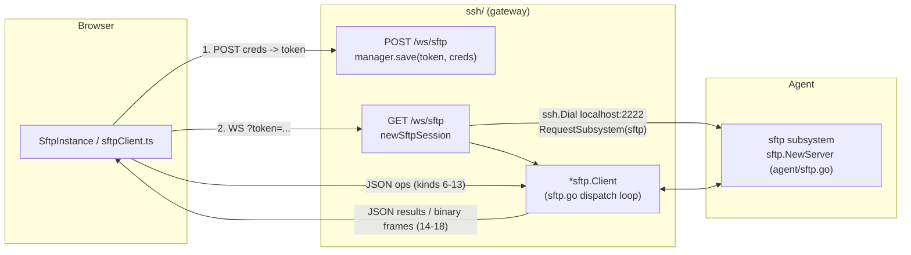

# 03 — Backend Implementation Plan

> Implementation-ready plan for the **gateway-side** of the Web SFTP client. The
> gateway (`ssh/`) opens the agent's `sftp` subsystem, runs a `github.com/pkg/sftp`
> **client** over the piped subsystem channel (`sftp.NewClientPipe`), and exposes a
> high-level **JSON file API** to the browser over a dedicated WebSocket route
> `/ws/sftp`. This is **Option A** from the canonical spec (§1): no raw SFTP binary
> packets are tunneled to the browser; the gateway is the SFTP client and translates
> ops to/from the JSON envelope defined in [`02-protocol.md`](02-protocol.md).

## Scope / non-goals

- **In scope:** everything under `ssh/` — the new `/ws/sftp` route + credential broker,
  `newSftpSession`, the SFTP dispatch loop and per-op handlers, the `messageKind`
  additions (values 6–18), the `Conn` read-limit change, new error sentinels, and the
  `pkg/sftp` dependency addition to `ssh/go.mod`.
- **Non-goals (covered elsewhere):**
  - No `api/` schema migration. `models.Session.Type` is free-form and the UI already
    badges `subsystem` events as `sftp` (canonical §1.7, §2). The first-class `"sftp"`
    session type is an **optional M5** refinement (see §12 and
    [`06-security-and-sessions.md`](06-security-and-sessions.md)).
  - No **agent** change. The agent SFTP server (`agent/sftp.go`,
    `agent/server/subsystem.go`) already speaks the full op set for native clients
    (canonical §2). We only add a *client* on the gateway.
  - Frontend is [`04-frontend.md`](04-frontend.md). Wire format is
    [`02-protocol.md`](02-protocol.md). Milestone slicing is
    [`05-milestones.md`](05-milestones.md).

---

## 1. Summary + scope

The whole backend change is additive and confined to the `web` package
(`ssh/web/`), plus a one-line dependency addition to `ssh/go.mod`/`ssh/go.sum`. The
existing terminal bridge (`NewSSHServerBridge`, `newSession`) is **not modified** — the
SFTP path is a sibling that reuses the same building blocks:

- the same **credential broker** (POST → RSA-encrypt password → `manager.save` under a
  JWT token; GET → resolve token → decrypt → dial),
- the same **auth** (`getAuth` + `Signer`, password or public-key challenge relayed as
  `messageKindSignature`),
- the same **dial** to `localhost:2222` with the `session-uid@shellhub.io` relay,

but instead of `RequestPty`/`Shell` it issues `RequestSubsystem("sftp")` and wraps the
resulting stdin/stdout pipes in a `*sftp.Client`, then runs a JSON dispatch loop.

Gateway forwarding of the `subsystem` request to the agent already exists and is
untouched (`ssh/server/channels/session.go:282`); from the agent's perspective a web
SFTP session is indistinguishable from a native one.

---

## 2. File-by-file plan (canonical §4)

| File | Action | Responsibility |
|------|--------|----------------|
| `ssh/web/messages.go` | modify | Append SFTP `messageKind` constants (values 6–18) after `messageKindSession`. |
| `ssh/web/conn.go` | modify | Add a `readLimit` field to `Conn` + `NewConnWithLimit(socket, limit)`; extend `ReadMessage`'s `switch` with inbound SFTP kinds (6–13); skip the 4096-rune input cap for them. |
| `ssh/web/web.go` | modify | Add `NewSFTPServerBridge(router, cache)` + `const WebsocketSFTPBridgeRoute = "/ws/sftp"`; POST reuses the Credentials→token→`manager.save` flow verbatim; GET upgrades the WS, reads `getToken`/`getIP` (no `getDimensions`), builds `NewConnWithLimit`, calls `newSftpSession(...)`. |
| `ssh/web/session.go` | modify | Add `newSftpSession(ctx, cache, conn, creds, info)`: copy `newSession` through the `session-uid@shellhub.io` relay, then `sess.RequestSubsystem("sftp")` + `sftp.NewClientPipe(stdout, stdin)`; hand off to the dispatch loop. No `RequestPty`/`Shell`. |
| `ssh/web/sftp.go` | **new** | The dispatch loop + per-op handlers. Reads `Message`s via `Conn.ReadMessage`, switches on the SFTP kinds, drives the single `*sftp.Client`, writes `messageKindSftpResult`/`...Progress`/`...Error`/binary frames. |
| `ssh/web/errors.go` | modify | Add SFTP sentinel errors (`ErrSubsystem`, `ErrSftpClient`, `ErrSftpOpen`, `ErrSftpOp`). |
| `ssh/go.mod` / `ssh/go.sum` | modify | `require github.com/pkg/sftp v1.13.10` (reuse the version + `go.sum` entries already used by `agent/go.mod`). |

**Reused (unchanged):** `getAuth` + `Signer` (`ssh/web/session.go:64`, `:110`),
`Credentials` + RSA encrypt/decrypt (`ssh/web/utils.go:11`, `:22`, `:37`), `manager` TTL
store (`ssh/web/manager.go`), `token.NewToken` (`ssh/web/pkg/token`),
`magickey.GetReference` (`ssh/pkg/magickey`), `getToken`/`getIP`
(`ssh/web/websocket.go:9`, `:43`), `Conn.WriteBinary`/`KeepAlive`
(`ssh/web/conn.go:132`, `:168`). `(*ssh.Session).RequestSubsystem` ships in
`golang.org/x/crypto/ssh v0.53.0`, already in `ssh/go.mod:18`.

---

## 3. Data flow overview



---

## 4. `messages.go` — const block additions (values 6–18)

Today the enum stops at `messageKindSession` (value 5, `ssh/web/messages.go:19`) inside a
single `iota + 1` block. Append the SFTP kinds **in the same block** so the numeric
values stay locked and contiguous. `messageKind` remains `uint8` and `Message` is
unchanged (`ssh/web/messages.go:3`, `:28`).

```go
const (
	// messageKindInput is the identifier to a input message. ...
	messageKindInput messageKind = iota + 1
	// messageKindResize ...
	messageKindResize
	// messageKindSignature ...
	messageKindSignature
	// messageKindError ...
	messageKindError
	// messageKindSession ...
	messageKindSession

	// --- SFTP: client -> server (inbound) ---

	// messageKindSftpList requests a directory listing. Data: SftpPathOp{ requestId, path }.
	messageKindSftpList // 6
	// messageKindSftpStat requests file/dir metadata. Data: SftpPathOp{ requestId, path }.
	messageKindSftpStat // 7
	// messageKindSftpMkdir creates a directory (recursively). Data: SftpPathOp{ requestId, path }.
	messageKindSftpMkdir // 8
	// messageKindSftpRename renames/moves an entry. Data: SftpRenameOp{ requestId, from, to }.
	messageKindSftpRename // 9
	// messageKindSftpRemove removes an entry. Data: SftpRemoveOp{ requestId, path, recursive }.
	messageKindSftpRemove // 10
	// messageKindSftpDownload starts a download. Data: SftpPathOp{ requestId, path }.
	messageKindSftpDownload // 11
	// messageKindSftpUpload begins an upload. Data: SftpUploadOp{ requestId, path, size }.
	messageKindSftpUpload // 12
	// messageKindSftpUploadChunk carries a base64 upload chunk. Data: SftpUploadChunkOp{ requestId, data, eof }.
	messageKindSftpUploadChunk // 13

	// --- SFTP: server -> client (outbound) ---

	// messageKindSftpResult acks an op. Data: SftpResult{ requestId, op, ok, entries?, stat? }.
	messageKindSftpResult // 14
	// messageKindSftpDownloadBegin precedes binary download frames. Data: SftpDownloadBegin{ requestId, name, size, mode, mtime }.
	messageKindSftpDownloadBegin // 15
	// messageKindSftpDownloadEnd terminates a download. Data: SftpDownloadEnd{ requestId }.
	messageKindSftpDownloadEnd // 16
	// messageKindSftpProgress reports transfer progress. Data: SftpProgress{ requestId, transferred, total, direction }.
	messageKindSftpProgress // 17
	// messageKindSftpError reports a per-op failure. Data: SftpError{ requestId?, code, message }.
	messageKindSftpError // 18
)
```

The payload structs live in `sftp.go` (§8). Field names/JSON tags must match
[`02-protocol.md`](02-protocol.md) exactly. `FileEntry` (canonical §3.2):

```go
// FileEntry mirrors an os.FileInfo entry for the browser.
type FileEntry struct {
	Name       string `json:"name"`
	Path       string `json:"path"`
	Size       int64  `json:"size"`
	Mode       string `json:"mode"`       // symbolic, e.g. "drwxr-xr-x"
	ModeBits   uint32 `json:"modeBits"`   // os.FileMode bits
	Mtime      int64  `json:"mtime"`      // unix seconds
	IsDir      bool   `json:"isDir"`
	IsLink     bool   `json:"isLink"`
	LinkTarget string `json:"linkTarget,omitempty"`
}
```

---

## 5. `conn.go` — per-`Conn` read limit + inbound SFTP kinds

Two problems must be solved (canonical §3.4):

1. `ReadMessage` hard-codes the read limit to `ReadMessageBufferSize` (16404 bytes) at
   `ssh/web/conn.go:68`. Upload chunks (128 KiB raw ≈ 170 KB base64) will not fit. Make
   the limit a per-`Conn` field so `/ws/sftp` can use a **larger** limit (256 KiB).
2. The `switch message.Kind` at `ssh/web/conn.go:80` only knows `messageKindInput`,
   `messageKindResize`, `messageKindSignature`; everything else falls into `default`
   and returns `ErrConnReadMessageKindInvalid` (`:111`). Add cases for the inbound SFTP
   kinds (6–13), unmarshalling `json.RawMessage` into typed op structs, and **do not**
   apply the 4096-rune input cap.

### 5.1 Field + constructors

```go
type Conn struct {
	Socket Socket
	Pinger *time.Ticker
	// readLimit caps how many bytes ReadMessage will decode from a single frame.
	// Defaults to ReadMessageBufferSize for terminal Conns; the /ws/sftp Conn uses
	// SftpReadMessageBufferSize so upload chunks fit.
	readLimit int64
}

func NewConn(socket Socket) *Conn {
	return NewConnWithLimit(socket, ReadMessageBufferSize)
}

func NewConnWithLimit(socket Socket, limit int64) *Conn {
	return &Conn{
		Socket:    socket,
		Pinger:    time.NewTicker(30 * time.Second),
		readLimit: limit,
	}
}

// SftpReadMessageBufferSize is the per-Conn read limit for /ws/sftp. 256 KiB leaves
// headroom for a 128 KiB raw upload chunk after base64 (~170 KB) plus the JSON envelope.
const SftpReadMessageBufferSize = 256 * 1024
```

`ReadMessage` line 68 changes from the hard-coded constant to the field:

```go
func (c *Conn) ReadMessage(message *Message) (int, error) {
	limit := io.LimitReader(c.Socket, c.readLimit)
	decoder := json.NewDecoder(limit)
	// ... unchanged: decode into json.RawMessage ...
```

> Note: existing callers all go through `NewConn` (see `ssh/web/web.go:141`), which now
> defaults `readLimit` to `ReadMessageBufferSize`, so terminal behaviour is byte-for-byte
> unchanged.

### 5.2 New switch cases (after the existing `messageKindSignature` case, before `default`)

```go
	case messageKindSftpList, messageKindSftpStat, messageKindSftpMkdir, messageKindSftpDownload:
		var op SftpPathOp
		if err := json.Unmarshal(data, &op); err != nil {
			return 0, errors.Join(ErrConnReadMessageJSONInvalid)
		}
		message.Data = op
	case messageKindSftpRename:
		var op SftpRenameOp
		if err := json.Unmarshal(data, &op); err != nil {
			return 0, errors.Join(ErrConnReadMessageJSONInvalid)
		}
		message.Data = op
	case messageKindSftpRemove:
		var op SftpRemoveOp
		if err := json.Unmarshal(data, &op); err != nil {
			return 0, errors.Join(ErrConnReadMessageJSONInvalid)
		}
		message.Data = op
	case messageKindSftpUpload:
		var op SftpUploadOp
		if err := json.Unmarshal(data, &op); err != nil {
			return 0, errors.Join(ErrConnReadMessageJSONInvalid)
		}
		message.Data = op
	case messageKindSftpUploadChunk:
		// NOTE: the 4096-rune TermniosMaxLineLength cap (applied to messageKindInput
		// above) MUST NOT apply here — base64 upload chunks are far larger and are not
		// terminal line input. The per-Conn readLimit (256 KiB) is the only bound.
		var op SftpUploadChunkOp
		if err := json.Unmarshal(data, &op); err != nil {
			return 0, errors.Join(ErrConnReadMessageJSONInvalid)
		}
		message.Data = op
```

The `default` branch at `ssh/web/conn.go:111` is unchanged: outbound-only kinds (14–18)
never arrive here, so they correctly reject as `ErrConnReadMessageKindInvalid`.

---

## 6. `web.go` — `NewSFTPServerBridge` + `/ws/sftp`

`NewSFTPServerBridge` mirrors `NewSSHServerBridge` (`ssh/web/web.go:42`). The **POST**
handler is a verbatim copy of the credential broker (`:48`–`:91`): decode `Credentials`,
mint a token via `token.NewToken(key)`, `request.encryptPassword(key)`,
`manager.save(token.ID, &request)`, return `{token}`. The **GET** handler differs only in
that it does **not** call `getDimensions`, builds a `Conn` with the larger limit via
`NewConnWithLimit`, and dispatches to `newSftpSession` instead of `newSession`.

```go
// NewSFTPServerBridge creates routes into an [echo.Router] to connect a websocket to the
// device's SFTP subsystem, exposing a high-level JSON file API to the browser.
func NewSFTPServerBridge(router *echo.Echo, cache cache.Cache) {
	const WebsocketSFTPBridgeRoute = "/ws/sftp"

	manager := newManager(30 * time.Second)

	// POST: identical credential broker to /ws/ssh (see NewSSHServerBridge).
	router.Add(http.MethodPost, WebsocketSFTPBridgeRoute, echo.WrapHandler(
		http.HandlerFunc(func(res http.ResponseWriter, req *http.Request) {
			type Success struct {
				Token string `json:"token"`
			}
			type Fail struct {
				Error string `json:"error"`
			}

			decoder := json.NewDecoder(req.Body)
			encoder := json.NewEncoder(res)
			response := func(res http.ResponseWriter, status int, data any) {
				res.WriteHeader(status)
				res.Header().Set("Content-Type", "application/json")
				encoder.Encode(data) //nolint: errcheck,errchkjson
			}

			var request Credentials
			if err := decoder.Decode(&request); err != nil {
				response(res, http.StatusBadRequest, Fail{Error: err.Error()})

				return
			}

			key := magickey.GetReference()

			token, err := token.NewToken(key)
			if err != nil {
				response(res, http.StatusBadRequest, Fail{Error: err.Error()})

				return
			}

			request.encryptPassword(key) //nolint:errcheck
			manager.save(token.ID, &request)

			response(res, http.StatusOK, Success{Token: token.ID})
		})),
	)

	// GET: upgrade the WebSocket, resolve creds, run the SFTP session.
	router.Add(http.MethodGet, WebsocketSFTPBridgeRoute, echo.WrapHandler(websocket.Handler(func(wsconn *websocket.Conn) {
		defer wsconn.Close() //nolint:errcheck

		exit := func(wsconn *websocket.Conn, err error) {
			log.WithError(err).Log(exitLogLevel(err), "web sftp error")

			buffer, marshalErr := json.Marshal(Message{Kind: messageKindError, Data: err.Error()})
			if marshalErr != nil {
				log.WithError(marshalErr).Error("failed to marshal error message")

				return
			}
			wsconn.Write(buffer) //nolint:errcheck
		}

		token, err := getToken(wsconn.Request())
		if err != nil {
			exit(wsconn, ErrWebSocketGetToken)

			return
		}

		// NOTE: no getDimensions — SFTP needs no cols/rows/PTY (canonical §1.2).

		ip, err := getIP(wsconn.Request())
		if err != nil {
			exit(wsconn, ErrWebSocketGetIP)

			return
		}

		creds, ok := manager.get(token)
		if !ok {
			exit(wsconn, ErrBridgeCredentialsNotFound)

			return
		}

		// Larger read limit so base64 upload chunks fit (canonical §3.4).
		conn := NewConnWithLimit(wsconn, SftpReadMessageBufferSize)
		defer conn.Close() //nolint:errcheck

		go conn.KeepAlive()

		creds.decryptPassword(magickey.GetReference()) //nolint:errcheck

		if err := newSftpSession(
			wsconn.Request().Context(),
			cache,
			conn,
			creds,
			Info{IP: ip},
		); err != nil {
			exit(wsconn, err)

			return
		}
	})))
}
```

`NewSFTPServerBridge` is registered next to `NewSSHServerBridge` at the gateway's HTTP
wiring site (wherever `NewSSHServerBridge(router, cache)` is called today).

> `exitLogLevel` (`ssh/web/web.go:22`) already classifies `ErrWebSocketGetToken`,
> `ErrWebSocketGetIP`, `ErrBridgeCredentialsNotFound`, and the auth/banner sentinels as
> `WarnLevel`, so the SFTP GET handler reuses it as-is. The new SFTP op sentinels (§9)
> fall through to `ErrorLevel`, which is fine for the connection-level `exit` path (per-op
> errors go over `messageKindSftpError`, not `exit`).

---

## 7. `session.go` — `newSftpSession`

`newSftpSession` is `newSession` (`ssh/web/session.go:146`) with the terminal tail
replaced. Everything from the logger down through the `session-uid@shellhub.io` relay
(`:211`–`:215`) is copied **verbatim**: `getAuth` (`:162`), the `web-ip/` cache handoff
(`:169`, `:175`), `ssh.Dial("tcp", "localhost:2222", …)` with the `BannerCallback`
(`:177`–`:205`), and `connection.NewSession()` (`:217`). Then, instead of
`StderrPipe`/`RequestPty`/`Shell`, it requests the `sftp` subsystem and builds the client.

```go
func newSftpSession(ctx context.Context, cache cache.Cache, conn *Conn, creds *Credentials, info Info) error {
	logger := log.WithFields(log.Fields{
		"user":   creds.Username,
		"device": creds.Device,
		"ip":     info.IP,
		"kind":   "sftp",
	})

	logger.Info("handling web sftp request started")
	defer logger.Info("handling web sftp request end")

	uuid := uuid.Generate()
	user := fmt.Sprintf("%s@%s", creds.Username, uuid)

	auth, err := getAuth(ctx, conn, creds)
	if err != nil {
		logger.WithError(err).Debug("failed to get the credentials")

		return ErrGetAuth
	}

	if err := cache.Set(ctx, "web-ip/"+user, fmt.Sprintf("%s:%s", creds.Device, info.IP), 1*time.Minute); err != nil {
		logger.WithError(err).Debug("failed to set the session IP on the cache")

		return err
	}
	defer cache.Delete(ctx, "web-ip/"+user) //nolint:errcheck

	connection, err := ssh.Dial("tcp", "localhost:2222", &ssh.ClientConfig{ //nolint: exhaustruct
		User:            user,
		Auth:            auth,
		HostKeyCallback: ssh.InsecureIgnoreHostKey(), //nolint:gosec
		BannerCallback: func(message string) error {
			if message != "" {
				return NewBannerError(message)
			}

			return nil
		},
	})
	if err != nil {
		var e *BannerError
		if errors.As(err, &e) {
			logger.WithError(e).Debug("failed to receive the connection banner")

			return mapBannerError(e)
		}

		logger.WithError(err).Debug("failed to dial to the ssh server")

		return ErrAuthentication
	}
	defer connection.Close() //nolint:errcheck

	// Relay the server session UID exactly like newSession (ssh/web/session.go:211).
	if ok, reply, err := connection.SendRequest("session-uid@shellhub.io", true, nil); err == nil && ok {
		if _, err := conn.WriteMessage(&Message{Kind: messageKindSession, Data: string(reply)}); err != nil {
			logger.WithError(err).Debug("failed to send the session UID to the web client")
		}
	}

	sess, err := connection.NewSession()
	if err != nil {
		logger.WithError(err).Debug("failed to create a new session")

		return ErrSession
	}
	defer sess.Close() //nolint:errcheck

	// --- SFTP branch (replaces RequestPty/Shell) ---

	stdin, err := sess.StdinPipe()
	if err != nil {
		logger.WithError(err).Debug("failed to create the stdin pipe")

		return err
	}

	stdout, err := sess.StdoutPipe()
	if err != nil {
		logger.WithError(err).Debug("failed to create the stdout pipe")

		return err
	}

	if err := sess.RequestSubsystem("sftp"); err != nil {
		logger.WithError(err).Debug("failed to request the sftp subsystem")

		return ErrSubsystem
	}

	client, err := sftp.NewClientPipe(stdout, stdin)
	if err != nil {
		logger.WithError(err).Debug("failed to create the sftp client")

		return ErrSftpClient
	}
	defer client.Close() //nolint:errcheck

	// Hand the single *sftp.Client to the dispatch loop (ssh/web/sftp.go).
	return sftpDispatch(ctx, logger, conn, client)
}
```

Notes:

- `sess.RequestSubsystem("sftp")` is provided by `golang.org/x/crypto/ssh v0.53.0`
  (`ssh/go.mod:18`) and mirrors the SSH request that native clients send; the gateway
  forwards it verbatim to the agent (`ssh/server/channels/session.go:282`).
- Order matters: create the pipes **before** `RequestSubsystem` (same as the terminal
  path creating pipes before `RequestPty`), then `sftp.NewClientPipe` reads stdout /
  writes stdin. The client performs the SFTP `INIT`/`VERSION` handshake inside
  `NewClientPipe`, so a failure there means the subsystem never came up.
- One `*sftp.Client` per WebSocket (canonical §1.5). `defer client.Close()` +
  `defer sess.Close()` + `defer connection.Close()` unwind on socket close; see §12.

---

## 8. `sftp.go` (new) — dispatch loop + per-op handlers

The dispatch loop reads `Message`s off `conn` (already typed by `ReadMessage`, §5.2),
switches on kind, and calls the matching handler. Per-op failures are reported with
`messageKindSftpError` carrying the op's `requestId` and **do not** tear down the loop;
only a read error / `io.EOF` (socket closed) ends it (canonical §3.3).

### 8.1 Payload structs

```go
package web

import (
	"encoding/base64"
	"errors"
	"io"
	"io/fs"
	"path"
	"time"

	"github.com/pkg/sftp"
	log "github.com/sirupsen/logrus"
)

type SftpPathOp struct {
	RequestID string `json:"requestId"`
	Path      string `json:"path"`
}

type SftpRenameOp struct {
	RequestID string `json:"requestId"`
	From      string `json:"from"`
	To        string `json:"to"`
}

type SftpRemoveOp struct {
	RequestID string `json:"requestId"`
	Path      string `json:"path"`
	Recursive bool   `json:"recursive"`
}

type SftpUploadOp struct {
	RequestID string `json:"requestId"`
	Path      string `json:"path"`
	Size      int64  `json:"size"`
}

type SftpUploadChunkOp struct {
	RequestID string `json:"requestId"`
	Data      string `json:"data"` // base64
	EOF       bool   `json:"eof"`
}

// Outbound payloads.

type SftpResult struct {
	RequestID string      `json:"requestId"`
	Op        string      `json:"op"`
	OK        bool        `json:"ok"`
	Entries   []FileEntry `json:"entries,omitempty"`
	Stat      *FileEntry  `json:"stat,omitempty"`
}

type SftpDownloadBegin struct {
	RequestID string `json:"requestId"`
	Name      string `json:"name"`
	Size      int64  `json:"size"`
	Mode      string `json:"mode"`
	Mtime     int64  `json:"mtime"`
}

type SftpDownloadEnd struct {
	RequestID string `json:"requestId"`
}

type SftpProgress struct {
	RequestID   string `json:"requestId"`
	Transferred int64  `json:"transferred"`
	Total       int64  `json:"total"`
	Direction   string `json:"direction"` // "download" | "upload"
}

type SftpError struct {
	RequestID string `json:"requestId,omitempty"`
	Code      string `json:"code"`
	Message   string `json:"message"`
}
```

### 8.2 Dispatch loop

```go
func sftpDispatch(ctx context.Context, logger *log.Entry, conn *Conn, client *sftp.Client) error {
	// uploads tracks the currently open upload target keyed by requestId. SFTP is
	// stateful and single-Client, so an upload spans an Upload begin + N UploadChunk.
	uploads := map[string]*sftp.File{}
	defer func() {
		for _, f := range uploads {
			f.Close() //nolint:errcheck
		}
	}()

	for {
		var message Message
		if _, err := conn.ReadMessage(&message); err != nil {
			if errors.Is(err, io.EOF) {
				return nil
			}

			// A single malformed frame should not kill the session; report and continue.
			logger.WithError(err).Warn("failed to read sftp message from the client")
			writeSftpError(conn, "", "protocol", err.Error())

			continue
		}

		switch message.Kind {
		case messageKindSftpList:
			handleList(conn, client, message.Data.(SftpPathOp))
		case messageKindSftpStat:
			handleStat(conn, client, message.Data.(SftpPathOp))
		case messageKindSftpMkdir:
			handleMkdir(conn, client, message.Data.(SftpPathOp))
		case messageKindSftpRename:
			handleRename(conn, client, message.Data.(SftpRenameOp))
		case messageKindSftpRemove:
			handleRemove(conn, client, message.Data.(SftpRemoveOp))
		case messageKindSftpDownload:
			handleDownload(conn, client, message.Data.(SftpPathOp))
		case messageKindSftpUpload:
			handleUploadBegin(conn, client, uploads, message.Data.(SftpUploadOp))
		case messageKindSftpUploadChunk:
			handleUploadChunk(conn, client, uploads, message.Data.(SftpUploadChunkOp))
		}
	}
}
```

### 8.3 Small helpers

```go
func writeResult(conn *Conn, r SftpResult) {
	conn.WriteMessage(&Message{Kind: messageKindSftpResult, Data: r}) //nolint:errcheck
}

func writeSftpError(conn *Conn, requestID, code, msg string) {
	conn.WriteMessage(&Message{Kind: messageKindSftpError, Data: SftpError{
		RequestID: requestID,
		Code:      code,
		Message:   msg,
	}}) //nolint:errcheck
}

func writeProgress(conn *Conn, requestID string, transferred, total int64, direction string) {
	conn.WriteMessage(&Message{Kind: messageKindSftpProgress, Data: SftpProgress{
		RequestID:   requestID,
		Transferred: transferred,
		Total:       total,
		Direction:   direction,
	}}) //nolint:errcheck
}

// toFileEntry maps an os.FileInfo (as returned by pkg/sftp) to the wire FileEntry.
// dir is the parent directory used to compute the absolute path.
func toFileEntry(client *sftp.Client, dir string, fi os.FileInfo) FileEntry {
	full := path.Join(dir, fi.Name())
	isLink := fi.Mode()&fs.ModeSymlink != 0

	entry := FileEntry{
		Name:     fi.Name(),
		Path:     full,
		Size:     fi.Size(),
		Mode:     fi.Mode().String(),
		ModeBits: uint32(fi.Mode()),
		Mtime:    fi.ModTime().Unix(),
		IsDir:    fi.IsDir(),
		IsLink:   isLink,
	}

	if isLink {
		if target, err := client.ReadLink(full); err == nil {
			entry.LinkTarget = target
		}
	}

	return entry
}
```

> `pkg/sftp` returns `os.FileInfo` from `ReadDir`/`Stat`/`Lstat`, so `toFileEntry` needs
> `os` imported alongside `io/fs`. `fi.Mode().String()` yields the symbolic mode
> (`"drwxr-xr-x"`); `uint32(fi.Mode())` is the raw bits (`modeBits`).

### 8.4 `handleList` — `client.ReadDir`

```go
func handleList(conn *Conn, client *sftp.Client, op SftpPathOp) {
	infos, err := client.ReadDir(op.Path)
	if err != nil {
		writeSftpError(conn, op.RequestID, "list", err.Error())

		return
	}

	entries := make([]FileEntry, 0, len(infos))
	for _, fi := range infos {
		entries = append(entries, toFileEntry(client, op.Path, fi))
	}

	writeResult(conn, SftpResult{RequestID: op.RequestID, Op: "list", OK: true, Entries: entries})
}
```

### 8.5 `handleStat` — `client.Stat` / `Lstat` / `ReadLink`

```go
func handleStat(conn *Conn, client *sftp.Client, op SftpPathOp) {
	// Lstat first so we detect symlinks; toFileEntry resolves the target via ReadLink.
	fi, err := client.Lstat(op.Path)
	if err != nil {
		writeSftpError(conn, op.RequestID, "stat", err.Error())

		return
	}

	entry := toFileEntry(client, path.Dir(op.Path), fi)
	writeResult(conn, SftpResult{RequestID: op.RequestID, Op: "stat", OK: true, Stat: &entry})
}
```

### 8.6 `handleMkdir` — `client.MkdirAll`

```go
func handleMkdir(conn *Conn, client *sftp.Client, op SftpPathOp) {
	if err := client.MkdirAll(op.Path); err != nil {
		writeSftpError(conn, op.RequestID, "mkdir", err.Error())

		return
	}

	writeResult(conn, SftpResult{RequestID: op.RequestID, Op: "mkdir", OK: true})
}
```

### 8.7 `handleRename` — `client.Rename`

```go
func handleRename(conn *Conn, client *sftp.Client, op SftpRenameOp) {
	if err := client.Rename(op.From, op.To); err != nil {
		writeSftpError(conn, op.RequestID, "rename", err.Error())

		return
	}

	writeResult(conn, SftpResult{RequestID: op.RequestID, Op: "rename", OK: true})
}
```

> `client.Rename` uses the standard SSH_FXP_RENAME. If overwrite-on-rename is desired,
> `client.PosixRename` maps to the `posix-rename@openssh.com` extension (§11). Pick one
> policy in M4; the spec lists `"rename"` as the only `op` value either way.

### 8.8 `handleRemove` — `client.Remove` / recursive walk

```go
func handleRemove(conn *Conn, client *sftp.Client, op SftpRemoveOp) {
	var err error
	if op.Recursive {
		err = removeAll(client, op.Path)
	} else {
		err = client.Remove(op.Path) // fails on non-empty dir, by design
	}

	if err != nil {
		writeSftpError(conn, op.RequestID, "remove", err.Error())

		return
	}

	writeResult(conn, SftpResult{RequestID: op.RequestID, Op: "remove", OK: true})
}

// removeAll deletes a path recursively. pkg/sftp v1.13.10 also exposes RemoveAll, but a
// manual walk gives us explicit control over symlink handling (never follow) and errors.
func removeAll(client *sftp.Client, root string) error {
	fi, err := client.Lstat(root)
	if err != nil {
		return err
	}

	// Never descend into a symlink; just unlink it.
	if !fi.IsDir() || fi.Mode()&fs.ModeSymlink != 0 {
		return client.Remove(root)
	}

	children, err := client.ReadDir(root)
	if err != nil {
		return err
	}

	for _, c := range children {
		if err := removeAll(client, path.Join(root, c.Name())); err != nil {
			return err
		}
	}

	return client.RemoveDirectory(root)
}
```

> `pkg/sftp` also provides `client.RemoveAll(root)` (§11). Either is acceptable; the walk
> above is shown because it makes the never-follow-symlink policy explicit (see risk 3 in
> canonical §7 / [`06-security-and-sessions.md`](06-security-and-sessions.md)).

### 8.9 `handleDownload` — `client.Open` + 32 KiB loop + `WriteBinary` + progress

Downloads use the **binary WS frame** path directly via `Conn.WriteBinary`
(`ssh/web/conn.go:132`) — **not** `redirToWs`, which trims/normalizes UTF-8 runes
(`ssh/web/session.go:310`) and would corrupt binary files. Frames are untagged, so only
one download may be in flight per WebSocket at a time; the browser serializes downloads
(canonical §3.3).

```go
func handleDownload(conn *Conn, client *sftp.Client, op SftpPathOp) {
	fi, err := client.Stat(op.Path)
	if err != nil {
		writeSftpError(conn, op.RequestID, "download", err.Error())

		return
	}

	f, err := client.Open(op.Path)
	if err != nil {
		writeSftpError(conn, op.RequestID, "download", err.Error())

		return
	}
	defer f.Close() //nolint:errcheck

	// 1. announce the transfer.
	conn.WriteMessage(&Message{Kind: messageKindSftpDownloadBegin, Data: SftpDownloadBegin{
		RequestID: op.RequestID,
		Name:      fi.Name(),
		Size:      fi.Size(),
		Mode:      fi.Mode().String(),
		Mtime:     fi.ModTime().Unix(),
	}}) //nolint:errcheck

	// 2. stream raw bytes as binary frames, interleaving progress.
	var buf [32 * 1024]byte // matches redirToWs buffer (ssh/web/session.go:312)
	var transferred int64
	for {
		nr, rerr := f.Read(buf[:])
		if nr > 0 {
			if _, werr := conn.WriteBinary(buf[:nr]); werr != nil {
				writeSftpError(conn, op.RequestID, "download", werr.Error())

				return
			}
			transferred += int64(nr)
			writeProgress(conn, op.RequestID, transferred, fi.Size(), "download")
		}
		if rerr == io.EOF {
			break
		}
		if rerr != nil {
			writeSftpError(conn, op.RequestID, "download", rerr.Error())

			return
		}
	}

	// 3. terminate.
	conn.WriteMessage(&Message{Kind: messageKindSftpDownloadEnd, Data: SftpDownloadEnd{
		RequestID: op.RequestID,
	}}) //nolint:errcheck
}
```

> `pkg/sftp`'s `*File` implements `WriteTo`, so `f.WriteTo(w)` can pull larger chunks via
> concurrent requests for raw throughput. But interleaving `messageKindSftpProgress` and
> emitting explicit binary frames is clearer with the manual 32 KiB loop, and 32 KiB
> matches the existing `redirToWs` buffer, so the frame cadence is familiar.

### 8.10 `handleUploadBegin` / `handleUploadChunk` — `client.Create` + base64 + `Write`

```go
func handleUploadBegin(conn *Conn, client *sftp.Client, uploads map[string]*sftp.File, op SftpUploadOp) {
	f, err := client.Create(op.Path) // O_RDWR|O_CREATE|O_TRUNC
	if err != nil {
		writeSftpError(conn, op.RequestID, "upload", err.Error())

		return
	}

	uploads[op.RequestID] = f
	// No result yet — the ack comes on the eof chunk.
}

func handleUploadChunk(conn *Conn, client *sftp.Client, uploads map[string]*sftp.File, op SftpUploadChunkOp) {
	f, ok := uploads[op.RequestID]
	if !ok {
		writeSftpError(conn, op.RequestID, "upload", "no upload in progress for this requestId")

		return
	}

	if op.Data != "" {
		raw, err := base64.StdEncoding.DecodeString(op.Data)
		if err != nil {
			f.Close() //nolint:errcheck
			delete(uploads, op.RequestID)
			writeSftpError(conn, op.RequestID, "upload", "invalid base64 chunk")

			return
		}

		if _, err := f.Write(raw); err != nil {
			f.Close() //nolint:errcheck
			delete(uploads, op.RequestID)
			writeSftpError(conn, op.RequestID, "upload", err.Error())

			return
		}

		// Progress is reported per chunk; total is unknown here unless tracked from
		// SftpUploadOp.Size (thread it through a small per-upload struct if you want it).
		writeProgress(conn, op.RequestID, 0, 0, "upload")
	}

	if op.EOF {
		err := f.Close()
		delete(uploads, op.RequestID)
		if err != nil {
			writeSftpError(conn, op.RequestID, "upload", err.Error())

			return
		}

		writeResult(conn, SftpResult{RequestID: op.RequestID, Op: "upload", OK: true})
	}
}
```

> To report meaningful upload progress (`transferred`/`total`), replace the
> `map[string]*sftp.File` with `map[string]*uploadState{ file *sftp.File; total, done int64 }`
> populated from `SftpUploadOp.Size`, and accumulate `done += len(raw)` per chunk. Raw
> chunk size is **128 KiB** (canonical §3.4), enforced client-side; the server just
> writes whatever a chunk decodes to, bounded by the 256 KiB `Conn` read limit (§5).

---

## 9. `errors.go` — new sentinels

Append to `ssh/web/errors.go` (the file already groups sentinels; add a new block near
the transport errors around `:38`):

```go
var (
	ErrSubsystem   = errors.New("failed to request the sftp subsystem on the session")
	ErrSftpClient  = errors.New("failed to create the sftp client over the subsystem pipe")
	ErrSftpOpen    = errors.New("failed to open the remote file")
	ErrSftpOp      = errors.New("sftp operation failed")
)
```

`ErrSubsystem` and `ErrSftpClient` are returned from `newSftpSession` (§7) and travel the
connection-level `exit` path (`messageKindError`). `ErrSftpOpen`/`ErrSftpOp` are available
for handlers that prefer wrapping over a raw string in `messageKindSftpError` (the sketches
in §8 send `err.Error()` directly; wrap with these sentinels if you want structured
`code` values). None of these are added to `exitLogLevel`'s `WarnLevel` set, so
connection-level SFTP faults log at `ErrorLevel` — appropriate, since a failed subsystem
request is a genuine fault, not a client rejection.

---

## 10. `go.mod` / `go.sum` — `pkg/sftp v1.13.10`

Add the dependency to `ssh/go.mod`. It is currently absent from `ssh/go.mod` but **already
pinned at `v1.13.10` in `agent/go.mod`** (canonical §2), so use the identical version and
copy the matching `go.sum` lines for `github.com/pkg/sftp` (and its transitive
`github.com/kr/fs`) from the agent module to keep version parity:

```go
require (
	// ... existing ...
	github.com/pkg/sftp v1.13.10
)
```

`github.com/kr/fs` (a `pkg/sftp` dependency used by its `Walker`) will appear as an
`// indirect` require. Run `cd ssh && go mod tidy` to materialize both `go.mod` and
`go.sum`; verify the resolved `pkg/sftp` version equals the agent's so the client and
server speak the same library revision.

> **Parity check:** `grep pkg/sftp agent/go.mod` must equal the new `ssh/go.mod` line.
> Divergence risks subtle protocol-extension mismatches (e.g. `posix-rename`,
> `statvfs`).

---

## 11. `pkg/sftp *Client` API cheat-sheet

Signatures for `github.com/pkg/sftp` v1.13.10 (the ones this backend uses; grounded in the
op set the agent already serves per canonical §2):

| Method | Signature | Used by | Notes |
|--------|-----------|---------|-------|
| `ReadDir` | `ReadDir(p string) ([]os.FileInfo, error)` | `handleList` | Directory entries; one `SSH_FXP_READDIR` loop internally. |
| `Open` | `Open(path string) (*File, error)` | `handleDownload` | Read-only open. `*File` is `io.Reader`/`WriterTo`. |
| `Create` | `Create(path string) (*File, error)` | `handleUploadBegin` | `O_RDWR\|O_CREATE\|O_TRUNC`. |
| `OpenFile` | `OpenFile(path string, f int) (*File, error)` | (alt upload) | Explicit flags, e.g. append. |
| `Mkdir` | `Mkdir(path string) error` | — | Single level; errors if parent missing. |
| `MkdirAll` | `MkdirAll(path string) error` | `handleMkdir` | Creates parents, like `os.MkdirAll`. |
| `Rename` | `Rename(oldname, newname string) error` | `handleRename` | Standard `SSH_FXP_RENAME`; fails if target exists on many servers. |
| `PosixRename` | `PosixRename(oldname, newname string) error` | (alt rename) | `posix-rename@openssh.com`; atomic overwrite. |
| `Remove` | `Remove(path string) error` | `handleRemove` | Unlink file **or** empty dir (tries both). |
| `RemoveDirectory` | `RemoveDirectory(path string) error` | `removeAll` | Explicit `rmdir`. |
| `RemoveAll` | `RemoveAll(path string) error` | (alt recursive) | Library-provided recursive delete. |
| `Stat` | `Stat(p string) (os.FileInfo, error)` | `handleDownload` | Follows symlinks. |
| `Lstat` | `Lstat(p string) (os.FileInfo, error)` | `handleStat`, `removeAll` | Does **not** follow symlinks. |
| `ReadLink` | `ReadLink(p string) (string, error)` | `toFileEntry` | Symlink target. |
| `Getwd` | `Getwd() (string, error)` | (initial cwd) | Remote working dir; handy to seed the UI's `cwd`. |
| `Close` | `Close() error` | teardown | Closes the client + underlying channel. |

`*File` methods used: `Read([]byte) (int, error)`, `Write([]byte) (int, error)`,
`Close() error` (also `WriteTo`/`ReadFrom` for high-throughput variants).

---

## 12. Reuse map + teardown / lifecycle

### 12.1 Reused unchanged

| Component | Location | Role in SFTP path |
|-----------|----------|-------------------|
| `getAuth` + `Signer` | `ssh/web/session.go:64`, `:110` | Password / pubkey-challenge auth, identical to terminal. |
| `Credentials` + RSA en/decrypt | `ssh/web/utils.go:11`, `:22`, `:37` | POST encrypts, GET decrypts. |
| `manager` (TTL store) | `ssh/web/manager.go` | Bridges POST token → GET creds. |
| `token.NewToken` / `magickey.GetReference` | `ssh/web/pkg/token`, `ssh/pkg/magickey` | Token minting + RSA key. |
| `getToken` / `getIP` | `ssh/web/websocket.go:9`, `:43` | Query parsing (`getDimensions` intentionally skipped). |
| `Conn.WriteBinary` / `KeepAlive` | `ssh/web/conn.go:132`, `:168` | Download frames + ping. |
| `exitLogLevel` | `ssh/web/web.go:22` | Connection-error log-level classification. |
| Gateway subsystem forward | `ssh/server/channels/session.go:282` | Forwards `subsystem` to agent; starts `pipe()`. Unchanged. |

### 12.2 Teardown

Deferred closes unwind LIFO when the socket closes or the dispatch loop returns:

```mermaid
sequenceDiagram
  participant B as Browser
  participant WS as GET /ws/sftp
  participant S as newSftpSession
  participant D as sftpDispatch
  participant A as Agent (sftp)

  B->>WS: WS open (?token)
  WS->>S: newSftpSession(...)
  S->>A: ssh.Dial + RequestSubsystem("sftp")
  S->>S: sftp.NewClientPipe(stdout, stdin)
  S->>D: sftpDispatch(ctx, conn, client)
  loop per op
    B->>D: JSON op (kind 6-13)
    D->>A: *sftp.Client call
    A-->>D: result / bytes
    D-->>B: Result / Progress / binary / Error (14-18)
  end
  B--xWS: socket closed
  D-->>S: ReadMessage -> io.EOF, return nil
  S->>A: client.Close(); sess.Close(); connection.Close()
  WS->>WS: conn.Close() (stops Pinger)
```

Order of deferred cleanup inside `newSftpSession`: `client.Close()` →
`sess.Close()` → `connection.Close()` → `cache.Delete("web-ip/"+user)`; the GET handler
additionally `defer conn.Close()` (stops the `Pinger`) and `defer wsconn.Close()`. Any
in-flight `uploads` map entries are closed by the `defer` in `sftpDispatch` (§8.2).

### 12.3 Optional M5: split the subsystem case

`ssh/server/channels/session.go:282` currently collapses `ExecRequestType,
SubsystemRequestType` into one case and sets `sess.Type = ExecRequestType` (`:285`). That
is why subsystems inherit the exec-close hack in `ssh/server/channels/utils.go` (`pipe()`
does `agent.Close()` instead of `CloseWrite()` for `semver < 0.9.3`, risking truncation —
canonical §7 risk 1). **Optional M5** splits `SubsystemRequestType` into its own case so
SFTP gets a distinct `sess.Type` (e.g. `"sftp"`), enabling the first-class session type
and mitigating the truncation hack. This is out of scope for M1–M4 and is detailed in
[`06-security-and-sessions.md`](06-security-and-sessions.md); verify the truncation risk
empirically in M2 (download) per [`05-milestones.md`](05-milestones.md).

---

## 13. Cross-references

- Wire format, kind values 6–18, `FileEntry`, transfer framing:
  [`02-protocol.md`](02-protocol.md).
- Auth reuse, agent sandboxing (no path jail), connector gating, session typing,
  recording/auditing, billing: [`06-security-and-sessions.md`](06-security-and-sessions.md).
- Go + UI + e2e test strategy per milestone (including the M2 truncation-risk
  verification): [`07-testing.md`](07-testing.md).
- Frontend counterpart (`sftpClient.ts`, `sftpStore.ts`, `SftpManager`/`SftpInstance`):
  [`04-frontend.md`](04-frontend.md).
- Milestone slicing (M1 read-only → M5 polish): [`05-milestones.md`](05-milestones.md).
