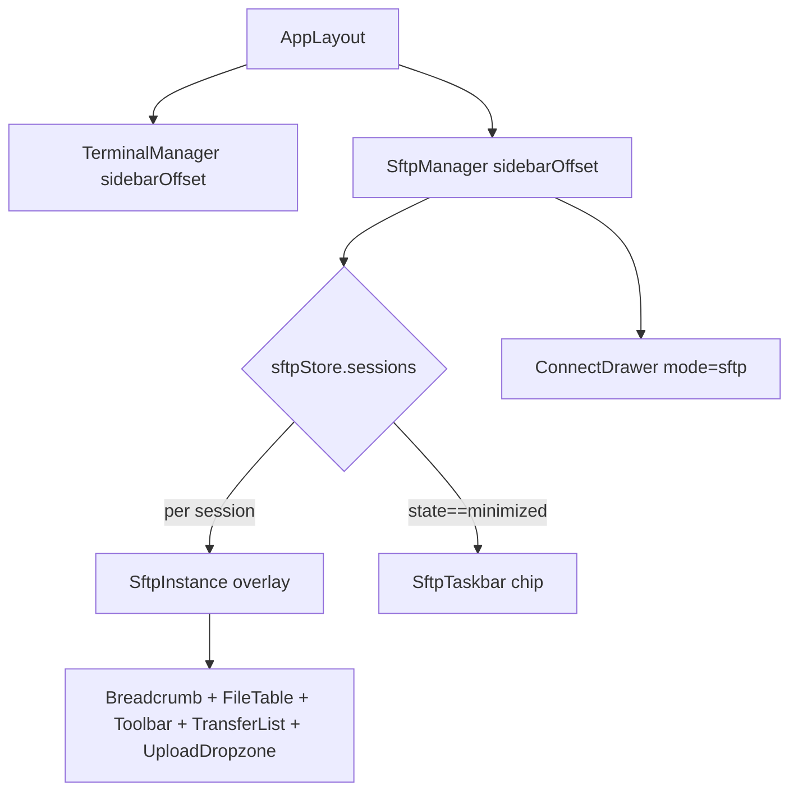
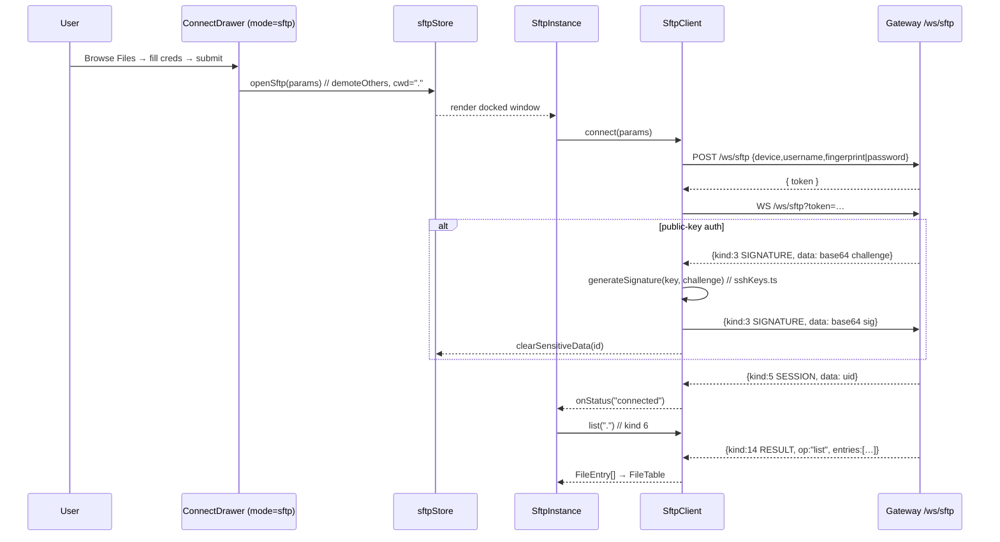

# 04 — Frontend Implementation Plan

The Web SFTP client is a floating file-manager window that reuses, almost verbatim, the
console's existing web-terminal window manager. Everything lives under
`ui/apps/console/src/` and is built with React 19, Zustand, and Tailwind. A new
`sftpStore` mirrors `terminalStore`; a new `SftpManager` mirrors `TerminalManager`; a new
`SftpInstance` forks the connect lifecycle of `TerminalInstance` but replaces xterm with a
breadcrumb + file table + transfer UI. The wire client (`api/sftpClient.ts`) speaks the
JSON envelope defined in `02-protocol.md`, resolving one promise per `requestId` and
demultiplexing binary download frames from JSON op results. Auth (password RSA-encrypt +
public-key challenge/response) is reused unchanged from the terminal path.

**Scope / non-goals.** This document covers only the frontend (`ui/apps/console/src/`).
The gateway `/ws/sftp` bridge, `newSftpSession`, and the `*sftp.Client` dispatch loop are
specified in `03-backend.md`; the wire protocol and message kinds in `02-protocol.md`; the
milestone slicing (M1–M5) in `05-milestones.md`. Non-goals here: no full-page route, no
side-drawer file browser, no third-party JS SFTP library, no changes to the session
recorder (recording is pty-only — see `06-security-and-sessions.md`). All message-kind
constant names and numeric values are LOCKED by the canonical spec and reproduced verbatim
below.

---

## 1. Summary + scope

| Aspect | Decision |
|--------|----------|
| Location | All new/changed files under `ui/apps/console/src/` |
| Stack | React 19 + Zustand + Tailwind (matches the terminal stack) |
| UX model | Floating window mirroring the web SSH terminal (overlay + taskbar + minimize/restore/fullscreen) |
| State | New `stores/sftpStore.ts` mirroring `stores/terminalStore.ts` |
| Transport | New `api/sftpClient.ts` over a dedicated `/ws/sftp` WebSocket |
| Auth | Reused verbatim: `generateSignature` (`utils/sshKeys.ts`), RSA-encrypted password broker (`POST /ws/sftp`) |
| Rendering | xterm replaced by a file table; downloads via `<a download>` Blob URL, uploads via `<input type=file>` + drag-drop, base64 chunking |

The design deliberately keeps the SFTP window manager a **parallel copy** of the terminal
window manager rather than a shared abstraction. The terminal code (`TerminalManager`,
`terminalStore`, `TerminalTaskbar`) is small and stable; forking is lower-risk than a
premature refactor into a generic "FloatingWindowManager". `05-milestones.md` M5 lists an
optional consolidation pass.

---

## 2. Floating-window UX spec

The SFTP window reuses the **exact overlay geometry** from `TerminalManager.tsx:72-84`:

```tsx
// TerminalManager.tsx:72-84 — reproduced shape for SftpManager
<div
  key={s.id}
  style={{ left: isFullscreen ? 0 : sidebarOffset }}
  className={[
    "fixed top-14 bottom-0 right-0 z-40 flex flex-col bg-background",
    "transition-[opacity,transform,left] duration-200 ease-out",
    isVisible
      ? "opacity-100 translate-y-0"
      : "opacity-0 translate-y-3 pointer-events-none",
  ].join(" ")}
>
  <SftpInstance session={s} visible={isVisible} />
</div>
```

Behaviours to preserve, one-for-one with the terminal:

| Behaviour | Terminal source | SFTP mirror |
|-----------|-----------------|-------------|
| Fixed overlay anchored `top-14 bottom-0 right-0` | `TerminalManager.tsx:76` | identical class string |
| `left = isFullscreen ? 0 : sidebarOffset` | `TerminalManager.tsx:74` | identical; `sidebarOffset` prop from `AppLayout` |
| Window states `docked` / `minimized` / `fullscreen` | `terminalStore.ts:5` `TerminalWindowState` | `SftpWindowState` (same union) |
| `demoteOthers` — opening/restoring one minimizes the rest | `terminalStore.ts:51-60` | copied verbatim |
| Taskbar of minimized windows, click to restore | `TerminalTaskbar.tsx` | `SftpTaskbar.tsx` (folder icon instead of `CommandLineIcon`) |
| Multiple concurrent windows | `terminalStore.ts:73-79` array push | identical (SFTP + terminal windows coexist) |
| Auto-minimize on route change | `TerminalManager.tsx:45-53` `minimizeAll()` on `location.pathname` change | copied verbatim |
| Connection-status dot (connecting/connected/disconnected) | `TerminalTaskbar.tsx:33-41` | identical |
| Body scroll-lock while a window is visible | `AppLayout.tsx:26-28,38` `hasVisibleTerminal` | extend to `hasVisibleSftp` (see §13) |

Because SFTP windows and terminal windows share the same overlay `z-40` and the same
`sidebarOffset`, only one *stack* is visually foreground at a time per manager, but the two
managers are independent — a docked SFTP window and a docked terminal window would overlap.
This is acceptable: `demoteOthers` runs **within** each store, and in practice a user
opening SFTP has just navigated (which fires `minimizeAll` on the terminal store via
`TerminalManager`'s route-change effect). Cross-manager coordination is called out as an
open question in §16.



---

## 3. File-by-file plan (from canonical spec §5)

| File | Action | Responsibility | First milestone |
|------|--------|----------------|-----------------|
| `api/sftpClient.ts` | new | WS connect + auth relay + `requestId` promise registry + op surface (`list`/`stat`/`mkdir`/`rename`/`remove`/`download`/`upload`) | M1 |
| `components/sftp/sftpProtocol.ts` | new | JS mirror of `messageKind` 6–18 + `WS_KIND` reuse + parse helpers | M1 |
| `stores/sftpStore.ts` | new | Zustand store mirroring `terminalStore`; adds `cwd`, `dirCache`, `transfers[]` | M1 |
| `components/sftp/SftpManager.tsx` | new | Overlay renderer + `ConnectDrawer` target + `SftpTaskbar` + minimize-on-nav | M1 |
| `components/sftp/SftpInstance.tsx` | new | Connect lifecycle fork + file browser UI | M1 |
| `components/sftp/SftpTaskbar.tsx` | new | Minimized-window taskbar | M1 (M5 for full parity) |
| `components/sftp/FileTable.tsx` | new | Presentational directory listing + row actions | M1 |
| `components/sftp/Breadcrumb.tsx` | new | Path segments → `cd` | M1 |
| `components/sftp/TransferList.tsx` | new | In-flight transfer progress | M2 |
| `components/sftp/UploadDropzone.tsx` | new | Drag-drop + file picker | M3 |
| `components/sftp/SftpErrorBanner.tsx` | new | Fatal-error banner (analogue of `TerminalErrorBanner`) | M1 |
| `components/sftp/sftpErrors.ts` | new | Error map + `HTTP_CONNECT_ERROR`/`WS_*` analogues (fork of `terminalErrors.ts`) | M1 |
| `components/ConnectDrawer.tsx` | modify | Add `mode: "terminal" \| "sftp"` (or `openSftp()`) | M1 |
| `pages/DeviceDetails.tsx` | modify | "Browse Files" button + `?sftp=true` auto-open | M1 |
| `pages/devices/index.tsx` | modify | Per-row "Files" action | M5 |
| `components/layout/AppLayout.tsx` | modify | Mount `<SftpManager/>` next to `<TerminalManager/>` | M1 |

---

## 4. Per-file detail

Sections §5–§14 expand each file with TypeScript/React sketches grounded in the real files
read from the repository. Every sketch cites the terminal-side source it forks.

---

## 5. `components/sftp/sftpProtocol.ts` (new)

Mirrors the LOCKED `messageKind` enum (`02-protocol.md` §3.1). It **reuses** the shared
auth/error/session kinds from the terminal path rather than re-declaring them: SIGNATURE,
ERROR, and SESSION keep the same numeric values as `WS_KIND` in `terminalErrors.ts:114-120`.
It does **not** declare `INPUT` (1) or `RESIZE` (2) — those are terminal-only.

```ts
// components/sftp/sftpProtocol.ts

// Shared auth/transport kinds — SAME numeric values as terminalErrors.ts WS_KIND.
// SIGNATURE/ERROR/SESSION are reused verbatim by the SFTP connect lifecycle.
export const WS_KIND = {
  SIGNATURE: 3,
  ERROR: 4,
  SESSION: 5,
} as const;

// SFTP kinds — values LOCKED by 02-protocol.md §3.1 (6–18).
export const SFTP_KIND = {
  LIST: 6,          // c→s { requestId, path }
  STAT: 7,          // c→s { requestId, path }
  MKDIR: 8,         // c→s { requestId, path }
  RENAME: 9,        // c→s { requestId, from, to }
  REMOVE: 10,       // c→s { requestId, path, recursive }
  DOWNLOAD: 11,     // c→s { requestId, path }
  UPLOAD: 12,       // c→s { requestId, path, size }  (begin)
  UPLOAD_CHUNK: 13, // c→s { requestId, data (base64), eof }
  RESULT: 14,       // s→c { requestId, op, ok, entries?, stat? }
  DOWNLOAD_BEGIN: 15, // s→c { requestId, name, size, mode, mtime }
  DOWNLOAD_END: 16, // s→c { requestId }
  PROGRESS: 17,     // s→c { requestId, transferred, total, direction }
  SFTP_ERROR: 18,   // s→c { requestId?, code, message }
} as const;

export type SftpOp = "list" | "stat" | "mkdir" | "rename" | "remove" | "upload";
export type TransferDirection = "download" | "upload";

export interface FileEntry {
  name: string;
  path: string;
  size: number;
  mode: string;      // symbolic, e.g. "drwxr-xr-x"
  modeBits: number;  // os.FileMode bits
  mtime: number;     // unix seconds
  isDir: boolean;
  isLink: boolean;
  linkTarget?: string; // present only when isLink
}

export interface SftpResult {
  requestId: string;
  op: SftpOp;
  ok: boolean;
  entries?: FileEntry[];
  stat?: FileEntry;
}

export interface SftpProgress {
  requestId: string;
  transferred: number;
  total: number;
  direction: TransferDirection;
}

export interface DownloadBegin {
  requestId: string;
  name: string;
  size: number;
  mode: string;
  mtime: number;
}

export interface SftpErrorPayload {
  requestId?: string;
  code: string;
  message: string;
}

// Generic envelope, matching ssh/web/messages.go Message{ kind, data }.
export interface WsEnvelope<T = unknown> {
  kind: number;
  data: T;
}

/**
 * Parse a JSON text frame into { kind, data }. Unlike terminalErrors.ts
 * parseMessage (terminalErrors.ts:150-172) — which requires data to be a
 * STRING because SIGNATURE/ERROR/SESSION carry strings — SFTP result/progress
 * frames carry OBJECTS, so this validates only that `kind` is a number and
 * returns `data` as-is.
 */
export function parseEnvelope(raw: string): WsEnvelope | null {
  try {
    const msg: unknown = JSON.parse(raw);
    if (
      typeof msg === "object" &&
      msg !== null &&
      "kind" in msg &&
      typeof (msg as { kind: unknown }).kind === "number"
    ) {
      return {
        kind: (msg as { kind: number }).kind,
        data: (msg as { data: unknown }).data,
      };
    }
  } catch {
    // not JSON
  }
  return null;
}
```

> **Note for the protocol author:** `terminalErrors.ts:150-172` `parseMessage` hard-requires
> `typeof data === "string"`. SFTP JSON frames (RESULT/PROGRESS/…) carry objects, so we need
> the separate `parseEnvelope` above. The SIGNATURE/ERROR/SESSION frames still carry strings
> and can go through either. See §16 for the cross-doc note.

---

## 6. `api/sftpClient.ts` (new)

The transport. One `SftpClient` instance per SFTP window (mirrors "one `*sftp.Client` per
WebSocket", canonical §1.5). It forks the connect handshake of `TerminalInstance.tsx:75-274`
but exposes a promise-based op surface instead of piping to xterm.

### 6.1 Connect + auth handshake (forked from `TerminalInstance.tsx`)

The POST → token → WS-open → SIGNATURE/ERROR/SESSION flow is copied from
`TerminalInstance.tsx`:

- POST body construction: `TerminalInstance.tsx:79-88` (fingerprint vs password).
- Token POST: `TerminalInstance.tsx:90-98` — but to `/ws/sftp` (canonical §5), not `/ws/ssh`.
- WS URL: `TerminalInstance.tsx:128-130` — but `/ws/sftp?token=…` with **no** `cols`/`rows`.
- SIGNATURE handling with `generateSignature` + `Buffer.from(challenge, "base64")`:
  `TerminalInstance.tsx:195-223`.
- Clear key material after signing: `TerminalInstance.tsx:211-220` → call
  `sftpStore.clearSensitiveData(session.id)`.
- ERROR → resolve to a fatal `SftpError`: `TerminalInstance.tsx:224-229`.
- SESSION → store the server session UID: `TerminalInstance.tsx:230-233`.

```ts
// api/sftpClient.ts
import { Buffer } from "buffer";
import apiClient from "@/api/client";
import { generateSignature } from "@/utils/sshKeys";
import {
  WS_KIND,
  SFTP_KIND,
  parseEnvelope,
  type FileEntry,
  type SftpResult,
  type SftpProgress,
  type DownloadBegin,
  type SftpErrorPayload,
} from "@/components/sftp/sftpProtocol";

const RAW_CHUNK = 128 * 1024; // 128 KiB raw → ~170 KB base64 (canonical §3.4)

export interface SftpConnectParams {
  deviceUid: string;
  username: string;
  password: string;
  fingerprint?: string;
  privateKey?: string;
  passphrase?: string;
}

export interface SftpClientHandlers {
  onSession?: (uid: string) => void;
  onFatalError?: (raw: string) => void; // messageKindError (transport/auth)
  onProgress?: (p: SftpProgress) => void;
  onClose?: () => void;
  onStatus?: (s: "connecting" | "connected" | "disconnected") => void;
  onKeyConsumed?: () => void; // fired after SIGNATURE → clearSensitiveData
}

type Pending = {
  resolve: (v: unknown) => void;
  reject: (e: unknown) => void;
  op: string;
};

export class SftpClient {
  private ws: WebSocket | null = null;
  private pending = new Map<string, Pending>();
  private seq = 0;

  // Download reassembly state (only one download in flight per socket —
  // canonical §3.3: binary frames are UNTAGGED).
  private dl: { requestId: string; meta: DownloadBegin; parts: Uint8Array[] } | null =
    null;

  constructor(private readonly handlers: SftpClientHandlers) {}

  private nextId(): string {
    this.seq += 1;
    return `r${this.seq}`;
  }

  async connect(params: SftpConnectParams): Promise<void> {
    this.handlers.onStatus?.("connecting");

    const body: Record<string, string> = {
      device: params.deviceUid,
      username: params.username,
    };
    if (params.fingerprint) body.fingerprint = params.fingerprint;
    else body.password = params.password;

    // POST /ws/sftp → JWT token (backend broker mirrors /ws/ssh — see 03-backend.md).
    const res = await apiClient.post<{ token: string }>("/ws/sftp", body);
    const token = res.data.token;

    // Copy key material locally so the closure doesn't pin the session object
    // (mirrors TerminalInstance.tsx:134-137).
    let keyMaterial = params.privateKey;
    let keyPassphrase = params.passphrase;

    const proto = window.location.protocol === "https:" ? "wss:" : "ws:";
    const ws = new WebSocket(
      `${proto}//${window.location.host}/ws/sftp?token=${token}`,
    );
    ws.binaryType = "arraybuffer"; // download frames arrive as ArrayBuffer
    this.ws = ws;

    ws.onopen = () => this.handlers.onStatus?.("connected");

    ws.onmessage = (event) => {
      if (event.data instanceof ArrayBuffer) {
        this.onBinary(new Uint8Array(event.data)); // download bytes
        return;
      }
      const env = parseEnvelope(String(event.data));
      if (!env) return;
      this.onJson(env, ws, () => {
        // SIGNATURE consumed → forget key material (TerminalInstance.tsx:211-220).
        keyMaterial = undefined;
        keyPassphrase = undefined;
        this.handlers.onKeyConsumed?.();
      }, keyMaterial, keyPassphrase);
    };

    ws.onclose = () => {
      this.handlers.onStatus?.("disconnected");
      this.rejectAll(new Error("socket closed"));
      this.handlers.onClose?.();
    };
    ws.onerror = () => this.handlers.onStatus?.("disconnected");
  }
```

### 6.2 `onmessage` demux — JSON vs binary

Following canonical §3.3: **binary frames = download bytes** (accumulated between
DOWNLOAD_BEGIN and DOWNLOAD_END into a `Blob`); **JSON frames** = auth handshake,
op results, progress, and errors.

```ts
  private onJson(
    env: { kind: number; data: unknown },
    ws: WebSocket,
    consumeKey: () => void,
    keyMaterial?: string,
    keyPassphrase?: string,
  ) {
    switch (env.kind) {
      case WS_KIND.SIGNATURE: {
        // Public-key challenge/response — identical to TerminalInstance.tsx:195-223.
        if (!keyMaterial) return;
        const challenge = Buffer.from(env.data as string, "base64");
        try {
          const signature = generateSignature(keyMaterial, challenge, keyPassphrase);
          ws.send(JSON.stringify({ kind: WS_KIND.SIGNATURE, data: signature }));
        } catch {
          consumeKey();
          ws.close();
          return;
        }
        consumeKey();
        break;
      }
      case WS_KIND.ERROR:
        // Transport/auth failure — resolved by the instance's error banner.
        this.handlers.onFatalError?.(env.data as string);
        break;
      case WS_KIND.SESSION:
        this.handlers.onSession?.(env.data as string);
        break;

      case SFTP_KIND.RESULT: {
        const r = env.data as SftpResult;
        this.settle(r.requestId, r);
        break;
      }
      case SFTP_KIND.DOWNLOAD_BEGIN: {
        const b = env.data as DownloadBegin;
        this.dl = { requestId: b.requestId, meta: b, parts: [] };
        break;
      }
      case SFTP_KIND.DOWNLOAD_END: {
        if (this.dl) {
          const { meta, parts } = this.dl;
          const blob = new Blob(parts as BlobPart[], {
            type: "application/octet-stream",
          });
          this.settle(meta.requestId, { blob, name: meta.name });
          this.dl = null;
        }
        break;
      }
      case SFTP_KIND.PROGRESS:
        this.handlers.onProgress?.(env.data as SftpProgress);
        break;
      case SFTP_KIND.SFTP_ERROR: {
        const e = env.data as SftpErrorPayload;
        if (e.requestId) this.reject(e.requestId, new SftpOpError(e.code, e.message));
        break;
      }
      default:
        break;
    }
  }

  private onBinary(chunk: Uint8Array) {
    if (this.dl) this.dl.parts.push(chunk);
  }
```

### 6.3 `requestId` promise registry

```ts
  private settle(requestId: string, value: unknown) {
    const p = this.pending.get(requestId);
    if (!p) return;
    this.pending.delete(requestId);
    p.resolve(value);
  }
  private reject(requestId: string, err: unknown) {
    const p = this.pending.get(requestId);
    if (!p) return;
    this.pending.delete(requestId);
    p.reject(err);
  }
  private rejectAll(err: unknown) {
    for (const [, p] of this.pending) p.reject(err);
    this.pending.clear();
  }

  private send<T>(kind: number, data: object, requestId: string, op: string): Promise<T> {
    return new Promise<T>((resolve, reject) => {
      if (!this.ws || this.ws.readyState !== WebSocket.OPEN) {
        reject(new Error("socket not open"));
        return;
      }
      this.pending.set(requestId, { resolve: resolve as (v: unknown) => void, reject, op });
      this.ws.send(JSON.stringify({ kind, data }));
    });
  }
```

### 6.4 Op methods

```ts
  list(path: string): Promise<SftpResult> {
    const requestId = this.nextId();
    return this.send(SFTP_KIND.LIST, { requestId, path }, requestId, "list");
  }
  stat(path: string): Promise<SftpResult> {
    const requestId = this.nextId();
    return this.send(SFTP_KIND.STAT, { requestId, path }, requestId, "stat");
  }
  mkdir(path: string): Promise<SftpResult> {
    const requestId = this.nextId();
    return this.send(SFTP_KIND.MKDIR, { requestId, path }, requestId, "mkdir");
  }
  rename(from: string, to: string): Promise<SftpResult> {
    const requestId = this.nextId();
    return this.send(SFTP_KIND.RENAME, { requestId, from, to }, requestId, "rename");
  }
  remove(path: string, recursive = false): Promise<SftpResult> {
    const requestId = this.nextId();
    return this.send(SFTP_KIND.REMOVE, { requestId, path, recursive }, requestId, "remove");
  }

  // Download: server replies DOWNLOAD_BEGIN, streams binary frames, DOWNLOAD_END.
  // Only one download at a time per socket (canonical §3.3) — callers serialize.
  download(path: string): Promise<{ blob: Blob; name: string }> {
    const requestId = this.nextId();
    return this.send(SFTP_KIND.DOWNLOAD, { requestId, path }, requestId, "download");
  }

  // Upload: UPLOAD (begin) → N UPLOAD_CHUNK (base64) → RESULT{op:"upload"}.
  async upload(file: File, destPath: string): Promise<SftpResult> {
    const requestId = this.nextId();
    // Register the completion promise BEFORE streaming chunks so the RESULT ack settles it.
    const done = new Promise<SftpResult>((resolve, reject) => {
      this.pending.set(requestId, {
        resolve: resolve as (v: unknown) => void,
        reject,
        op: "upload",
      });
    });
    this.ws?.send(
      JSON.stringify({
        kind: SFTP_KIND.UPLOAD,
        data: { requestId, path: destPath, size: file.size },
      }),
    );

    let offset = 0;
    while (offset < file.size) {
      const end = Math.min(offset + RAW_CHUNK, file.size);
      const buf = await file.slice(offset, end).arrayBuffer();
      const base64 = arrayBufferToBase64(new Uint8Array(buf));
      const eof = end >= file.size;
      this.ws?.send(
        JSON.stringify({ kind: SFTP_KIND.UPLOAD_CHUNK, data: { requestId, data: base64, eof } }),
      );
      offset = end;
    }
    return done;
  }

  close() {
    if (this.ws) {
      this.ws.onopen = this.ws.onclose = this.ws.onerror = this.ws.onmessage = null;
      this.ws.close();
      this.ws = null;
    }
    this.rejectAll(new Error("client closed"));
  }
}

export class SftpOpError extends Error {
  constructor(public code: string, message: string) {
    super(message);
    this.name = "SftpOpError";
  }
}

// btoa operates on binary strings; build one from the Uint8Array in slices to
// avoid call-stack limits on large chunks. See §14.
function arrayBufferToBase64(bytes: Uint8Array): string {
  let binary = "";
  const SLICE = 0x8000; // 32 KiB
  for (let i = 0; i < bytes.length; i += SLICE) {
    binary += String.fromCharCode(...bytes.subarray(i, i + SLICE));
  }
  return btoa(binary);
}
```

**Key-material hygiene.** Like `TerminalInstance.tsx:134-137,211-220`, key material is
copied into closure locals and cleared the moment the SIGNATURE challenge is answered, via
`onKeyConsumed` → `sftpStore.clearSensitiveData(session.id)`. `generateSignature` is the
same `utils/sshKeys.ts:59-95` helper the terminal uses (RSA → `pkcs1-sha1`; ECDSA/ed25519
→ curve-matched hash).

---

## 7. `stores/sftpStore.ts` (new)

A near-clone of `stores/terminalStore.ts`. The session shape mirrors `TerminalSession`'s
credential fields (`terminalStore.ts:8-21`) plus SFTP-specific browsing state.

```ts
// stores/sftpStore.ts
import { create } from "zustand";
import { generateRandomUUID } from "@/utils/random-uuid";
import { useRecentDevicesStore } from "./recentDevicesStore";
import type { FileEntry, TransferDirection } from "@/components/sftp/sftpProtocol";

export type SftpWindowState = "docked" | "minimized" | "fullscreen";
export type ConnectionStatus = "connecting" | "connected" | "disconnected";

export interface Transfer {
  id: string;             // requestId
  name: string;
  direction: TransferDirection;
  transferred: number;
  total: number;
  status: "active" | "done" | "error";
  error?: string;
}

export interface SftpSession {
  id: string;
  // --- credential fields, mirror TerminalSession (terminalStore.ts:8-21) ---
  deviceUid: string;
  deviceName: string;
  username: string;
  password: string;
  fingerprint?: string;
  privateKey?: string;
  passphrase?: string;
  // --- window + connection state ---
  state: SftpWindowState;
  connectionStatus: ConnectionStatus;
  // --- SFTP-specific browsing state ---
  cwd: string;                              // current directory (default "/" or "." → HOME)
  dirCache: Record<string, FileEntry[]>;    // path → entries (invalidated on mutation)
  transfers: Transfer[];
}

export interface ReconnectTarget {
  deviceUid: string;
  deviceName: string;
}

interface SftpState {
  sessions: SftpSession[];
  reconnectTarget: ReconnectTarget | null;
  open: (p: Omit<SftpSession,
    "id" | "state" | "connectionStatus" | "cwd" | "dirCache" | "transfers">) => void;
  minimize: (id: string) => void;
  minimizeAll: () => void;
  restore: (id: string) => void;
  toggleFullscreen: (id: string) => void;
  close: (id: string) => void;
  requestConnect: (deviceUid: string, deviceName: string) => void;
  clearReconnect: () => void;
  setConnectionStatus: (id: string, status: ConnectionStatus) => void;
  clearSensitiveData: (id: string) => void;
  // SFTP-specific:
  setCwd: (id: string, cwd: string) => void;
  cacheDir: (id: string, path: string, entries: FileEntry[]) => void;
  invalidateDir: (id: string, path: string) => void;
  upsertTransfer: (id: string, t: Transfer) => void;
}

// Identical to terminalStore.ts:51-60.
function demoteOthers(sessions: SftpSession[], targetId: string): SftpSession[] {
  return sessions.map((s) =>
    s.id === targetId
      ? s
      : s.state !== "minimized"
        ? { ...s, state: "minimized" as const }
        : s,
  );
}

export const useSftpStore = create<SftpState>((set) => ({
  sessions: [],
  reconnectTarget: null,

  open: (params) => {
    const id = generateRandomUUID();
    // Same app-wide "recent devices" choke point as terminalStore.ts:69-72.
    useRecentDevicesStore.getState().record(params.deviceUid, params.deviceName);
    set((state) => ({
      reconnectTarget: null,
      sessions: [
        ...demoteOthers(state.sessions, id),
        {
          ...params,
          id,
          state: "docked",
          connectionStatus: "connecting",
          cwd: ".",           // agent resolves "." to the SSH user's HOME
          dirCache: {},
          transfers: [],
        },
      ],
    }));
  },

  minimize: (id) => set((s) => ({
    sessions: s.sessions.map((x) => (x.id === id ? { ...x, state: "minimized" } : x)),
  })),
  minimizeAll: () => set((s) => ({
    sessions: s.sessions.map((x) => (x.state !== "minimized" ? { ...x, state: "minimized" } : x)),
  })),
  restore: (id) => set((s) => ({
    sessions: demoteOthers(s.sessions, id).map((x) => (x.id === id ? { ...x, state: "docked" } : x)),
  })),
  toggleFullscreen: (id) => set((s) => ({
    sessions: demoteOthers(s.sessions, id).map((x) =>
      x.id !== id ? x : { ...x, state: x.state === "fullscreen" ? "docked" : "fullscreen" }),
  })),
  close: (id) => set((s) => ({ sessions: s.sessions.filter((x) => x.id !== id) })),

  requestConnect: (deviceUid, deviceName) =>
    set({ reconnectTarget: { deviceUid, deviceName } }),
  clearReconnect: () => set({ reconnectTarget: null }),

  setConnectionStatus: (id, status) => set((s) => ({
    sessions: s.sessions.map((x) => (x.id === id ? { ...x, connectionStatus: status } : x)),
  })),

  // Identical to terminalStore.ts:157-165 — drop key material + blank the password.
  clearSensitiveData: (id) => set((s) => ({
    sessions: s.sessions.map((x) =>
      x.id === id ? { ...x, privateKey: undefined, passphrase: undefined, password: "" } : x),
  })),

  setCwd: (id, cwd) => set((s) => ({
    sessions: s.sessions.map((x) => (x.id === id ? { ...x, cwd } : x)),
  })),
  cacheDir: (id, path, entries) => set((s) => ({
    sessions: s.sessions.map((x) =>
      x.id === id ? { ...x, dirCache: { ...x.dirCache, [path]: entries } } : x),
  })),
  invalidateDir: (id, path) => set((s) => ({
    sessions: s.sessions.map((x) => {
      if (x.id !== id) return x;
      const next = { ...x.dirCache };
      delete next[path];
      return { ...x, dirCache: next };
    }),
  })),
  upsertTransfer: (id, t) => set((s) => ({
    sessions: s.sessions.map((x) => {
      if (x.id !== id) return x;
      const i = x.transfers.findIndex((v) => v.id === t.id);
      const transfers = i >= 0
        ? x.transfers.map((v, j) => (j === i ? t : v))
        : [...x.transfers, t];
      return { ...x, transfers };
    }),
  })),
}));
```

Differences from `terminalStore`: no `record` field (recording is pty-only, §1 non-goals),
no `closeAndReconnect` in M1 (add in M5 for parity), plus `cwd`/`dirCache`/`transfers` and
their mutators. The `demoteOthers`, `open`, `minimize`, `restore`, `toggleFullscreen`,
`close`, `requestConnect`, `setConnectionStatus`, and `clearSensitiveData` actions are
line-for-line ports of `terminalStore.ts`.

---

## 8. `components/sftp/SftpManager.tsx` (new)

A direct fork of `TerminalManager.tsx`. Renders one `SftpInstance` per session in the
fixed overlay, opens `ConnectDrawer` on a reconnect target, mounts `SftpTaskbar`, and
auto-minimizes on route change.

```tsx
// components/sftp/SftpManager.tsx
import { useEffect, useRef, useState } from "react";
import { useLocation } from "react-router-dom";
import { useSftpStore } from "@/stores/sftpStore";
import { useNamespace } from "@/hooks/useNamespaces";
import { useAuthStore } from "@/stores/authStore";
import ConnectDrawer from "../ConnectDrawer";
import { buildSshid } from "@/utils/sshid";
import SftpInstance from "./SftpInstance";
import SftpTaskbar from "./SftpTaskbar";

export default function SftpManager({ sidebarOffset }: { sidebarOffset: number }) {
  const sessions = useSftpStore((s) => s.sessions);
  const minimizeAll = useSftpStore((s) => s.minimizeAll);
  const reconnectTarget = useSftpStore((s) => s.reconnectTarget);
  const tenantId = useAuthStore((s) => s.tenant) ?? "";
  const { namespace: currentNamespace } = useNamespace(tenantId);

  const [connectTarget, setConnectTarget] =
    useState<{ uid: string; name: string; sshid: string } | null>(null);

  // Open ConnectDrawer (in SFTP mode) when a connect is requested.
  // Mirrors TerminalManager.tsx:30-43.
  useEffect(() => {
    if (!reconnectTarget) return;
    useSftpStore.getState().clearReconnect();
    const nsName = currentNamespace?.name;
    const sshid = nsName
      ? buildSshid(nsName, reconnectTarget.deviceName)
      : reconnectTarget.deviceUid;
    // eslint-disable-next-line react-hooks/set-state-in-effect
    setConnectTarget({ uid: reconnectTarget.deviceUid, name: reconnectTarget.deviceName, sshid });
  }, [reconnectTarget, currentNamespace]);

  // Auto-minimize on navigation. Mirrors TerminalManager.tsx:45-53.
  const location = useLocation();
  const prevPathRef = useRef(location.pathname);
  useEffect(() => {
    if (location.pathname !== prevPathRef.current) {
      prevPathRef.current = location.pathname;
      minimizeAll();
    }
  }, [location.pathname, minimizeAll]);

  return (
    <>
      {connectTarget && (
        <ConnectDrawer
          open
          mode="sftp"                          // NEW prop — see §11
          onClose={() => setConnectTarget(null)}
          deviceUid={connectTarget.uid}
          deviceName={connectTarget.name}
          sshid={connectTarget.sshid}
        />
      )}

      {sessions.map((s) => {
        const isVisible = s.state !== "minimized";
        const isFullscreen = s.state === "fullscreen";
        return (
          <div
            key={s.id}
            style={{ left: isFullscreen ? 0 : sidebarOffset }}
            className={[
              "fixed top-14 bottom-0 right-0 z-40 flex flex-col bg-background",
              "transition-[opacity,transform,left] duration-200 ease-out",
              isVisible
                ? "opacity-100 translate-y-0"
                : "opacity-0 translate-y-3 pointer-events-none",
            ].join(" ")}
          >
            <SftpInstance session={s} visible={isVisible} />
          </div>
        );
      })}

      <SftpTaskbar sidebarOffset={sidebarOffset} />
    </>
  );
}
```

The overlay `<div>` is identical to `TerminalManager.tsx:72-84` — same classes, same
`left` calculation, same transitions. `RecordingSnackbar` is omitted (no recording).

---

## 9. `components/sftp/SftpInstance.tsx` (new)

The file-browser window. The **connect lifecycle** (mount → `SftpClient.connect` → status
tracking → SIGNATURE/ERROR/SESSION → `clearSensitiveData` → unmount teardown) is forked
from `TerminalInstance.tsx:54-308`. The **render** replaces xterm with a toolbar +
breadcrumb + file table + upload dropzone + transfer list.

```tsx
// components/sftp/SftpInstance.tsx
import { useEffect, useRef, useState, useCallback } from "react";
import { useSftpStore, type SftpSession } from "@/stores/sftpStore";
import { SftpClient, SftpOpError } from "@/api/sftpClient";
import type { FileEntry } from "./sftpProtocol";
import type { SftpError } from "./sftpErrors";
import { HTTP_CONNECT_ERROR, resolveError } from "./sftpErrors";
import SftpErrorBanner from "./SftpErrorBanner";
import Breadcrumb from "./Breadcrumb";
import FileTable from "./FileTable";
import TransferList from "./TransferList";
import UploadDropzone from "./UploadDropzone";
import { downloadBlob } from "@/utils/download"; // <a download> helper — §14

export default function SftpInstance({
  session,
  visible,
}: {
  session: SftpSession;
  visible: boolean;
}) {
  const clientRef = useRef<SftpClient | null>(null);
  const [error, setError] = useState<SftpError | null>(null);
  const [entries, setEntries] = useState<FileEntry[]>([]);
  const [loading, setLoading] = useState(false);

  const store = useSftpStore;
  const updateStatus = useCallback(
    (s: "connecting" | "connected" | "disconnected") =>
      store.getState().setConnectionStatus(session.id, s),
    [session.id, store],
  );

  // --- Directory loader (used by breadcrumb, toolbar Refresh, row nav) ---
  const loadDir = useCallback(async (path: string) => {
    const client = clientRef.current;
    if (!client) return;
    setLoading(true);
    try {
      const res = await client.list(path);
      setEntries(res.entries ?? []);
      store.getState().setCwd(session.id, path);
      store.getState().cacheDir(session.id, path, res.entries ?? []);
    } catch (e) {
      if (e instanceof SftpOpError) {
        // per-op error → toast/inline, NOT the fatal banner
        console.error("sftp list failed", e.code, e.message);
      }
    } finally {
      setLoading(false);
    }
  }, [session.id, store]);

  // --- Connect on mount, teardown on unmount (fork of TerminalInstance.tsx:54-308) ---
  useEffect(() => {
    let cancelled = false;
    const client = new SftpClient({
      onStatus: (s) => !cancelled && updateStatus(s),
      onSession: () => { /* store server UID if auditing (M5) */ },
      onFatalError: (raw) => {
        if (cancelled) return;
        updateStatus("disconnected");
        setError(resolveError(raw, session.deviceUid)); // sftpErrors.ts fork of terminalErrors.ts:174
      },
      onKeyConsumed: () => store.getState().clearSensitiveData(session.id),
      onProgress: (p) => {
        store.getState().upsertTransfer(session.id, {
          id: p.requestId,
          name: p.requestId,
          direction: p.direction,
          transferred: p.transferred,
          total: p.total,
          status: p.transferred >= p.total ? "done" : "active",
        });
      },
      onClose: () => !cancelled && updateStatus("disconnected"),
    });
    clientRef.current = client;

    client
      .connect({
        deviceUid: session.deviceUid,
        username: session.username,
        password: session.password,
        fingerprint: session.fingerprint,
        privateKey: session.privateKey,
        passphrase: session.passphrase,
      })
      .then(() => !cancelled && loadDir(session.cwd))
      .catch(() => { if (!cancelled) setError(HTTP_CONNECT_ERROR); }); // POST failed → terminalErrors.ts:122 analogue

    return () => {
      cancelled = true;
      store.getState().clearSensitiveData(session.id);
      client.close();
      clientRef.current = null;
    };
    // eslint-disable-next-line react-hooks/exhaustive-deps
  }, [session.id]);

  // --- Row actions ---
  const onDownload = useCallback(async (entry: FileEntry) => {
    const client = clientRef.current;
    if (!client) return;
    const { blob, name } = await client.download(entry.path);
    downloadBlob(blob, name); // §14 — <a download> Blob URL
  }, []);

  const onUpload = useCallback(async (files: FileList) => {
    const client = clientRef.current;
    if (!client) return;
    for (const file of Array.from(files)) {
      const dest = joinPath(session.cwd, file.name);
      await client.upload(file, dest);
    }
    store.getState().invalidateDir(session.id, session.cwd);
    await loadDir(session.cwd);
  }, [session.cwd, session.id, store, loadDir]);

  return (
    <div className="relative flex-1 flex flex-col overflow-hidden">
      {error !== null && <SftpErrorBanner error={error} sessionId={session.id} />}

      {/* Toolbar */}
      <div className="flex items-center gap-2 px-3 h-11 border-b border-border bg-surface">
        <Breadcrumb cwd={session.cwd} onNavigate={loadDir} />
        <div className="ml-auto flex items-center gap-1.5">
          <button onClick={() => promptNewFolder(clientRef, session, loadDir)}>New Folder</button>
          <label className="cursor-pointer">
            Upload
            <input
              type="file"
              multiple
              className="sr-only"
              onChange={(e) => e.target.files && onUpload(e.target.files)}
            />
          </label>
          <button onClick={() => loadDir(session.cwd)}>Refresh</button>
        </div>
      </div>

      {/* Body */}
      <UploadDropzone onFiles={onUpload} className={error ? "opacity-30 pointer-events-none" : ""}>
        <FileTable
          entries={entries}
          loading={loading}
          onOpenDir={(entry) => loadDir(entry.path)}
          onDownload={onDownload}
          onRename={(entry) => promptRename(clientRef, session, entry, loadDir)}
          onDelete={(entry) => confirmDelete(clientRef, session, entry, loadDir)}
        />
      </UploadDropzone>

      <TransferList transfers={session.transfers} />
    </div>
  );
}
```

Lifecycle parity notes:

- `cancelled` guard + teardown that nulls WS handlers and closes: `TerminalInstance.tsx:276-306`.
- `clearSensitiveData` on unmount and after signing: `TerminalInstance.tsx:213,292`.
- POST failure → `HTTP_CONNECT_ERROR`: `TerminalInstance.tsx:93-97` → `terminalErrors.ts:122-130`.
- Fatal WS error → banner with hints/links: `TerminalInstance.tsx:224-229` +
  `TerminalErrorBanner`. The `sftpErrors.ts` `resolveError` is a fork of
  `terminalErrors.ts:174-208` (same error-string keys — the backend reuses
  `messageKindError` for auth/transport failures, canonical §3.3).
- Per-op failures (`SftpOpError` from `messageKindSftpError`) surface inline/as toasts, NOT
  via the fatal banner — they don't tear down the socket.

---

## 10. Presentational sub-components

### 10.1 `components/sftp/SftpTaskbar.tsx`

Fork of `TerminalTaskbar.tsx`. Same fixed bar (`bottom-0 right-0`, `left: sidebarOffset`,
`h-11`, connection-status dot), swapping `CommandLineIcon` for a `FolderIcon`.

```tsx
// props
{ sidebarOffset: number }
// reads useSftpStore(): { sessions, restore, close }; filters state === "minimized"
```

Everything else — the chip styling by `connectionStatus`, click-to-`restore`, the
stop-propagation `close` button — is copied from `TerminalTaskbar.tsx:5-73`.

### 10.2 `components/sftp/FileTable.tsx`

Presentational directory table; no data fetching.

```ts
interface FileTableProps {
  entries: FileEntry[];
  loading: boolean;
  onOpenDir: (entry: FileEntry) => void;      // double-click / Enter on a dir
  onDownload: (entry: FileEntry) => void;     // file only
  onRename: (entry: FileEntry) => void;
  onDelete: (entry: FileEntry) => void;
}
```

Columns: name (icon by `isDir`/`isLink`), size (human-readable; dirs blank), mode
(`entry.mode`, e.g. `drwxr-xr-x`), mtime (`new Date(entry.mtime * 1000)`). Row click on a
dir → `onOpenDir`; row-hover action buttons Download (files only) / Rename / Delete. Sort
dirs-first then by name. Symlinks show `→ linkTarget`.

### 10.3 `components/sftp/Breadcrumb.tsx`

```ts
interface BreadcrumbProps {
  cwd: string;                       // e.g. "/home/user/docs"
  onNavigate: (path: string) => void;
}
```

Splits `cwd` on `/`, renders each prefix as a clickable segment calling `onNavigate` with
the cumulative path. Leading root segment navigates to `/`. When `cwd === "."` (HOME
sentinel), render a "Home" pill until the first `list` resolves an absolute `entry.path`.

### 10.4 `components/sftp/TransferList.tsx`

```ts
interface TransferListProps {
  transfers: Transfer[];            // from sftpStore session.transfers
}
```

Renders a compact stacked list of active/recent transfers, each a labelled progress bar
driven by `messageKindSftpProgress` (`transferred/total`, `direction`). Completed transfers
auto-dismiss after a delay; errored ones show the `code`/`message` from
`messageKindSftpError`. Collapsed to a small badge when empty.

### 10.5 `components/sftp/UploadDropzone.tsx`

```ts
interface UploadDropzoneProps {
  onFiles: (files: FileList) => void;   // from drag-drop
  className?: string;
  children: React.ReactNode;            // wraps the FileTable
}
```

Wraps the table area; `onDragOver`/`onDragLeave` toggle a highlighted overlay,
`onDrop` reads `e.dataTransfer.files` and calls `onFiles`. Combined with the toolbar's
`<input type=file multiple>` (§9), this gives both drag-drop and picker upload sources
(§14).

---

## 11. `components/ConnectDrawer.tsx` (modify)

`ConnectDrawer` already collects username / password / private-key (vault or manual) /
passphrase and validates the key (`ConnectDrawer.tsx:174-243`). Add a `mode` prop so the
same drawer can open either a terminal or an SFTP window; on submit, branch to the right
store.

```ts
// ConnectDrawer.tsx:32-38 — extend Props
interface Props {
  open: boolean;
  onClose: () => void;
  deviceUid: string;
  deviceName: string;
  sshid: string;
  mode?: "terminal" | "sftp"; // NEW, default "terminal"
}
```

```tsx
// inside the component, alongside ConnectDrawer.tsx:118
const openTerminal = useTerminalStore((s) => s.open);
const openSftp = useSftpStore((s) => s.open);
const mode = props.mode ?? "terminal";
```

```tsx
// handleConnect — replace ConnectDrawer.tsx:241 openTerminal(params) with:
if (mode === "sftp") {
  // record flag is terminal-only; strip it for SFTP.
  const { record: _drop, ...sftpParams } = params;
  openSftp(sftpParams);
} else {
  openTerminal(params);
}
onClose();
```

Notes:
- The recording opt-in block (`ConnectDrawer.tsx:235-239,477-552`) is hidden when
  `mode === "sftp"` — there is no SFTP recording (§1 non-goals). Guard those blocks with
  `mode === "terminal"`.
- Copy chrome (title, the `ssh …@sshid` helper card at `ConnectDrawer.tsx:281-316`) should
  switch to SFTP-appropriate copy — e.g. title "Browse Files" and, if desired, a
  `sftp <username>@<sshid>` helper instead of `ssh …`. The credential-collection body
  (`ConnectDrawer.tsx:326-475`) is reused unchanged.
- Alternative to a `mode` prop: expose a second submit path (a "Browse Files" button in the
  footer that calls `openSftp`). The `mode` prop is preferred because the two entry points
  (DeviceDetails "Browse Files", devices-row "Files") already know which they want.

---

## 12. Entry points

### 12.1 `pages/DeviceDetails.tsx` (modify)

Add a **"Browse Files"** button beside "Connect" (`DeviceDetails.tsx:147-169`), gated on
`device.online` **and** host-mode (not connector — canonical §5 "Connector-mode gate"), and
support `?sftp=true` auto-open mirroring the existing `?connect=true` handling
(`DeviceDetails.tsx:54-78`).

```tsx
// Beside the Connect button (DeviceDetails.tsx:150-169):
<RestrictedAction action="device:connect">
  <Button
    variant="secondary"
    onClick={() => {
      const existing = useSftpStore
        .getState()
        .sessions.find((s) => s.deviceUid === device.uid);
      if (existing) useSftpStore.getState().restore(existing.id);
      else setSftpOpen(true);
    }}
    disabled={!device.online || isConnectorDevice(device)} // §16 open question
    icon={<FolderIcon className="w-4 h-4" strokeWidth={2} />}
  >
    Browse Files
  </Button>
</RestrictedAction>
```

```tsx
// Auto-open on ?sftp=true — mirror DeviceDetails.tsx:54-67:
const shouldAutoSftp =
  searchParams.get("sftp") === "true" && device?.online && !existingSftpSession;
const [autoSftpDone, setAutoSftpDone] = useState(false);
if (shouldAutoSftp && !autoSftpDone) { setAutoSftpDone(true); setSftpOpen(true); }
if (!shouldAutoSftp && autoSftpDone) { setAutoSftpDone(false); }
```

Render a second `ConnectDrawer` (or the same one with `mode`) with `mode="sftp"` alongside
the existing one at `DeviceDetails.tsx:349-352`:

```tsx
<ConnectDrawer
  open={sftpOpen}
  mode="sftp"
  onClose={() => setSftpOpen(false)}
  deviceUid={device.uid}
  deviceName={device.name}
  sshid={sshid}
/>
```

### 12.2 `pages/devices/index.tsx` (modify) — M5

Add a per-row **"Files"** action mirroring the row Connect button
(`pages/devices/index.tsx:205-248`). Same online gate, same existing-session `restore`
shortcut, but sets an SFTP connect target / opens the drawer in `mode="sftp"`:

```tsx
{
  key: "files",
  header: "",
  headerClassName: "w-20",
  render: (device) => device.online ? (
    <RestrictedAction action="device:connect">
      <Button
        variant="ghost"
        size="sm"
        icon={<FolderIcon className="w-3 h-3" strokeWidth={2} />}
        onClick={(e) => {
          e.stopPropagation();
          const existing = useSftpStore
            .getState()
            .sessions.find((s) => s.deviceUid === device.uid);
          if (existing) useSftpStore.getState().restore(existing.id);
          else setSftpTarget({
            uid: device.uid,
            name: device.name,
            sshid: nsName ? buildSshid(nsName, device.name) : device.uid,
          });
        }}
      >
        Files
      </Button>
    </RestrictedAction>
  ) : null,
}
```

**Connector gate:** connector (container) devices error server-side
(`agent/server/modes/connector/sessioner.go` returns an error). The UI must hide/disable
"Browse Files"/"Files" for them. See §16 — the exact frontend field to detect connector
devices is an open question.

### 12.3 `components/layout/AppLayout.tsx` (modify)

Mount `<SftpManager/>` next to `<TerminalManager/>` at `AppLayout.tsx:98`, and extend the
body scroll-lock to also consider a visible SFTP window (`AppLayout.tsx:26-28,38`).

```tsx
// AppLayout.tsx:26-28 — add:
const hasVisibleSftp = useSftpStore((s) =>
  s.sessions.some((t) => t.state !== "minimized"),
);
// AppLayout.tsx:38 — combine:
const lockScroll = hasVisibleTerminal || hasVisibleSftp;
// className: `... ${lockScroll ? "overflow-hidden" : ""}`

// AppLayout.tsx:98 — mount:
<TerminalManager sidebarOffset={sidebarOffset} />
<SftpManager sidebarOffset={sidebarOffset} />
```

---

## 13. Connect → browse sequence



---

## 14. Browser transfer mechanics

### 14.1 Download → save (M2)

The `SftpClient` reassembles binary WS frames between `messageKindSftpDownloadBegin` and
`messageKindSftpDownloadEnd` into a `Blob` (§6.2). Saving uses an `<a download>` +
Object URL, the standard no-dependency approach:

```ts
// utils/download.ts
export function downloadBlob(blob: Blob, name: string): void {
  const url = URL.createObjectURL(blob);
  const a = document.createElement("a");
  a.href = url;
  a.download = name;
  document.body.appendChild(a);
  a.click();
  a.remove();
  URL.revokeObjectURL(url);
}
```

The whole file is buffered in memory as a `Blob` — acceptable for typical files; multi-GB
downloads are out of scope (canonical §7.2). **Future option:** the File System Access API
(`window.showSaveFilePicker()` → `FileSystemWritableFileStream`) to stream frames straight
to disk without buffering, where supported. Set `ws.binaryType = "arraybuffer"` (§6.1) so
frames arrive as `ArrayBuffer`.

### 14.2 Upload source (M3)

Two sources feed the same `onUpload(files: FileList)` handler (§9):
- **Picker:** `<input type="file" multiple>` in the toolbar (`e.target.files`).
- **Drag-drop:** `UploadDropzone` reads `e.dataTransfer.files` (§10.5).

Each `File` is streamed in 128 KiB raw chunks (`file.slice(offset, end).arrayBuffer()`),
base64-encoded, and sent as `messageKindSftpUploadChunk`; the final chunk carries `eof:true`
(§6.4, canonical §3.4). Progress updates arrive as `messageKindSftpProgress`.

### 14.3 base64 of `ArrayBuffer`

- **Encode (upload):** `btoa` needs a binary string. Build it from the `Uint8Array` in
  32 KiB slices via `String.fromCharCode(...bytes.subarray(...))` to avoid
  `Maximum call stack size exceeded` on large chunks, then `btoa(binary)`
  (`arrayBufferToBase64`, §6.4).
- **Decode:** not required on the client — downloads arrive as raw binary frames, not
  base64 (canonical §3.3). If a future JSON-embedded download path is added, decode with
  `Uint8Array.from(atob(b64), (c) => c.charCodeAt(0))`.

---

## 15. Reuse map (unchanged)

| Reused asset | Source | Used by |
|--------------|--------|---------|
| `apiClient` | `api/client.ts` | `sftpClient.ts` POST `/ws/sftp` |
| `generateSignature` | `utils/sshKeys.ts:59-95` | `sftpClient.ts` SIGNATURE handler |
| `validatePrivateKey`, `getFingerprint` | `utils/sshKeys.ts:10-26` | `ConnectDrawer` (unchanged) |
| `WS_KIND` SIGNATURE/ERROR/SESSION | `terminalErrors.ts:114-120` | `sftpProtocol.ts` |
| Error map + `resolveError` | `terminalErrors.ts:21-208` | forked into `sftpErrors.ts` |
| `HTTP_CONNECT_ERROR`, `WS_CLOSE_ERROR`, `WS_NETWORK_ERROR` | `terminalErrors.ts:122-148` | `sftpErrors.ts` |
| Overlay window CSS pattern | `TerminalManager.tsx:72-84` | `SftpManager.tsx` |
| Connect lifecycle (token→WS→signature→clear) | `TerminalInstance.tsx:75-308` | `SftpInstance.tsx` / `sftpClient.ts` |
| `demoteOthers` + all window actions | `terminalStore.ts:51-165` | `sftpStore.ts` |
| Taskbar chip pattern | `TerminalTaskbar.tsx:5-73` | `SftpTaskbar.tsx` |
| `ConnectDrawer` credential UI | `ConnectDrawer.tsx:326-475` | shared (adds `mode`) |
| `recentDevicesStore.record` | `terminalStore.ts:69-72` | `sftpStore.open` |
| `buildSshid` | `utils/sshid.ts` | `SftpManager`, entry points |
| `?connect=true` auto-open pattern | `DeviceDetails.tsx:54-78` | `?sftp=true` |
| Row Connect button pattern | `pages/devices/index.tsx:205-248` | row "Files" action |

Cross-references: wire protocol and message kinds → `02-protocol.md`; backend `/ws/sftp`
bridge and `newSftpSession` → `03-backend.md`; milestone slicing/acceptance → `05-milestones.md`;
auth reuse, connector gating, recording/auditing → `06-security-and-sessions.md`.

---

## 16. Open questions / gaps noticed in the spec

1. **`parseMessage` cannot be reused as-is.** `terminalErrors.ts:150-172` requires
   `typeof data === "string"`, but SFTP RESULT/PROGRESS/DOWNLOAD_BEGIN frames carry objects.
   This doc introduces `parseEnvelope` in `sftpProtocol.ts`. The canonical §5 line "Reuses
   `WS_KIND` SIGNATURE/ERROR/SESSION semantics" is honored, but the *parse helper* must be
   new, not reused.
2. **Connector detection has no named frontend field.** Canonical §5 requires gating
   "Browse Files" on host-mode (not connector), but there is no obvious `device.info`/mode
   field in the console's device type to distinguish connector (container) devices from host
   devices (no such field surfaced in `pages/DeviceDetails.tsx` or `pages/devices/index.tsx`).
   Either the backend must expose a mode flag on the device model or the UI must rely on
   graceful server-side error handling (canonical §5 "surface the error gracefully"). Needs
   a decision — recorded for `06-security-and-sessions.md`.
3. **HOME/initial directory.** The spec defines `cwd` state but not the initial path. This
   doc uses `"."` and relies on the agent resolving it to the SSH user's HOME (host mode
   chdir's to HOME per canonical §2). If `pkg/sftp` resolves `"."` to `/`, an explicit
   initial `stat`/`realpath` step is needed — confirm against `03-backend.md`.
4. **Cross-manager foregrounding.** `demoteOthers` only operates within a single store, so a
   docked terminal and a docked SFTP window can overlap in the shared `z-40` overlay. Route
   navigation minimizes both via each manager's route effect, but a same-page open of one
   while the other is docked is unhandled. Low priority; note for M5 consolidation.
5. **`Transfer.name`** — `messageKindSftpProgress` carries only `requestId`, not a filename
   (`02-protocol.md` §3.1). The client must map `requestId → name` locally (from the
   originating `download`/`upload` call) to label the `TransferList`. The sketch uses
   `requestId` as a placeholder; the real implementation should thread the name through.
