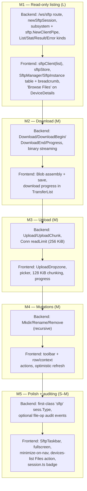

# 05 — Milestones & Delivery Plan

This document breaks the Web SFTP client feature into **five independently shippable
milestones (M1–M5)**. Each milestone lands a coherent, demoable slice of the feature
behind the same floating-window UI shell (mirroring the existing web terminal window
manager), so the console is never left in a half-wired state. Within every milestone the
work is ordered **backend-first, then frontend**, so the JSON file API described in
`02-protocol.md` exists and can be exercised (via a WebSocket smoke test) before the React
components that consume it are built. This plan is the scheduling/sequencing companion to
`03-backend.md` (backend detail) and `04-frontend.md` (frontend detail); it does not
restate their code, it references it.

## Scope / non-goals

- **In scope:** the milestone decomposition, per-milestone backend + frontend task
  checklists grounded in canonical spec §4 / §5, out-of-scope boundaries per milestone,
  acceptance criteria, human demo/verification steps, relative sizing, a PR breakdown,
  and a global Definition of Done.
- **Non-goals:** the wire protocol itself (see `02-protocol.md`), full backend handler
  code (see `03-backend.md`), full component/UX design (see `04-frontend.md`), the test
  matrix (see `07-testing.md`), and risk analysis (see `08-risks-and-open-questions.md`).
  Scope boundaries here are **LOCKED** by canonical spec §6 and must not drift.

---

## 1. Summary & scope

The feature ships as a **walking skeleton first, then capability layers**. Every milestone
is releasable on its own:

| Milestone | Theme | Ships | Size |
|-----------|-------|-------|------|
| **M1** | Read-only listing (walking skeleton) | `/ws/sftp` route, auth reuse, `sftp` subsystem + `*sftp.Client`, List/Stat, read-only file table + breadcrumb, "Browse Files" entry point | **L** |
| **M2** | Download | Binary-frame streaming download, progress, browser Blob assembly + save | **M** |
| **M3** | Upload | base64 chunked upload (128 KiB), larger `Conn` read limit, drag-drop + picker + progress | **M** |
| **M4** | Mutations | mkdir / rename / remove (recursive), toolbar + row actions, optimistic refresh | **M** |
| **M5** | Polish + auditing (optional) | first-class `"sftp"` session type, optional file-op audit events, taskbar/fullscreen/minimize-on-nav parity, devices-list row action | **S–M** |

The UI is a **floating window throughout** — never a full-page route or side drawer. M1
already renders `SftpManager` + `SftpInstance` in the fixed overlay (mirroring
`TerminalManager`/`TerminalInstance`); later milestones enrich the same window rather than
introducing new surfaces. Connector-mode devices are **gated out** of the entry points
from M1 onward, because `agent/server/modes/connector/sessioner.go:210-212`
(`Sessioner.SFTP`) returns `"SFTP isn't supported to ShellHub Agent in connector mode"`.

---

## 2. Dependency & ordering flowchart

Milestones are strictly linear in their hard dependencies (each builds on the prior
protocol + UI scaffold), and within each milestone the backend precedes the frontend.

> The `F(n) --> B(n+1)` edges denote "the prior milestone is fully merged before the next
> starts". They are the delivery order; they are **not** a claim that later backend work
> imports earlier frontend code.

---

## 3. Milestones in detail

### M1 — Read-only listing (walking skeleton) · size **L**

**Goal.** Prove the entire vertical slice end-to-end: a user opens a floating SFTP window
from a device, the browser authenticates exactly like the web terminal, the gateway opens
the `sftp` subsystem to the agent and drives a `github.com/pkg/sftp` client, and the window
renders a read-only directory listing with a working breadcrumb. This validates
**route + auth + subsystem + client + UI** in one shippable increment.

#### Backend tasks (grounds: canonical spec §4)

- [ ] `ssh/web/messages.go` — append the SFTP `messageKind` constants after
      `messageKindSession`. M1 needs `messageKindSftpList` (6), `messageKindSftpStat` (7),
      `messageKindSftpResult` (14), and `messageKindSftpError` (18); define the full 6–18
      block now so numeric values are locked once (see `02-protocol.md` §3.1).
- [ ] `ssh/go.mod` / `ssh/go.sum` — `require github.com/pkg/sftp v1.13.10`, reusing the
      exact version + `go.sum` entries already pinned in `agent/go.mod` (canonical spec §2).
- [ ] `ssh/web/errors.go` — add SFTP sentinel errors `ErrSubsystem`, `ErrSftpClient`,
      `ErrSftpOp`.
- [ ] `ssh/web/web.go` — add `const WebsocketSFTPBridgeRoute = "/ws/sftp"` and
      `NewSFTPServerBridge(router, cache)`. POST reuses the `Credentials` → RSA-encrypt →
      `token.NewToken` → `manager` flow **verbatim** from `NewSSHServerBridge`; GET upgrades
      the WebSocket, resolves credentials, and calls `newSftpSession(...)` with **no**
      `getDimensions` call (SFTP needs no `cols`/`rows`).
- [ ] `ssh/web/session.go` — add `newSftpSession(ctx, cache, conn, creds, info)`. Copy
      `newSession` (`ssh/web/session.go:146`) through the `session-uid@shellhub.io` relay
      block (`ssh/web/session.go:209-215`): reuse `getAuth`
      (`ssh/web/session.go:65`) + `Signer` (`ssh/web/session.go:110`), the
      `web-ip/` cache handoff (`ssh/web/session.go:169-175`), and the
      `ssh.Dial("tcp", "localhost:2222", …)` (`ssh/web/session.go:177`). Then, instead of
      `RequestPty`/`Shell` (`ssh/web/session.go:247-261`), take `agent.StdinPipe()` /
      `agent.StdoutPipe()`, call `sess.RequestSubsystem("sftp")`
      (available in `golang.org/x/crypto/ssh v0.53.0`), and
      `sftp.NewClientPipe(stdout, stdin)`; hand the client to the dispatch loop.
- [ ] `ssh/web/sftp.go` (**new**) — the dispatch loop: read `Message`s via
      `Conn.ReadMessage`, `switch message.Kind`, and implement handlers for
      `messageKindSftpList` (call `client.ReadDir(path)` → `[]FileEntry` → `messageKindSftpResult{op:"list"}`)
      and `messageKindSftpStat` (`client.Stat`/`Lstat` → `messageKindSftpResult{op:"stat"}`).
      Map per-op failures to `messageKindSftpError` with the echoed `requestId`. Owns the
      single `*sftp.Client`; tears it down on socket close.
- [ ] `ssh/web/conn.go` — extend `ReadMessage`'s `switch message.Kind` to accept inbound
      SFTP kinds 6–7 (M1 subset of 6–13); ensure the 4096-rune `messageKindInput` cap does
      **not** apply to SFTP kinds. (Full `readLimit` field arrives in M3.)

#### Frontend tasks (grounds: canonical spec §5)

- [ ] `components/sftp/sftpProtocol.ts` (**new**) — JS mirror of the `messageKind` enum
      (values 6–18) + parse helpers, reusing `WS_KIND` SIGNATURE/ERROR/SESSION semantics;
      do **not** duplicate terminal INPUT/RESIZE.
- [ ] `api/sftpClient.ts` (**new**) — connect (POST `/ws/sftp` → token → open
      `ws(s)://host/ws/sftp?token=TOKEN`), handle SIGNATURE/ERROR/SESSION lifecycle,
      promise surface keyed by `requestId` with `list` and `stat` implemented for M1.
- [ ] `stores/sftpStore.ts` (**new**) — Zustand store mirroring `stores/terminalStore.ts`
      (`open`/`minimize`/`restore`/`close`/`setConnectionStatus`/`requestConnect`, same
      credential fields), plus per-session `cwd` and a directory cache.
- [ ] `components/sftp/SftpManager.tsx` (**new**) — mirror `TerminalManager.tsx`: render one
      `SftpInstance` per session in the fixed overlay; wire `ConnectDrawer` to the connect
      target.
- [ ] `components/sftp/SftpInstance.tsx` (**new**) — token-fetch → WS-open →
      SIGNATURE/ERROR/SESSION lifecycle (fork of `TerminalInstance.tsx`), then a
      **read-only** `FileTable` + `Breadcrumb`. Replaces xterm entirely.
- [ ] `components/sftp/FileTable.tsx`, `components/sftp/Breadcrumb.tsx` (**new**) —
      presentational: table renders `FileEntry` rows (name/size/mode/mtime, dir-first
      sort); breadcrumb navigates `cwd` and re-issues `list`.
- [ ] `components/layout/AppLayout.tsx` — mount `<SftpManager sidebarOffset={sidebarOffset}/>`
      next to `<TerminalManager/>` (~line 98).
- [ ] `components/ConnectDrawer.tsx` — add `mode: "terminal" | "sftp"`; on SFTP mode call
      `sftpStore.open()`. Reuse all username/password/key/vault/passphrase collection.
- [ ] `pages/DeviceDetails.tsx` — add a **"Browse Files"** button beside "Connect", gated on
      `device.online` **AND** host mode (not connector); support `?sftp=true` auto-open
      mirroring `?connect=true`.

#### Out of scope for M1

Download, upload, any mutation (mkdir/rename/remove), the `Conn` `readLimit` field, the
`SftpTaskbar`/fullscreen/minimize-on-nav parity, the devices-list row action, first-class
`"sftp"` session typing, and auditing. Directory listing is **read-only** — no row actions.

#### Acceptance criteria

| Criterion | How to verify |
|-----------|---------------|
| `/ws/sftp` POST issues a token and GET upgrades the WS | `curl` the POST with valid `Credentials`, observe token; open WS with `?token=`, observe no immediate close |
| Password auth reused unchanged | Connect a password device; listing loads without a separate auth prompt |
| Public-key auth reused unchanged | Connect a pubkey device; browser answers the `messageKindSignature` challenge and listing loads |
| `sftp` subsystem opens against a host-mode agent | Backend logs show `RequestSubsystem("sftp")` success and `sftp.NewClientPipe` returns no error |
| `list` returns correct `FileEntry[]` | Compare window contents against `ssh <device> ls -la <path>` |
| Connector devices cannot open SFTP | "Browse Files" hidden/disabled on a connector device; forced connect surfaces the connector error gracefully |
| Per-op error path works | `list` a non-existent path → `messageKindSftpError` → window shows an inline error, socket stays open |

#### Demo / verification steps

1. Start the stack; register one **host-mode** agent and one **connector** agent.
2. Open the host device's **DeviceDetails**, click **Browse Files** → a floating window opens.
3. Confirm the listing of `$HOME` matches `ssh <device> ls -la`.
4. Click into a subdirectory via a row and via the breadcrumb; confirm both navigate.
5. Navigate to a path you lack permission for; confirm an inline error, window stays open.
6. Open the **connector** device's DeviceDetails; confirm **Browse Files** is hidden/disabled.
7. Close the window; confirm the WebSocket closes and the `*sftp.Client` is torn down (logs).

---

### M2 — Download · size **M**

**Goal.** Let the user download any file from the listing to their machine, streamed as
binary WebSocket frames with live progress, and validate the download transfer framing
(and empirically test the pre-0.9.3 exec-close truncation risk from
`08-risks-and-open-questions.md`).

#### Backend tasks (grounds: canonical spec §4)

- [ ] `ssh/web/sftp.go` — handle `messageKindSftpDownload` (11): `client.Open(path)`, reply
      `messageKindSftpDownloadBegin` (15) `{requestId, name, size, mode, mtime}`, then stream
      file bytes as **raw binary WS frames** via `Conn.WriteBinary` (**not** `redirToWs`,
      which trims UTF-8 — see `ssh/web/session.go:310-381`), using a **32 KiB** read buffer
      (matching `redirToWs`'s `buf [32*1024]byte` at `ssh/web/session.go:312`). Interleave
      `messageKindSftpProgress` (17) `{transferred, total, direction:"download"}` and finish
      with `messageKindSftpDownloadEnd` (16).
- [ ] `ssh/web/sftp.go` — enforce **one download in flight per WebSocket** (binary frames
      are untagged; see `02-protocol.md` §3.3); reject/queue a second concurrent download.
- [ ] `ssh/web/conn.go` — accept inbound `messageKindSftpDownload` (11) in the `ReadMessage`
      switch.

#### Frontend tasks (grounds: canonical spec §5)

- [ ] `api/sftpClient.ts` — add `download(path)`: demux **Blob** frames (bytes) vs JSON
      (Begin/Progress/End), assemble the Blob, and trigger a browser save
      (`URL.createObjectURL` + anchor click) named from `messageKindSftpDownloadBegin.name`.
      Serialize downloads client-side (only one in flight).
- [ ] `stores/sftpStore.ts` — add in-flight `transfers[]` state; append a download transfer
      and update it from `messageKindSftpProgress`.
- [ ] `components/sftp/TransferList.tsx` (**new**) — presentational progress list for active
      transfers (name, direction, transferred/total bar).
- [ ] `components/sftp/SftpInstance.tsx` — add a per-row **Download** action and mount
      `TransferList`.

#### Out of scope for M2

Upload (all kinds), mutations, concurrent multi-download per socket, resumable/partial
downloads, the `Conn` `readLimit` bump (only needed for large **inbound** upload chunks).

#### Acceptance criteria

| Criterion | How to verify |
|-----------|---------------|
| Small text file downloads byte-identical | `sha256sum` the downloaded file vs the source on the device |
| Large binary file downloads byte-identical | Download a ≥100 MB binary; compare `sha256sum` — catches the exec-close truncation risk |
| Progress reflects real bytes | Watch `TransferList` advance from 0 → total during a large download |
| Downloads serialize per socket | Trigger two downloads quickly; confirm the second waits, both complete intact |
| Binary path does not corrupt UTF-8/high bytes | Download a file with 0x80–0xFF bytes; verify no rune-trimming (proves `WriteBinary`, not `redirToWs`) |

#### Demo / verification steps

1. Open an SFTP window; download a small text file; `diff` against the source.
2. Create a ≥100 MB random binary on the device (`dd if=/dev/urandom …`); download it;
   compare `sha256sum`. This is the empirical exec-close-truncation check.
3. Start two downloads in quick succession; confirm serialization and both checksums match.
4. Download a file containing raw bytes 0x80–0xFF; confirm no corruption.

---

### M3 — Upload · size **M**

**Goal.** Let the user upload files into the current directory via drag-drop or a file
picker, chunked as base64-in-JSON with live progress.

#### Backend tasks (grounds: canonical spec §4)

- [ ] `ssh/web/conn.go` — add a per-`Conn` `readLimit` field + `NewConnWithLimit`
      constructor (default `ReadMessageBufferSize` = 16404; canonical spec §3.4). The
      `/ws/sftp` `Conn` uses a **larger limit (256 KiB)** so upload chunks fit; extend
      `ReadMessage` to accept inbound `messageKindSftpUpload` (12) and
      `messageKindSftpUploadChunk` (13); keep the 4096-rune cap off for SFTP kinds.
- [ ] `ssh/web/web.go` — construct the `/ws/sftp` `Conn` via `NewConnWithLimit(256 KiB)`.
- [ ] `ssh/web/sftp.go` — handle `messageKindSftpUpload` (12, begin): `client.Create(path)`;
      then N `messageKindSftpUploadChunk` (13): base64-decode `data`, write to the remote
      file, emit `messageKindSftpProgress` `{direction:"upload"}`; on `eof:true` close the
      file and ack with `messageKindSftpResult{op:"upload", ok:true}`. Errors →
      `messageKindSftpError`.

#### Frontend tasks (grounds: canonical spec §5)

- [ ] `api/sftpClient.ts` — add `upload(path, file)`: send `messageKindSftpUpload`, then
      stream **128 KiB raw** chunks (base64 ≈ 170 KB, under the 256 KiB envelope; canonical
      spec §3.4) as `messageKindSftpUploadChunk`, final chunk `eof:true`; resolve on the
      `messageKindSftpResult{op:"upload"}` ack.
- [ ] `stores/sftpStore.ts` — append upload transfers to `transfers[]`; update from progress.
- [ ] `components/sftp/UploadDropzone.tsx` (**new**) — drag-drop zone over the file table.
- [ ] `components/sftp/SftpInstance.tsx` — add a **file-picker** upload button, mount
      `UploadDropzone`, refresh the listing after each upload completes.

#### Out of scope for M3

Mutations (mkdir/rename/remove), folder/recursive upload, upload resume, parallel multi-file
throughput tuning beyond sequential chunking, first-class session typing, auditing.

#### Acceptance criteria

| Criterion | How to verify |
|-----------|---------------|
| Small file uploads byte-identical | `sha256sum` on device vs source |
| Large file uploads byte-identical | Upload ≥100 MB; compare `sha256sum` on the device |
| Chunk size respected | Inspect frames: raw chunk 128 KiB, envelope < 256 KiB |
| `readLimit` bump effective | Upload succeeds without a "message too large" `ReadMessage` error |
| Progress reflects real bytes | `TransferList` advances 0 → total during upload |
| Drag-drop and picker both work | Upload once via drag-drop, once via picker; both land |
| Listing refreshes post-upload | Uploaded file appears without a manual reload |

#### Demo / verification steps

1. Drag a small file into the window; confirm it appears in the listing and checksum matches.
2. Upload a ≥100 MB file via the picker; watch progress; compare `sha256sum` on the device.
3. Confirm no `ReadMessage` size errors in gateway logs (validates the 256 KiB `readLimit`).

---

### M4 — Mutations · size **M**

**Goal.** Let the user create directories, rename/move entries, and delete files and
directories (recursively), with the listing refreshing to reflect the change.

#### Backend tasks (grounds: canonical spec §4)

- [ ] `ssh/web/sftp.go` — handle `messageKindSftpMkdir` (8): `client.MkdirAll(path)` →
      `messageKindSftpResult{op:"mkdir"}`.
- [ ] `ssh/web/sftp.go` — handle `messageKindSftpRename` (9) `{from, to}`:
      `client.Rename(from, to)` → `messageKindSftpResult{op:"rename"}`.
- [ ] `ssh/web/sftp.go` — handle `messageKindSftpRemove` (10) `{path, recursive}`:
      `client.Remove(path)`, or a walk + `RemoveDirectory` when `recursive:true` →
      `messageKindSftpResult{op:"remove"}`. All failures → `messageKindSftpError`.
- [ ] `ssh/web/conn.go` — accept inbound `messageKindSftpMkdir`/`Rename`/`Remove` (8–10) in
      the `ReadMessage` switch (completes the inbound 6–13 range).

#### Frontend tasks (grounds: canonical spec §5)

- [ ] `api/sftpClient.ts` — add `mkdir(path)`, `rename(from, to)`, `remove(path, recursive)`.
- [ ] `components/sftp/SftpInstance.tsx` — add a **toolbar** (New Folder) and **row / context
      actions** (Rename, Delete); confirm-dialog for delete (recursive for directories);
      **optimistic refresh** of the listing, reverting on `messageKindSftpError`.

#### Out of scope for M4

First-class `"sftp"` session type, auditing events, `SftpTaskbar`/fullscreen/minimize-on-nav
parity, devices-list row action, chmod/chown/symlink creation, multi-select bulk ops.

#### Acceptance criteria

| Criterion | How to verify |
|-----------|---------------|
| mkdir creates a directory | New folder appears; confirm on device with `ls` |
| rename moves/renames | Rename a file; confirm old name gone, new present on device |
| remove deletes a file | Delete a file; confirm absent on device |
| recursive remove deletes a non-empty dir | Delete a populated directory; confirm gone on device |
| Optimistic refresh reverts on error | Delete a permission-denied path; UI reverts and shows `messageKindSftpError` |
| Errors stay scoped | A failed op shows an inline error; the window/socket survives |

#### Demo / verification steps

1. Create a new folder; verify with `ls` on the device.
2. Rename a file; verify old/new names on the device.
3. Delete a file, then a non-empty directory (recursive); verify both gone.
4. Attempt to delete a path you lack permission for; confirm the UI reverts and errors inline.

---

### M5 — Polish + first-class SFTP type + optional auditing · size **S–M**

**Goal.** Round off UX parity with the terminal window manager and (optionally) give SFTP a
first-class session identity plus a file-op audit trail; also remove the pre-0.9.3
exec-close truncation hack for SFTP.

#### Backend tasks (grounds: canonical spec §4 / §7)

- [ ] `ssh/server/channels/session.go` — split the shared
      `ExecRequestType, SubsystemRequestType` case so SFTP gets its own `sess.Type`. This
      mitigates the pre-0.9.3 `agent.Close()` truncation branch in
      `ssh/server/channels/utils.go` `pipe()` (canonical spec §4 gateway note, §7 risk 1).
- [ ] *(optional)* `ssh/web/sftp.go` — emit file-op audit events via `session.Event` /
      `EventSessionStream` (a **new** file-op event schema — the pty recorder is a no-op for
      SFTP; canonical spec §7 risk 5).

#### Frontend tasks (grounds: canonical spec §5)

- [ ] `components/sftp/SftpTaskbar.tsx` (**new**) — mirror `TerminalTaskbar.tsx` for SFTP
      windows.
- [ ] `components/sftp/SftpManager.tsx` — add `minimize`/`minimizeAll`/`restore`/
      `toggleFullscreen` parity and auto-minimize on route change (mirror `TerminalManager`).
- [ ] `stores/sftpStore.ts` — add `minimizeAll`/`toggleFullscreen`/`clearSensitiveData` to
      full parity with `terminalStore`.
- [ ] `pages/devices/index.tsx` — add a per-row **"Files"** action mirroring Connect (gated
      like DeviceDetails).
- [ ] *(optional)* `ui/apps/console/src/utils/session.ts` — surface the first-class `"sftp"`
      session type once the backend sets it (badge already renders `subsystem` → `sftp`,
      canonical spec §2).

#### Out of scope for M5

Any new file operation (chmod/chown/symlink), transfer resume, sandboxing/path-jail policy
(a separate decision — canonical spec §7 risk 3), billing changes (open question — §7 risk 6).

#### Acceptance criteria

| Criterion | How to verify |
|-----------|---------------|
| SFTP window has taskbar + minimize/restore/fullscreen parity | Exercise each control; behavior matches the terminal window |
| Auto-minimize on route change | Navigate away with a window open; it minimizes like the terminal |
| Devices-list "Files" action opens SFTP | Click "Files" on a host-mode row; window opens; hidden/disabled for connector |
| First-class `"sftp"` session type recorded | Open a session; confirm `models.Session.Type == "sftp"` and the badge renders |
| No transfer truncation vs any supported agent | Re-run the M2 large-download checksum against a pre-0.9.3 agent |
| *(if built)* Audit events recorded | Perform ops; confirm file-op events persisted/queryable |

#### Demo / verification steps

1. Open an SFTP window; minimize, restore, fullscreen, and open a second concurrent window.
2. Navigate to another route; confirm auto-minimize; navigate back; confirm restore.
3. From the **devices list**, click **Files** on a host-mode row; confirm host-mode only.
4. Inspect the session record; confirm `Type == "sftp"` and the badge.
5. *(if auditing built)* perform mkdir/upload/delete; confirm audit events.

---

## 4. Suggested PR breakdown

Land backend and frontend as **separate PRs per milestone** where practical, so the JSON API
merges and can be smoke-tested before its UI. Group files by the milestone that introduces
them.

| PR | Milestone | Files landing together |
|----|-----------|------------------------|
| **PR 1 — SFTP protocol + go.mod** | M1 | `ssh/web/messages.go` (kinds 6–18), `ssh/go.mod`, `ssh/go.sum`, `ssh/web/errors.go` |
| **PR 2 — Gateway SFTP session + dispatch (list/stat)** | M1 | `ssh/web/web.go` (`/ws/sftp` bridge), `ssh/web/session.go` (`newSftpSession`), `ssh/web/sftp.go` (loop + list/stat), `ssh/web/conn.go` (accept kinds 6–7) |
| **PR 3 — SFTP client + read-only UI** | M1 | `components/sftp/sftpProtocol.ts`, `api/sftpClient.ts`, `stores/sftpStore.ts`, `components/sftp/SftpManager.tsx`, `SftpInstance.tsx`, `FileTable.tsx`, `Breadcrumb.tsx`, `components/layout/AppLayout.tsx`, `components/ConnectDrawer.tsx`, `pages/DeviceDetails.tsx` |
| **PR 4 — Download (backend)** | M2 | `ssh/web/sftp.go` (download handlers), `ssh/web/conn.go` (accept kind 11) |
| **PR 5 — Download (frontend)** | M2 | `api/sftpClient.ts` (`download`), `stores/sftpStore.ts` (transfers), `components/sftp/TransferList.tsx`, `SftpInstance.tsx` |
| **PR 6 — Upload (backend)** | M3 | `ssh/web/conn.go` (`readLimit`/`NewConnWithLimit`, accept 12–13), `ssh/web/web.go` (256 KiB Conn), `ssh/web/sftp.go` (upload handlers) |
| **PR 7 — Upload (frontend)** | M3 | `api/sftpClient.ts` (`upload`), `stores/sftpStore.ts`, `components/sftp/UploadDropzone.tsx`, `SftpInstance.tsx` |
| **PR 8 — Mutations** | M4 | `ssh/web/sftp.go` (mkdir/rename/remove), `ssh/web/conn.go` (accept 8–10), `api/sftpClient.ts`, `components/sftp/SftpInstance.tsx` |
| **PR 9 — First-class SFTP type** | M5 | `ssh/server/channels/session.go`, `ui/apps/console/src/utils/session.ts` |
| **PR 10 — UI polish** | M5 | `components/sftp/SftpTaskbar.tsx`, `SftpManager.tsx`, `stores/sftpStore.ts`, `pages/devices/index.tsx` |
| **PR 11 — Auditing (optional)** | M5 | `ssh/web/sftp.go` (event emission) + any new event schema files |

---

## 5. Global Definition of Done

A milestone is **Done** only when every box below is checked (see `07-testing.md` for the
full test matrix and `08-risks-and-open-questions.md` for risk sign-off):

- [ ] **Tests** — Go unit tests for each new/changed handler in `ssh/web/sftp.go`; UI unit
      tests for `api/sftpClient.ts` demux/promise logic and `stores/sftpStore.ts`; an
      end-to-end WebSocket smoke test for the milestone's kinds (per `07-testing.md`).
- [ ] **Docs** — this doc, `02-protocol.md`, `03-backend.md`, and `04-frontend.md` updated if
      the milestone changed any locked name, value, or path; the `README.md` index reflects
      shipped scope.
- [ ] **Connector-gating** — connector devices are gated in every entry point the milestone
      touches (`pages/DeviceDetails.tsx`, `pages/devices/index.tsx`), and the server-side
      connector error (`agent/server/modes/connector/sessioner.go:210-212`) surfaces
      gracefully in the UI.
- [ ] **Error UX** — every per-op failure emits `messageKindSftpError` with the echoed
      `requestId` and renders inline without tearing down the window/socket; connection/auth
      failures continue to use `messageKindError` unchanged.
- [ ] **Auth reuse verified** — both password (RSA/magickey) and public-key
      (`messageKindSignature`) paths exercised for the milestone.
- [ ] **Lint/build green** — `ssh/` Go lint + build and the console UI lint/typecheck/build
      pass.
- [ ] **Manual demo** — the milestone's Demo / verification steps executed against a live
      host-mode agent and a connector agent.

---

## 6. Cross-references

- `02-protocol.md` — wire protocol, `messageKind` values, transfer framing rules.
- `03-backend.md` — full gateway implementation plan and code sketches for `ssh/web/sftp.go`,
  `newSftpSession`, and the `Conn` changes.
- `04-frontend.md` — full component/UX plan for `api/sftpClient.ts`, `sftpStore`, and the
  `components/sftp/*` windows.
- `07-testing.md` — Go + UI + e2e test strategy mapped to each milestone.
- `08-risks-and-open-questions.md` — exec-close truncation (verified in M2/M5), upload
  throughput, path-jail policy, connector gating, recording/auditing, and billing.
