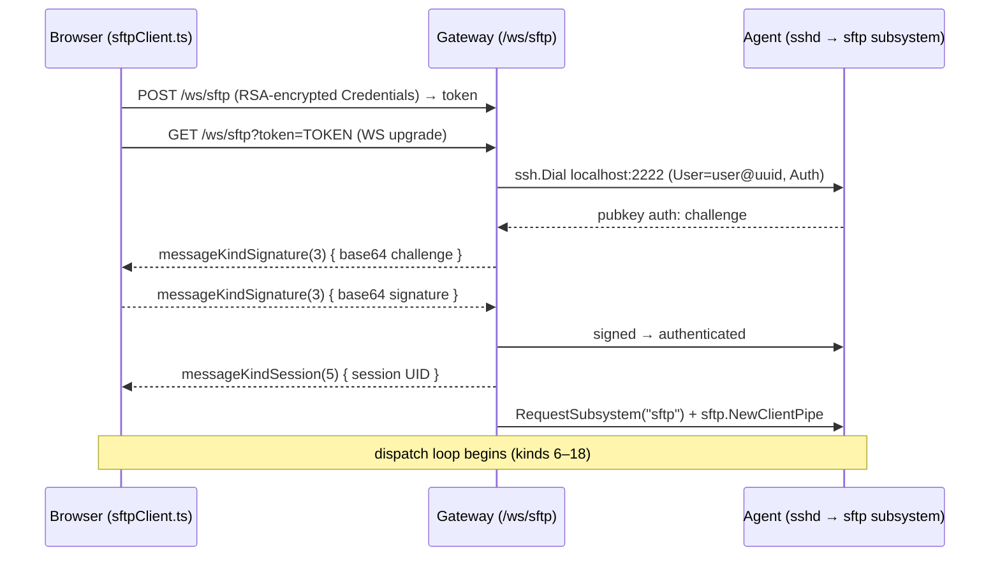
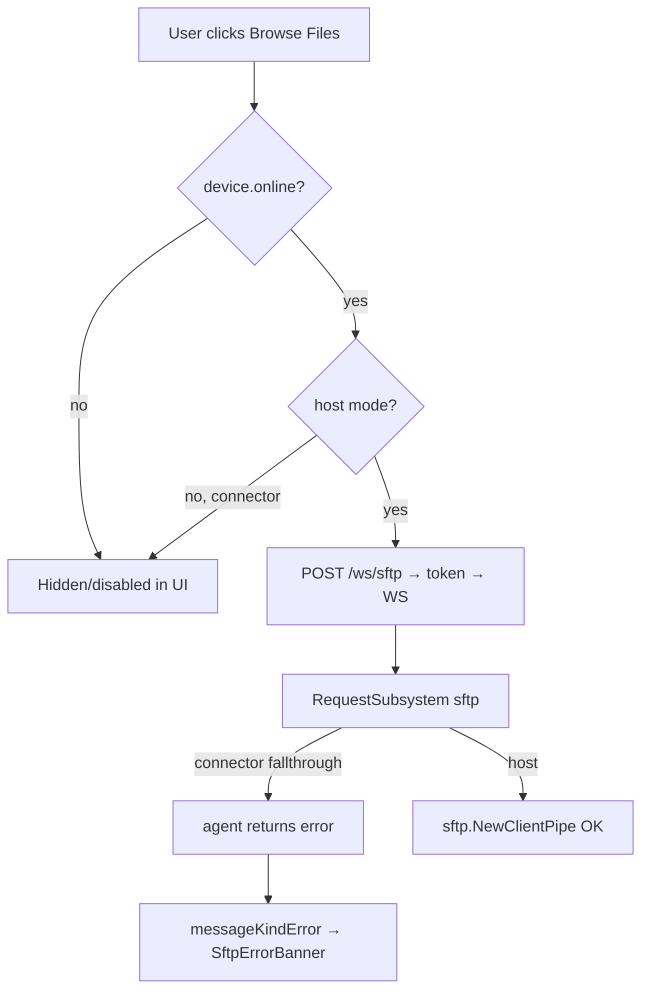

# 06 — Security, Authorization & Session Model

This document specifies the security posture of the Web SFTP client: how it
**reuses the terminal path's authentication and authorization verbatim**, what
sandboxing the agent does (and does not) provide, how connector-mode devices are
gated, how the SFTP session is typed and recorded in the session model, and the
open billing/license question. The guiding principle is that `/ws/sftp` is a
sibling of `/ws/ssh` that opens the **same** SSH connection to the **same** agent
and merely requests the `sftp` subsystem instead of a PTY + shell — so every
credential, ACL, firewall, and billing gate the terminal already enforces applies
unchanged. New security surface is limited to (a) the JSON file-operation dispatch
loop and (b) optional first-class session typing / audit events.

## Scope / non-goals

- **In scope:** auth reuse (password + public-key), ACL evaluation, agent-side
  filesystem sandboxing and its limits, connector-mode gating, the optional
  first-class `"sftp"` session type, session recording behavior for pty-less
  sessions, an optional file-transfer audit event schema, and the billing/license
  question.
- **Non-goals:** the wire protocol (see `02-protocol.md`), backend handler code
  (see `03-backend.md`), frontend gating UX detail (see `04-frontend.md`), and the
  consolidated risk register (see `08-risks-and-open-questions.md`). This document
  states security decisions and recommended defaults; it does not re-derive the
  transport design.

---

## 1. Summary

The SFTP feature introduces **no new authentication, credential storage, or
transport-trust mechanism**. `/ws/sftp` reuses the exact broker flow that
`/ws/ssh` uses: the browser POSTs RSA-encrypted `Credentials`, receives a JWT
token, and upgrades a WebSocket; the gateway resolves the credentials, dials
`localhost:2222` with the same `getAuth`/`Signer` machinery, and then — instead of
`RequestPty` + `Shell` — issues `RequestSubsystem("sftp")` and wraps the piped
channel in a `github.com/pkg/sftp` **client**. Because the underlying SSH
connection is identical, all existing gates fire: firewall rules, public-key ACLs
(`EvaluateKey`), billing, and license (`ssh/session/session.go:609` `Evaluate`).
The only genuinely new security considerations are: SFTP has **no PTY**, so
asciinema recording is a structural no-op (safe); the agent runs the SFTP server
with **no path jail** (identical exposure to native SFTP today); and connector
(container) devices reject SFTP at the agent, which the UI must gate.

---

## 2. Authentication reuse

`/ws/sftp` MUST reuse the terminal broker and credential path with zero
divergence. The relevant code, all in `ssh/web/`, is shared:

| Concern | Reused component | Location |
|---|---|---|
| Credential envelope (RSA-encrypted) | `Credentials`, encrypt/decrypt | `ssh/web/utils.go` |
| Token minting / TTL store | `token.NewToken`, `manager` | `ssh/web/pkg/token`, `ssh/web/manager.go` |
| RSA reference key | `magickey.GetReference` | `ssh/pkg/magickey` |
| Auth method selection | `getAuth` | `ssh/web/session.go:65` |
| Public-key challenge relay | `Signer` | `ssh/web/session.go:110` |
| Session-UID relay | `session-uid@shellhub.io` request | `ssh/web/session.go:211` |

`newSftpSession` (new, `ssh/web/session.go` per `03-backend.md`) copies
`newSession` (`ssh/web/session.go:146`) up to and including the
`session-uid@shellhub.io` relay at `ssh/web/session.go:211`, then diverges: it does
**not** call `RequestPty` (`ssh/web/session.go:247`) or `Shell`
(`ssh/web/session.go:257`); it calls `sess.RequestSubsystem("sftp")` and
`sftp.NewClientPipe(stdout, stdin)`.

### 2.1 Password authentication

When `creds.isPassword()` is true, `getAuth` returns a single
`ssh.Password(creds.Password)` method (`ssh/web/session.go:66-68`). The password
arrives already RSA-encrypted from the browser and is decrypted with the magickey
reference before this point (unchanged from the terminal path). No SFTP-specific
change is required — the same `ssh.ClientConfig.Auth` is handed to `ssh.Dial`
(`ssh/web/session.go:177`).

### 2.2 Public-key authentication (browser-relayed `Signer`)

The private key never leaves the browser. `getAuth` builds a `Signer`
(`ssh/web/session.go:102-107`) whose `Sign` method
(`ssh/web/session.go:119-144`) base64-encodes the SSH challenge, sends it to the
browser as `messageKindSignature` (value `3`, LOCKED — see `02-protocol.md`),
blocks on `conn.ReadMessage`, and returns the browser-produced signature blob.
This is a **synchronous request/response over the same WebSocket** the file
operations use. Two consequences the SFTP dispatch loop must respect:

1. The signature exchange happens **during `ssh.Dial`, before** the dispatch loop
   starts reading SFTP messages. There is no interleaving with file ops.
2. `messageKindSignature` (`3`) and `messageKindError` (`4`) keep their numeric
   values (LOCKED). `ssh/web/conn.go`'s inbound `switch message.Kind` must
   continue to accept kind `3` on the `/ws/sftp` `Conn` so the challenge response
   is decoded — this is already true and must not regress when adding kinds 6–13.



The password flow is identical minus the two `messageKindSignature` frames.

---

## 3. Authorization / ACL

### 3.1 How the terminal path evaluates access

Public-key authorization is enforced in `getAuth` at `ssh/web/session.go:88`:

```go
// Trys to evaluate the public key from the API.
ok, err := cli.EvaluateKey(ctx, creds.Fingerprint, device, creds.Username)
if err != nil {
    return nil, ErrEvaluatePublicKey
}
if !ok {
    return nil, ErrForbiddenPublicKey
}
```

`EvaluateKey` checks the public-key ACL (fingerprint + target device + target
username) server-side; a `false` result rejects the connection with
`ErrForbiddenPublicKey` **before** `ssh.Dial` is attempted. Because
`newSftpSession` reuses `getAuth` verbatim, **the identical ACL check runs for
SFTP** — no additional wiring is required for public-key devices.

Beyond `getAuth`, the shared gateway path applies further gates on the SSH
connection itself (all in `ssh/session/session.go`, invoked from the terminal
`Auth`/`Evaluate` flow and equally applicable to the subsystem connection the
SFTP bridge opens):

| Gate | Function | Location | Applies to SFTP? |
|---|---|---|---|
| Firewall rule | `checkFirewall` | `ssh/session/session.go:395` | Yes (same SSH conn) |
| Public-key ACL | `EvaluateKey` | `ssh/web/session.go:88` | Yes (reused `getAuth`) |
| Billing (cloud) | `checkBilling` | `ssh/session/session.go:426` | Yes — see §8 |
| License (enterprise) | `checkLicense` | `ssh/session/session.go:591` | Yes — see §8 |

Password auth performs **no gateway-side ACL** in `getAuth`
(`ssh/web/session.go:66-68`); it is delegated to the agent's OS-level
authentication (PAM/`osauth`) exactly as native SSH password auth is. SFTP
inherits this unchanged.

### 3.2 Open question — does SFTP warrant a distinct permission?

The codebase today has **no `device:sftp` or read-vs-write scope** — access is
binary: whatever can open a shell can open the SFTP subsystem, because both are
just channels/requests on the same authenticated SSH connection (the agent's
`SubsystemHandlers{"sftp": ...}` registration is unconditional per the canonical
spec §2). A native SSH client with valid credentials can already `sftp` into the
device today; the web client does not widen this.

**Recommended default (ship this):** do **not** introduce a new permission for
M1–M4. Rationale:

1. It matches the existing native-SFTP reality — adding a web-only gate would be
   security theater (a native client bypasses it).
2. It keeps `newSftpSession` a faithful copy of `newSession` with no new API
   surface, honoring canonical-spec decision #6 ("Auth is reused verbatim").

**Future option (defer to a follow-up, note in `08-risks-and-open-questions.md`):**
if per-namespace policy demands it, add a namespace setting such as
`Settings.SFTP: "disabled" | "read-only" | "read-write"` evaluated at
`newSftpSession` entry (reject with a `messageKindError`) and, for read-only,
enforced defensively at the agent via `pkg/sftp` `ServerOption`s (see §4.2). A
per-public-key `read`/`write` scope is a larger ACL-model change and is explicitly
out of scope for this feature.

---

## 4. Sandboxing & filesystem permissions

### 4.1 What the agent does today

`agent/sftp.go` `NewSFTPServer` (`agent/sftp.go:36`) constructs the in-process
SFTP server after dropping privileges to the target OS user:

```go
// agent/sftp.go:39-100 (condensed)
if mode == command.SFTPServerModeDocker {
    if err := syscall.Chroot("/host"); err != nil { ... }   // docker builds only
}
// ... reads HOME, GID, UID from env ...
syscall.Chdir(home)   // agent/sftp.go:77
syscall.Setgid(gid)   // agent/sftp.go:83
syscall.Setuid(uid)   // agent/sftp.go:89

server, err := sftp.NewServer(piped, []sftp.ServerOption{}...)  // agent/sftp.go:95
```

Key facts, load-bearing for the security model:

- **`ServerOption` slice is empty** (`agent/sftp.go:95`). There is **no path
  jail**, **no read-only mode**, and **no working-directory restriction** at the
  SFTP layer. `chdir(HOME)` sets the initial CWD but does **not** confine the
  session — an authenticated user can `cd /` and traverse the entire filesystem.
- **Authorization = Unix permissions.** After `Setuid`/`Setgid`, every file
  operation is subject to the target user's kernel-enforced permissions. The SFTP
  server holds no additional policy.
- **`chroot("/host")` applies only to docker-mode builds** (`agent/sftp.go:39-44`).
  On a bare-metal/host-mode agent there is **no chroot** — the filesystem view is
  the real root.

**This is the same exposure as native SSH SFTP today.** The web client changes the
*transport* (gateway-side Go client → JSON to browser) but not the *authority*: it
cannot access anything a native `sftp user@device` session couldn't. The web
client MUST NOT assume any sandboxing — path validation and confinement, if
desired, are policy decisions that belong at the agent.

### 4.2 Optional hardening (policy decision — do not ship silently)

`pkg/sftp` `NewServer` accepts `ServerOption`s that could tighten the agent. These
are **agent-side** changes to `agent/sftp.go:95` and are a namespace/product
policy call, not a requirement of this feature:

| Option | Effect | Trade-off |
|---|---|---|
| `sftp.ReadOnly()` | Rejects all write/create/remove/rename ops | Breaks upload/mkdir/rename/delete (M3/M4); only viable behind a "read-only" policy |
| `sftp.WithServerWorkingDirectory(home)` | Sets initial CWD (cosmetic; not a jail) | Does not confine traversal |

A **true** working-dir jail requires a `chroot`-style confinement (as docker mode
already does via `syscall.Chroot`) or a custom `sftp.Handlers` implementation that
validates every path against an allowed prefix — neither exists today. Flag any
such work as a distinct hardening initiative in `08-risks-and-open-questions.md`;
the default for this feature is **parity with native SFTP (no jail)**.

---

## 5. Connector-mode gating

Container devices running in connector mode **reject SFTP at the agent**.
`agent/server/modes/connector/sessioner.go:210` returns an error:

```go
// SFTP handles the SSH's server sftp session when server is running in connector mode.
func (s *Sessioner) SFTP(_ gliderssh.Session) error {
    return errors.New("SFTP isn't supported to ShellHub Agent in connector mode")
}
```

### 5.1 Server-side behavior

When the browser targets a connector device, `newSftpSession` will successfully
authenticate and reach `sess.RequestSubsystem("sftp")`, but the agent's connector
`Sessioner.SFTP` returns the error above, so the subsystem request fails. The
gateway must surface this as a `messageKindError` (kind `4`, LOCKED) — or, once the
dispatch loop is running, a `messageKindSftpError` (kind `18`) — using a sentinel
such as `ErrSubsystem` (`ssh/web/errors.go`, per `03-backend.md`). The bridge
should not crash or leak the raw agent string; map it to a stable, user-facing
"SFTP is not supported on container (connector) devices" message.

### 5.2 Required UI gating

Per canonical-spec §5 and `04-frontend.md`, the UI MUST proactively gate rather
than rely solely on the runtime error:

- `pages/DeviceDetails.tsx` — show **"Browse Files"** only when `device.online`
  **AND** the device is host-mode (not connector).
- `pages/devices/index.tsx` — hide/disable the per-row **"Files"** action for
  connector devices.
- If a connector device is reached anyway (race, stale UI), the `SftpInstance`
  must render the mapped error gracefully via the `SftpErrorBanner` analogue and
  close the socket — never hang.



---

## 6. Session model & typing

### 6.1 Current behavior (free-form `Type`, collapsed subsystem)

`models.Session.Type` is a **free-form string** (`pkg/models/session.go:25`):

```go
Type string `json:"type"`
```

In the gateway session channel, both `exec` and `subsystem` requests are handled
by a **single case** that collapses the connection type to `exec`
(`ssh/server/channels/session.go:282-285`):

```go
case ExecRequestType, SubsystemRequestType:
    session.Event[models.SSHCommand](sess, req.Type, req.Payload, seat)

    sess.Type = ExecRequestType
```

Two things happen here:

1. **The event type is recorded faithfully** as `req.Type` — for an SFTP
   subsystem that is the string `"subsystem"`, which flows to
   `models.SessionEvent.Type` and is aggregated into `SessionEvents.Types`
   (`pkg/models/session.go:80,105`). The constant
   `SessionEventTypeSubsystem = "subsystem"` already exists
   (`pkg/models/session.go:80`).
2. **The session-level `Type` is flattened to `"exec"`** — SFTP is
   indistinguishable from exec at the `Session.Type` field level.

The UI compensates by inspecting the **event types**, not `Session.Type`:
`ui/apps/console/src/utils/session.ts:7-11` badges any session whose events
include `"subsystem"` as `sftp`:

```ts
if (types.includes("subsystem"))
  return { label: "sftp", color: "text-accent-cyan bg-accent-cyan/10 border-accent-cyan/20" };
```

So today's badge is **correct but indirect** — it infers "sftp" from the presence
of a subsystem event, which is fine because the only subsystem ShellHub speaks is
`sftp`. Per canonical-spec decision #7, this means **no API schema migration is
required** to ship M1–M4.

### 6.2 Optional first-class `"sftp"` type (M5 refinement)

Canonical-spec §6 (M5) makes a first-class type **optional**. If adopted, the
exact touch points are:

| # | File | Change |
|---|---|---|
| 1 | `ssh/server/channels/session.go` | Add a `SftpRequestType = "sftp"` constant alongside the request-type block (`ssh/server/channels/session.go:19-65`). |
| 2 | `ssh/server/channels/session.go:282-285` | In the `SubsystemRequestType` arm, unmarshal `models.SSHSubsystem` (`pkg/models/ssh.go:7-9`) and, when `.Subsystem == "sftp"`, set `sess.Type = SftpRequestType` instead of `ExecRequestType`. |
| 3 | `pkg/models/session.go` | (Optional) Add `SessionEventTypeSftp` if a dedicated event type is wanted; not strictly required since `Session.Type` alone can carry it. |
| 4 | `ui/apps/console/src/utils/session.ts:3-23` | Prefer `session.type === "sftp"` before the `types.includes("subsystem")` fallback, so the badge is driven by the first-class field with the event-type check as backward-compatible fallback. |

Sketch of touch point #2 (grounded in `ssh/server/channels/session.go:282` and
`pkg/models/ssh.go:7`):

```go
case ExecRequestType, SubsystemRequestType:
    session.Event[models.SSHCommand](sess, req.Type, req.Payload, seat)

    if req.Type == SubsystemRequestType {
        var sub models.SSHSubsystem
        if err := gossh.Unmarshal(req.Payload, &sub); err == nil && sub.Subsystem == "sftp" {
            sess.Type = SftpRequestType
            break
        }
    }

    sess.Type = ExecRequestType
```

### 6.3 Why the first-class type also mitigates the exec-close hack

Setting `sess.Type = ExecRequestType` for subsystems is what activates the
legacy agent-close branch in `pipe()`
(`ssh/server/channels/utils.go:128-139`):

```go
if ver.LessThan(semver.MustParse("v0.9.3")) && sess.Type == ExecRequestType {
    agent.Close()          // may truncate an in-flight SFTP transfer
} else {
    agent.CloseWrite()
}
```

Because SFTP currently reports `sess.Type == ExecRequestType`, a transfer against a
pre-0.9.3 agent takes the `agent.Close()` path — a hard close that can truncate the
last bytes rather than a graceful `CloseWrite()`. Giving SFTP its own
`SftpRequestType` makes the `sess.Type == ExecRequestType` guard false, so SFTP
always takes `agent.CloseWrite()`. This is why M5's first-class type is coupled to
Risk #1 in `08-risks-and-open-questions.md` — verify empirically during M2
(download) as the canonical spec directs.

> Note: the inline comment at `ssh/server/channels/utils.go:128-129` says "less
> than v0.9.2", but the actual guard checks `v0.9.3`
> (`ssh/server/channels/utils.go:132`). Cite the code (`v0.9.3`), not the stale
> comment.

---

## 7. Session recording & auditing

### 7.1 Recording is PTY-gated → a safe no-op for SFTP

ShellHub's asciinema recording is wired through `pipe()` and gated on the seat
having a PTY at three independent points, all of which **short-circuit for a
pty-less SFTP session**:

| Stage | Guard | Location |
|---|---|---|
| Recorder attach | Recorder is only added on Enterprise/Cloud **and** `sess.Recorded(seat)` succeeds | `ssh/server/channels/utils.go:91-110` |
| `Recorded()` flag | Returns an error unless `seat.HasPty` | `ssh/session/session.go:494-496` |
| Asciinema save on finish | `SaveSession` runs only `if seat.HasPty` | `ssh/session/session.go:808` |

`Recorded()` explicitly rejects a pty-less seat:

```go
// ssh/session/session.go:494
if seat, ok := s.Seats.Get(seat); !ok || !seat.HasPty {
    return errors.New("session won't be recorded because there is no pty")
}
```

Because `newSftpSession` never issues a `pty-req` (it skips
`ssh/web/session.go:247`), the seat's `HasPty` stays `false` (default from
`Seats.NewSeat`, `ssh/session/session.go:199`). Consequently:

- `Recorded(seat)` returns an error → the recorder is set to `nil` →
  `pipe()` does not append the pty recorder (`ssh/server/channels/utils.go:104-110`).
- `Finish()` skips `SaveSession` (`ssh/session/session.go:808`).

So **no SFTP file bytes are ever written to the asciinema recording stream** — the
pty recorder is structurally inapplicable, not merely unused. This is the desired
behavior: raw file contents must not leak into terminal recordings.

### 7.2 If a file-transfer audit trail is required — a NEW event schema

The pty recorder is the wrong tool for auditing SFTP (it records terminal frames,
not file operations, and is PTY-gated off). If auditing is required, emit
**structured file-operation events** from the **gateway SFTP dispatch loop**
(`ssh/web/sftp.go`, per `03-backend.md`), reusing the existing event transport —
`session.Event` / `session.Event[D]` (`ssh/session/session.go:696,712`) writing to
`EventSessionStream` (`ssh/session/session.go:315`). This is a **new schema**, not
a reuse of `PtyOutputEventType`.

Proposed event types (mirroring the `SessionEventType` constant style at
`pkg/models/session.go:63-86`):

| Constant | Value | Data payload |
|---|---|---|
| `SessionEventTypeSftpOpen` | `sftp-open` | `{ path, flags }` |
| `SessionEventTypeSftpRead` | `sftp-read` | `{ path, bytes }` (download) |
| `SessionEventTypeSftpWrite` | `sftp-write` | `{ path, bytes }` (upload) |
| `SessionEventTypeSftpRename` | `sftp-rename` | `{ from, to }` |
| `SessionEventTypeSftpRemove` | `sftp-remove` | `{ path, recursive }` |
| `SessionEventTypeSftpMkdir` | `sftp-mkdir` | `{ path }` |

Emission sketch, called from each op handler in the dispatch loop (the
gateway-side `*sftp.Client` is per-WebSocket, so the loop knows the session):

```go
// in ssh/web/sftp.go, after a successful op:
sess.Event("sftp-rename", models.SSHSftpRename{From: from, To: to}, seat)
```

Notes:

- The gateway-side `Conn` (`ssh/web/`) does not itself hold a `*session.Session`;
  the event stream lives on the SSH-server side (`ssh/session`). Auditing at this
  granularity therefore requires the dispatch loop to have access to an event sink.
  If that plumbing is undesirable, an alternative is to emit a single coarse
  `subsystem`/`sftp` session-level event (already happens via
  `ssh/server/channels/session.go:283`) and treat per-file auditing as
  out-of-scope. **Recommended default:** ship without per-file auditing (M1–M4);
  design the schema above as an M5/enterprise opt-in and record the plumbing cost
  in `08-risks-and-open-questions.md`.
- Do **not** route file bytes through events — audit metadata only (path, size,
  op), never payloads.

---

## 8. Billing / license

Both billing and license are evaluated on the shared SSH connection via
`Evaluate` (`ssh/session/session.go:609`):

```go
func (s *Session) Evaluate(ctx gliderssh.Context) error {
    if envs.IsEnterprise() && !envs.IsCloud() {
        if ok, err := s.checkLicense(ctx); err != nil || !ok { return err }   // :612
    }
    if envs.IsEnterprise() || envs.IsCloud() {
        if ok, err := s.checkFirewall(ctx); err != nil || !ok { return err }  // :621
    }
    if envs.IsCloud() {
        if ok, err := s.checkBilling(ctx); err != nil || !ok { return err }   // :627
    }
    ...
}
```

`checkBilling` (`ssh/session/session.go:426`) gates on
`BillingEvaluate(...).CanConnect` (`ssh/session/session.go:437-449`); `checkLicense`
(`ssh/session/session.go:591`) gates on `LicenseEvaluate(...).CanConnect`. Because
the SFTP bridge opens the **same** authenticated SSH connection through the same
`Auth`/`Evaluate` flow, **an SFTP session is billed and license-checked exactly
like a shell connect today** — one `CanConnect` consumption per connection.

**Open question (carry to `08-risks-and-open-questions.md`):** *Should an SFTP
session count as a billable "connect" identically to a shell?* Arguments:

- **Bill identically (recommended default):** it is a real, resource-consuming
  connection to the device; treating it differently would require a new
  billing dimension and a way for the billing service to distinguish SFTP at
  `BillingEvaluate` time (which currently receives only `TenantID`,
  `ssh/session/session.go:437`). Simplicity + parity with native SFTP argue for
  identical billing.
- **Bill differently:** if product wants "file transfer" priced/limited separately
  from "interactive shell", the billing API would need an SFTP-aware signal. This
  is a billing-service change beyond this feature's scope.

Recommended default: **bill identically**; flag any divergence as a product/billing
decision, not an SFTP-feature decision.

---

## 9. Cross-references

- `03-backend.md` — `newSftpSession`, the `/ws/sftp` bridge, `ssh/web/sftp.go`
  dispatch loop, and sentinel errors referenced throughout this document.
- `08-risks-and-open-questions.md` — consolidated register for: the exec-close
  truncation hack (§6.3), no-path-jail exposure (§4), the distinct-SFTP-permission
  question (§3.2), the per-file audit plumbing cost (§7.2), and the
  SFTP-billing-parity question (§8).
- `02-protocol.md` — `messageKindSignature` (3), `messageKindError` (4),
  `messageKindSession` (5), and `messageKindSftpError` (18) referenced in §2 and §5.
- `04-frontend.md` — the connector-mode UI gating (§5.2) in full UX detail.
