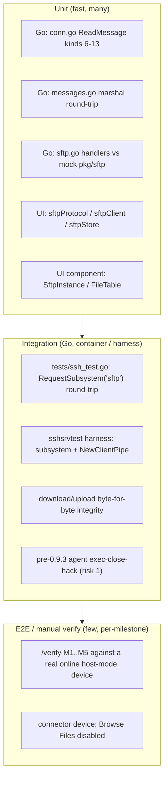

# 07 — Testing Strategy

This document defines the test strategy for the visual Web SFTP client. It mirrors the
conventions already present in the repository: **table-driven Go unit tests** with
`testify` and `mockery`-generated mocks under `ssh/web/mocks` (see `ssh/web/conn_test.go`,
`ssh/web/session_test.go`), **container-backed integration tests** driven from
`tests/ssh_test.go` (an end-to-end `docker-compose` + agent-in-`testcontainers` harness),
and **vitest + `@testing-library/react`** on the UI (see
`ui/apps/console/src/components/terminal/terminalErrors.test.ts`). Every new test named
here maps to a message kind, file, or milestone defined in the canonical spec and the
sibling docs. The wire protocol under test is the one in `02-protocol.md`; the backend
under test is in `03-backend.md`; the frontend under test is in `04-frontend.md`; the
milestone gates the tests certify are in `05-milestones.md`.

## Scope / non-goals

**In scope:** unit tests for the new `messageKind` constants (values 6–18) and their
`Conn.ReadMessage` decoding; `ssh/web/sftp.go` op handlers against a mock / in-memory
`pkg/sftp` server; integration of `RequestSubsystem("sftp")` + `sftp.NewClientPipe`
end-to-end; the frontend `sftpClient`/`sftpProtocol`/`sftpStore`/components; and per-
milestone manual verification steps mirroring the repo `/verify` approach.

**Non-goals:** re-testing the agent SFTP server (`agent/sftp.go`, already covered by the
`connection SFTP …` cases in `tests/ssh_test.go`), re-testing auth/token/`magickey`
(reused verbatim — see `06-security-and-sessions.md`), performance/load benchmarking
beyond the byte-integrity and throughput smoke checks called out below, and pty session
recording (asciinema no-ops for SFTP — risk 5 in `08-risks-and-open-questions.md`).

---

## 1. Test-pyramid overview



| Layer | Runner | Location | Speed | Count |
|-------|--------|----------|-------|-------|
| Go unit | `go test` + `testify`/`mockery` | `ssh/web/*_test.go` | ms | many |
| UI unit | `vitest run` | `ui/apps/console/src/**/*.test.ts` | ms | many |
| UI component | `vitest` + `@testing-library/react` | `ui/apps/console/src/components/sftp/*.test.tsx` | ms–s | some |
| Go integration | `go test ./tests` (`testcontainers` + `docker-compose.test.yml`) | `tests/ssh_test.go` | min | few |
| E2E / manual | `/verify` per milestone | browser vs live device | manual | per-milestone |

---

## 2. Backend Go unit tests

All new backend unit tests live in package `web` alongside the code under test, follow the
existing table-driven shape (a `tests := []struct{ description; requiredMocks; expect }`
slice iterated with `t.Run`), and use `mocks.MockSocket` (`ssh/web/mocks/mock_socket.go`)
as the `Socket`. Model them directly on `TestConnReadMessage_input` /
`TestConnReadMessage_resize` (`ssh/web/conn_test.go:13`, `:91`).

### 2.1 `conn.go` `ReadMessage` — new SFTP kinds

Today `ReadMessage` (`ssh/web/conn.go:67`) decodes into a `json.RawMessage`, switches on
`message.Kind` (`ssh/web/conn.go:80`), and returns `ErrConnReadMessageKindInvalid`
(`ssh/web/errors.go:42`) in the `default` branch — so kinds 6–13 are **rejected today** and
the tests below are red until `03-backend.md`'s `conn.go` changes land (add `readLimit` +
`NewConnWithLimit`, extend the switch with the inbound SFTP kinds, skip the 4096-rune cap).
The 4096-rune cap currently lives only in the `messageKindInput` branch
(`ssh/web/conn.go:90`, `ErrConnReadMessageInputTooLong` at `errors.go:44`).

Add `ssh/web/conn_sftp_test.go` (new) with a table `TestConnReadMessage_sftp`:

| # | Case | Setup (mock `Read`) | Expected |
|---|------|---------------------|----------|
| 1 | valid `messageKindSftpList` (6) | marshal `Message{Kind:6, Data: SftpListRequest{RequestID:"r1", Path:"/etc"}}` | `Kind==6`, decoded `Data`, `err==nil` |
| 2 | valid `messageKindSftpUploadChunk` (13) | marshal a chunk with base64 `data` + `eof:true` | `Kind==13`, `err==nil` |
| 3 | malformed JSON body | `Read` returns 512 bytes of non-object garbage | `read==0`, `errors.Is(err, ErrConnReadMessageJSONInvalid)` |
| 4 | malformed inner payload (kind ok, `data` not an object) | `Message{Kind:6, Data:"not-an-object"}` | `errors.Is(err, ErrConnReadMessageJSONInvalid)` |
| 5 | oversized chunk within the SFTP `readLimit` | 170 KB base64 chunk via `NewConnWithLimit(sock, 256*1024)` | `err==nil` (must NOT be truncated by the old 16404 `ReadMessageBufferSize`) |
| 6 | oversized chunk **exceeding** `readLimit` | chunk > 256 KiB via a limited conn | decode fails → `errors.Is(err, ErrConnReadMessageJSONInvalid)` |
| 7 | 4096-rune cap MUST NOT apply to SFTP | `messageKindSftpUpload` payload with a `path`/`data` >4096 runes | `err==nil` (contrast with case 8) |
| 8 | 4096-rune cap STILL applies to input | `messageKindInput` string >4096 runes | `errors.Is(err, ErrConnReadMessageInputTooLong)` (regression guard) |

Case 5/6 are the load-bearing ones: they encode the LOCKED "the 4096-rune input cap MUST
NOT apply to SFTP kinds" and "the `/ws/sftp` `Conn` uses a larger limit (256 KiB)" rules
from `02-protocol.md` §3.4. Because `ReadMessage` wraps the socket in
`io.LimitReader(c.Socket, ReadMessageBufferSize)` (`conn.go:68`), the test for case 5 must
exercise the new `readLimit` field rather than the hard-coded constant — assert that a
`Conn` built with `NewConn` (default limit) rejects the 170 KB chunk while one built with
`NewConnWithLimit(sock, 256*1024)` accepts it.

```go
// ssh/web/conn_sftp_test.go (sketch — mirrors conn_test.go:53-74)
func TestConnReadMessage_sftpListValid(t *testing.T) {
    socket := new(mocks.MockSocket)
    conn := NewConnWithLimit(socket, 256*1024) // new ctor from 03-backend.md

    payload, _ := json.Marshal(Message{
        Kind: messageKindSftpList, // 6
        Data: SftpListRequest{RequestID: "r1", Path: "/etc"},
    })
    socket.On("Read", mock.AnythingOfType("[]uint8")).
        Return(len(payload), nil).
        Run(func(args mock.Arguments) { copy(args.Get(0).([]byte), payload) }).
        Once()

    var message Message
    read, err := conn.ReadMessage(&message)
    assert.NoError(t, err)
    assert.Equal(t, messageKindSftpList, message.Kind)
    assert.Positive(t, read)
}
```

### 2.2 `messages.go` marshaling round-trip

`TestMessageMinSize` / `ExampleMessage` (`ssh/web/messages_test.go:9`, `:21`) already pin
`MessageMinSize == 20` and the exact JSON `{"kind":0,"data":""}`. Add
`ssh/web/messages_sftp_test.go` proving the new constants and payload structs:

- `TestSftpMessageKindValues` — a table asserting the numeric value of every new constant
  (`messageKindSftpList == 6` … `messageKindSftpError == 18`). This locks the wire numbers
  from `02-protocol.md` §3.1 so a future re-order can't silently break the browser.
- `TestSftpPayloadRoundTrip` — for each payload type (`SftpListRequest`,
  `SftpRenameRequest{From,To}`, `SftpRemoveRequest{Path,Recursive}`,
  `SftpUploadBegin{Path,Size}`, `SftpUploadChunk{Data,Eof}`, `SftpResult{RequestID,Op,Ok,Entries,Stat}`,
  `SftpDownloadBegin{Name,Size,Mode,Mtime}`, `SftpProgress{Transferred,Total,Direction}`,
  `SftpError{RequestID,Code,Message}`) `json.Marshal` then `json.Unmarshal` and assert deep
  equality, plus that the JSON tags match the spec exactly (`requestId`, `modeBits`,
  `linkTarget`, `direction`, etc.).
- `TestFileEntryJSONShape` — marshal a `FileEntry` and assert the key set is exactly
  `{name,path,size,mode,modeBits,mtime,isDir,isLink,linkTarget}` per `02-protocol.md` §3.2,
  and that `linkTarget` is omitted / empty when `isLink` is false.

```go
func TestSftpMessageKindValues(t *testing.T) {
    for _, tc := range []struct{ name string; got messageKind; want uint8 }{
        {"list", messageKindSftpList, 6},
        {"stat", messageKindSftpStat, 7},
        {"mkdir", messageKindSftpMkdir, 8},
        {"rename", messageKindSftpRename, 9},
        {"remove", messageKindSftpRemove, 10},
        {"download", messageKindSftpDownload, 11},
        {"upload", messageKindSftpUpload, 12},
        {"uploadChunk", messageKindSftpUploadChunk, 13},
        {"result", messageKindSftpResult, 14},
        {"downloadBegin", messageKindSftpDownloadBegin, 15},
        {"downloadEnd", messageKindSftpDownloadEnd, 16},
        {"progress", messageKindSftpProgress, 17},
        {"error", messageKindSftpError, 18},
    } {
        t.Run(tc.name, func(t *testing.T) {
            assert.Equal(t, tc.want, uint8(tc.got))
        })
    }
}
```

### 2.3 `sftp.go` handlers vs an in-memory `pkg/sftp` server

`ssh/web/sftp.go` (new) holds the single `*sftp.Client` and the dispatch loop. To unit-test
its handlers without a real device, stand up an **in-memory `pkg/sftp` server over an
`io.Pipe` pair** and connect a real `*sftp.Client` to it — `pkg/sftp` `v1.13.10` is already
pinned in `agent/go.mod` and is added to `ssh/go.mod` by `03-backend.md`. This exercises the
genuine client library (readdir/stat/mkdir/rename/remove/open) against a controllable
temp-dir-backed server, and lets us assert the `os.FileInfo → FileEntry` mapping exactly.

```go
// ssh/web/sftp_test.go (sketch): real client <-> in-memory server over a pipe.
func newTestSftpClient(t *testing.T, root string) *sftp.Client {
    t.Helper()
    cr, sw := io.Pipe() // server -> client
    sr, cw := io.Pipe() // client -> server
    srv, err := sftp.NewServer(struct {
        io.Reader
        io.WriteCloser
    }{sr, sw}) // server reads client writes, writes to client reader
    require.NoError(t, err)
    go srv.Serve() //nolint:errcheck
    client, err := sftp.NewClientPipe(cr, cw)
    require.NoError(t, err)
    t.Cleanup(func() { client.Close(); srv.Close() })
    return client
}
```

Each handler is tested through a mock `Conn` (capturing the `WriteMessage` /
`WriteBinary` calls) with the client pointed at a `t.TempDir()`:

| Handler | Kind in → out | Happy path | Error path |
|---------|---------------|-----------|-----------|
| list | 6 → `messageKindSftpResult{op:"list"}` (14) | temp dir with 2 files + 1 subdir → `entries` len 3, sorted, correct `isDir` | non-existent path → `messageKindSftpError` (18) with `requestId` echoed |
| stat | 7 → `messageKindSftpResult{op:"stat"}` | a symlink → `isLink:true`, `linkTarget` populated | `os.IsNotExist` → `SftpError` |
| mkdir | 8 → `messageKindSftpResult{op:"mkdir"}` | new dir created, `ok:true` | EEXIST / permission → `SftpError` |
| rename | 9 → `messageKindSftpResult{op:"rename"}` | `from`→`to` moves the file | missing `from` → `SftpError` |
| remove | 10 → `messageKindSftpResult{op:"remove"}` | file removed; `recursive:true` removes a non-empty dir | non-empty dir with `recursive:false` → `SftpError` |
| download | 11 → `DownloadBegin`(15) + binary frames + `Progress`(17) + `DownloadEnd`(16) | byte-for-byte content via `WriteBinary`, `total==size` | open error → `SftpError`, no `DownloadBegin` |
| upload | 12 + N×13 → `messageKindSftpResult{op:"upload"}` | chunks reassembled byte-for-byte, `eof` closes the remote file | write error mid-stream → `SftpError`, partial file cleaned/left per policy |

Two dedicated tests pin the mapping and the framing rule:

- `TestFileInfoToFileEntry` — table over `os.FileInfo` fixtures (regular file, directory
  `os.ModeDir`, symlink `os.ModeSymlink`, and a mode like `0755`) asserting `mode` renders
  the symbolic string (e.g. `"drwxr-xr-x"`), `modeBits` equals the raw `os.FileMode`, `mtime`
  is unix seconds, and `isDir`/`isLink` are correct. This is the `os.FileInfo → FileEntry`
  mapping from `02-protocol.md` §3.2.
- `TestDownloadUsesWriteBinaryNotRedirToWs` — assert the download handler calls
  `Conn.WriteBinary` (`conn.go:132`) and never routes bytes through `redirToWs` (which trims
  UTF-8 continuation bytes — the exact hazard covered by
  `TestRedirToWs_Regression_EndNegative` at `session_test.go:41`). Verified by feeding a file
  whose bytes include `0x80 0x81 0x82` and asserting the emitted binary frame is identical.

For handlers whose only dependency is the socket, reuse the `mocks.MockSocket` pattern from
`conn_test.go`; assert the emitted `Message.Kind` and that `requestId` is echoed on **every**
response (correlation rule, `02-protocol.md` §3.3).

---

## 3. Backend integration tests

Integration coverage extends the existing suite in `tests/ssh_test.go`, which already spins
up the full stack via `environment.New(t).Up(ctx)` (`docker-compose.test.yml`), builds the
agent in a `testcontainers` container (`NewAgentContainer`, `ssh_test.go:57`), accepts the
device, and dials `localhost:$SHELLHUB_SSH_PORT`. Crucially the suite runs **both transport
versions** (`for _, version := range []int{1, 2}` at `ssh_test.go:100`), which is exactly the
axis the exec-close-hack (risk 1) is sensitive to.

### 3.1 Reuse the existing subsystem round-trip

`tests/ssh_test.go` already contains `"connection with subsystem request (sftp)"`
(`ssh_test.go:1231`): it calls `sess.RequestSubsystem("sftp")` (`:1249`), writes an
`SSH_FXP_INIT` packet, and asserts an `SSH_FXP_VERSION` reply (`:1266`). It also has
`"connection SFTP to upload file"` (`:528`), `"connection SFTP to download file"` (`:564`),
and `"connection SFTP to upload large file"` (10 MB, `:773`) that assert byte-count integrity
via `sftp.NewClient` + `io.Copy` (`:814`) and a remote `stat -c %s` cross-check (`:822`).
These already prove the **agent side** end-to-end and must stay green.

### 3.2 New gateway-side SFTP integration (the code we add)

The new code is the **gateway `*sftp.Client`** in `ssh/web/sftp.go`, not the agent. Add
integration cases that drive it through `sftp.NewClientPipe` exactly as the production
`newSftpSession` will (`03-backend.md`):

1. **`sshsrvtest` harness test (`ssh/web/sftp_integration_test.go`, new).** Use
   `sshsrvtest.New(srv, cfg)` (`ssh/pkg/sshsrvtest/sshsrvtest.go:41`) with a `gliderssh.Server`
   whose `SubsystemHandlers["sftp"]` runs an in-process `sftp.NewServer(...).Serve()` over the
   session pipes. `Conn.Start()` (`sshsrvtest.go:51`) dials and yields `conn.Agent`
   (a `*gossh.Session`). Then:
   - `require.NoError(t, conn.Agent.RequestSubsystem("sftp"))`,
   - build the gateway client with `sftp.NewClientPipe(stdout, stdin)`,
   - drive list/stat/mkdir/rename/remove/download/upload and assert results.
   This is the fastest faithful integration point because it exercises the real
   `RequestSubsystem` + `NewClientPipe` handshake without Docker. Note the harness panics on
   any internal error (see `sshsrvtest/doc.go`), so guard setup with `require`.

2. **Full-stack `/ws/sftp` case (add to `tests/ssh_test.go` table).** Mirror the
   `connection with subsystem request (sftp)` case but instead POST to `/ws/sftp` (the
   `WebsocketSFTPBridgeRoute` from `03-backend.md`) to mint a token, upgrade the WebSocket,
   send a `messageKindSftpList` frame, and assert a `messageKindSftpResult{op:"list"}` reply.
   Reuse the `require.EventuallyWithT(... 30*time.Second ...)` device-online pattern already in
   the file (`ssh_test.go:1420`). This is the only test that covers the browser→gateway JSON
   leg end-to-end.

3. **Download/upload byte-for-byte integrity through the gateway.** Extend the harness test:
   write a file with known random content (reuse the `rand.Read` + 10 MB pattern from
   `ssh_test.go:792-816`), download it via `messageKindSftpDownload`, reassemble the binary
   frames, and `assert.Equal` the SHA-256 (or `bytes.Equal`) against the source. Then upload
   a fresh random buffer via `messageKindSftpUpload` + `messageKindSftpUploadChunk` (128 KiB
   raw chunks, base64) and cross-check the on-disk size/hash. This certifies M2/M3 acceptance.

### 3.3 Pre-0.9.3 agent exec-close-hack (risk 1)

Risk 1 (`08-risks-and-open-questions.md`): subsystems set `sess.Type = ExecRequestType`, so
the `semver < 0.9.3` branch in `ssh/server/channels/utils.go` `pipe()` calls `agent.Close()`
instead of `CloseWrite()`, which can **truncate transfers** against old agents. Verify
empirically:

- The `tests/ssh_test.go` harness can pin the agent connection/transport version via
  `NewAgentContainerWithConnectionVersion` (`ssh_test.go:51`) — the suite already parametrizes
  v1/v2 (`ssh_test.go:100`). Add a case that runs a **download of a multi-MB file** and asserts
  the received bytes equal the source **for both versions**; a truncation regression shows up
  as a short read / hash mismatch on the affected path.
- If an actual pre-0.9.3 agent image is available, add it as a build/env variant and assert the
  same integrity. Document the observed outcome in `08-risks-and-open-questions.md` (the spec
  marks this "Verify empirically in M2"). If truncation reproduces, the mitigation is the
  first-class SFTP `sess.Type` split in `ssh/server/channels/session.go` (M5).

---

## 4. Frontend unit tests

UI unit tests use `vitest` (`npm test` → `vitest run`, see `ui/apps/console/package.json`)
and live next to their source as `*.test.ts(x)`, matching
`ui/apps/console/src/components/terminal/terminalErrors.test.ts`. Mock the environment with
`vi.mock("@/env", …)` exactly as that file does (`terminalErrors.test.ts:4`).

### 4.1 `components/sftp/sftpProtocol.ts`

- `parse`/`serialize` round-trip for every kind 6–18: `serialize(kind, data)` → JSON →
  `parse` → deep-equal. Assert the JS enum numeric values match the Go constants
  (mirror `TestSftpMessageKindValues`) so the two enums can never drift.
- SIGNATURE/ERROR/SESSION (kinds 3/4/5) reuse: assert `sftpProtocol` recognizes them with the
  same semantics as the terminal `WS_KIND` and does **not** define INPUT/RESIZE.
- malformed frame → parse returns a typed error / null (never throws), so `sftpClient` can
  surface it as a banner.

### 4.2 `api/sftpClient.ts`

The client's contract (from `04-frontend.md`): promise-per-`requestId`, demux Blob (download
bytes) vs JSON (results/progress/errors), base64 chunk uploads. Test with a **fake
WebSocket** (a small class exposing `onmessage`/`send`/`onopen`) injected into the client:

| Test | Setup | Assert |
|------|-------|--------|
| requestId correlation | call `list("/etc")`, then feed a `messageKindSftpResult` with a **different** requestId, then the matching one | promise resolves only on the matching id; stale id ignored |
| concurrent ops | issue `list` + `stat` concurrently | each resolves with its own payload; no cross-talk |
| Blob assembly — 0 B | `DownloadBegin{size:0}` then `DownloadEnd`, no binary frames | resolves a 0-byte Blob |
| Blob assembly — 1 chunk | `DownloadBegin` + one binary frame + `DownloadEnd` | Blob bytes equal the frame |
| Blob assembly — many chunks | `DownloadBegin` + N binary frames + `Progress` + `DownloadEnd` | concatenated Blob equals source; final `Progress.transferred == total` |
| download serialization | start a 2nd download while one is in flight | 2nd is queued, not interleaved (untagged binary frames, `02-protocol.md` §3.3) |
| upload base64 boundaries | upload buffers of size 0, exactly 128 KiB (1 chunk), and 128 KiB+1 and 300 KiB (multi-chunk) | chunk count = `ceil(size/131072)`; last chunk has `eof:true`; re-decoded base64 equals source |
| error routing | feed `messageKindSftpError{requestId, code, message}` | matching promise rejects with `{code,message}`; `messageKindError` (4) surfaces as a connection-level error, not a per-op reject |

```ts
// api/sftpClient.test.ts (sketch)
it("resolves the matching requestId only", async () => {
  const ws = new FakeWebSocket();
  const client = new SftpClient(ws);
  const p = client.list("/etc");
  ws.emit(serialize(WS_KIND.SFTP_RESULT, { requestId: "other", op: "list", ok: true, entries: [] }));
  ws.emit(serialize(WS_KIND.SFTP_RESULT, { requestId: client.lastRequestId, op: "list", ok: true, entries: [{ name: "hosts" }] }));
  await expect(p).resolves.toMatchObject({ entries: [{ name: "hosts" }] });
});
```

### 4.3 `stores/sftpStore.ts`

Mirror `terminalStore` tests: assert the reducers/actions `open`/`minimize`/`minimizeAll`/
`restore`/`toggleFullscreen`/`close`/`setConnectionStatus`/`clearSensitiveData` mutate the
correct session, and the SFTP-only state: `cwd` update on navigation, directory-cache
insert/invalidate, and `transfers[]` append/progress/complete/remove. `clearSensitiveData`
must wipe credentials (password/passphrase/private key) — assert none remain after `close`.

### 4.4 `components/sftp/FileTable.tsx` (pure logic)

Sort/render logic unit tests (no DOM needed for the comparator): directories-before-files,
name/size/mtime sort ascending+descending, symlink rows show `linkTarget`, and formatting
helpers (human size, mode string passthrough). Render assertions are covered in §5.

---

## 5. Frontend component tests (vitest + @testing-library/react)

Component tests render real components with a **stubbed `sftpClient`** and, where the
connect lifecycle is under test, a **mocked WebSocket**. Follow the `terminalErrors.test.ts`
mocking style (`vi.mock`, `vi.mocked`, `beforeEach` reset).

| Test file | Renders | Scenario | Assert |
|-----------|---------|----------|--------|
| `SftpInstance.test.tsx` | `SftpInstance` | mocked WS emits SESSION(5) then a `list` result | window shows breadcrumb + file rows; loading spinner clears |
| `SftpInstance.test.tsx` | `SftpInstance` | mocked WS emits ERROR(4) `"access to the device has been denied"` | `SftpErrorBanner` shown with the mapped title (reuse `resolveError`, `terminalErrors.test.ts:22`) |
| `FileTable.test.tsx` | `FileTable` | list of mixed entries | dirs first, click a dir fires navigate with new `cwd`; a file row exposes download/rename/delete actions |
| `Breadcrumb.test.tsx` | `Breadcrumb` | `cwd = /var/log` | segments `/ var log`; clicking `var` navigates to `/var` |
| `UploadDropzone.test.tsx` | `UploadDropzone` | fire a `drop` with a `File` | calls stubbed `client.upload(path, file)`; shows a `TransferList` row |
| `TransferList.test.tsx` | `TransferList` | a stubbed in-flight transfer at 40% | progress bar reflects `transferred/total`; completes to 100% and auto-dismisses |
| `SftpManager.test.tsx` | `SftpManager` | two open sessions | two windows render; `SftpTaskbar` shows both; route change auto-minimizes |
| `DeviceDetails.test.tsx` | connect area | connector device (feature disabled) | "Browse Files" hidden/disabled (connector gate, `05-milestones.md` / `06-security-and-sessions.md`) |

```tsx
// SftpInstance.test.tsx (sketch)
it("renders the directory listing when the client returns entries", async () => {
  const client = { list: vi.fn().mockResolvedValue({ entries: [
    { name: "etc", isDir: true, path: "/etc" },
    { name: "hosts", isDir: false, path: "/hosts", size: 12 },
  ] }) };
  render(<SftpInstance sessionId="s1" client={client as unknown as SftpClient} />);
  expect(await screen.findByText("etc")).toBeInTheDocument();
  expect(screen.getByText("hosts")).toBeInTheDocument();
});
```

---

## 6. End-to-end / manual verification per milestone

Mirror the repo `/verify` approach: drive the real UI against a **live online host-mode
device** (accept a device exactly as `tests/ssh_test.go` does) and, for gating, a
**connector device** with the feature disabled. Each milestone has a click-by-click gate
that maps to the acceptance criteria in `05-milestones.md`.

### M1 — Read-only listing
1. Open a host-mode device's **Device Details**; confirm a **"Browse Files"** button appears
   beside "Connect" (gated on `device.online` AND host mode).
2. Click "Browse Files" → a floating SFTP window opens (overlay, like the terminal).
3. Enter credentials in `ConnectDrawer` (SFTP mode) → window connects; the file table lists
   the HOME directory; breadcrumb shows the path.
4. Click a subdirectory → table updates, breadcrumb grows; click a breadcrumb segment → go up.
5. Point at a **connector device**: confirm "Browse Files" is hidden/disabled (risk 4 gate).

### M2 — Download
1. In an open window, click a file's **Download** action.
2. Confirm a `TransferList` row appears, progresses, and the browser saves the file.
3. Verify byte integrity: `sha256sum` the downloaded file vs the source on the device.
4. Download a binary file containing non-UTF-8 bytes → integrity holds (guards the
   `WriteBinary` vs `redirToWs` path).
5. Against a **pre-0.9.3 agent** (if available): download a multi-MB file and confirm no
   truncation (risk 1); record the result.

### M3 — Upload
1. Drag a file onto the **UploadDropzone** (and separately via the file picker).
2. Confirm progress, completion, and that the new file appears after refresh.
3. Upload a >128 KiB file (multi-chunk) and a large (multi-MB) file; verify size/hash on device.
4. Upload a 0-byte file; confirm it lands correctly.

### M4 — Mutations
1. **Mkdir**: create a folder via toolbar → appears immediately (optimistic refresh).
2. **Rename**: rename a file via row action → name updates.
3. **Remove**: delete a file; delete a non-empty directory with **recursive** → gone.
4. Trigger an error (e.g. remove a permission-protected path) → `SftpErrorBanner` shows the
   op error without killing the window.

### M5 — Polish + auditing (optional)
1. Confirm the session badges as **`sftp`** in the Sessions list
   (`ui/apps/console/src/pages/sessions/SessionTypeBadge.tsx`).
2. Exercise `SftpTaskbar`, fullscreen, minimize-on-navigation parity with the terminal.
3. Confirm the row-level **"Files"** action on the devices list.
4. If audit events are enabled, confirm file-op events are recorded (new schema, not the pty
   recorder — risk 5).

---

## 7. How to run

### Backend (Go)

```bash
# Unit tests for the web bridge (conn/messages/sftp handlers):
cd ssh && go test ./web/... -run 'Sftp|ReadMessage' -v

# All ssh unit tests:
cd ssh && go test ./...

# Full-stack integration (docker required; brings up docker-compose.test.yml,
# builds the agent in a testcontainer, runs both transport v1 and v2):
cd tests && go test -run TestSSH -v ./...
```

The integration suite reads `SHELLHUB_DATABASE` from `.env` and, per the comment at
`ssh_test.go:1368`, CI runs it once per backend (mongo via `docker-compose.test.yml`,
postgres via `docker-compose.postgres.test.yml`). SFTP integration cases are added to the
existing `tests` table so they inherit the same compose bring-up and the v1/v2 parametrization.

### Frontend (UI)

```bash
cd ui/apps/console
npm test                # vitest run — one-shot (CI)
npm run test:watch      # vitest — watch mode during development
npx vitest run src/components/sftp   # only the SFTP suite
npx vitest run src/api/sftpClient.test.ts
```

### Notes on `docker-compose.test.yml`

`docker-compose.test.yml` (repo root) is the stack the `tests/` harness composes via
`environment.New(t).Up(ctx)`; the agent is **not** in the compose file — it is built and run
as a separate `testcontainers` container (`NewAgentContainer`, `ssh_test.go:57`, using
`agent/Dockerfile.test`). No new compose service is required for SFTP: the `/ws/sftp` route
is served by the same `ssh` gateway service already in the stack, so integration tests reach
it through the existing `SHELLHUB_SSH_PORT` / HTTP ports the harness already exposes.

---

## 8. Cross-references

- **`05-milestones.md`** — the M1–M5 acceptance criteria that the §3 integration cases and
  the §6 manual gates certify. Test IDs here are named to match milestone scope boundaries.
- **`08-risks-and-open-questions.md`** — risk 1 (exec-close-hack, §3.3), risk 2 (upload
  throughput, §2.1 cases 5/6 + §3.2.3), risk 4 (connector gating, §5 + §6 M1), risk 5
  (recording is pty-only, §6 M5). Any empirical finding from §3.3 must be written back there.
- **`02-protocol.md`** — the wire kinds (6–18) and framing rules under test in §2 and §4.
- **`03-backend.md`** — the `conn.go`/`messages.go`/`sftp.go` changes the §2 unit tests target.
- **`04-frontend.md`** — the `sftpClient`/`sftpProtocol`/`sftpStore`/components the §4–§5 tests target.
- **`06-security-and-sessions.md`** — auth reuse (not re-tested here) and the connector gate.
