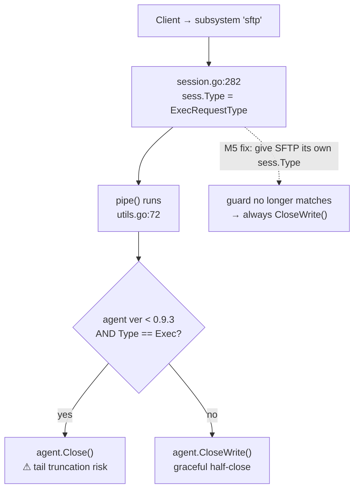

# 08 — Risks & Open Questions

This document enumerates the engineering risks and the still-open product/architecture
decisions for the **Web SFTP client** feature (a floating-window file manager in the
ShellHub console, built on Option A — a gateway-side `github.com/pkg/sftp` client — as
locked in the canonical spec). Every risk is grounded in a concrete file and line in the
current codebase, rated for impact and likelihood, given a mitigation, and mapped to the
milestone (`M1`–`M5`, see `05-milestones.md`) in which it must be verified. The open
questions each carry a **recommended default** so the team can ratify or override rather
than start from a blank page.

## Scope / non-goals

- **In scope:** risks introduced or exposed by adding the `/ws/sftp` route, the
  gateway-side `*sftp.Client`, the base64 upload path, and the reuse of the existing
  subsystem tunnel; plus the product decisions that gate GA.
- **Non-goals:** this doc does not restate the wire protocol (see `02-protocol.md`), the
  backend/frontend file plans (see `03-backend.md`, `04-frontend.md`), or the full
  security model (see `06-security-and-sessions.md`). It references those docs rather than
  duplicating them. It also does not re-open the locked architectural decisions in
  canonical spec §1; where a risk suggests revisiting one, it is filed as an open question
  with a default, not a re-decision.

---

## 1. Summary

The feature reuses an already-working end-to-end SFTP path — the agent speaks the `sftp`
subsystem today (`agent/sftp.go`) and the gateway already forwards `subsystem` requests
verbatim (`ssh/server/channels/session.go`) — so the dominant risks are **not** "will SFTP
work at all" but rather **edge behaviors around session typing, transfer framing, and the
absence of a sandbox**. The single highest-severity technical risk is the pre-0.9.3
`agent.Close()` truncation hack in `pipe()`, which keys off `sess.Type == ExecRequestType`
— and every subsystem, including our SFTP, is currently stamped `ExecRequestType`. The
remaining risks are throughput (base64 upload overhead), the fact that the agent runs the
SFTP server with **zero `ServerOption`s** (no path jail, no read-only mode), the
connector-mode gap, the pty-only recorder, and unconfirmed billing semantics. The open
questions are mostly policy calls (ACL model, sandbox policy, auditing requirement,
billing classification, buffer sizing, and whether to promote a first-class `"sftp"`
session type now).

---

## 2. Risks

Severity legend — **Impact:** Low / Medium / High / Critical; **Likelihood:** Low /
Medium / High.

| # | Risk | Description (with citations) | Impact | Likelihood | Mitigation | Verify in |
|---|------|------------------------------|--------|------------|------------|-----------|
| R1 | Exec-close hack truncates transfers | `pipe()` closes the agent side hard when the peer is pre-0.9.3 **and** `sess.Type == ExecRequestType`. See `ssh/server/channels/utils.go:130-139` (`ver.LessThan(semver.MustParse("v0.9.3")) && sess.Type == ExecRequestType` → `agent.Close()` instead of `agent.CloseWrite()`). Subsystems are stamped `ExecRequestType` at `ssh/server/channels/session.go:282-285` (`case ExecRequestType, SubsystemRequestType:` … `sess.Type = ExecRequestType`), so SFTP inherits the hack. A hard `Close()` (vs. `CloseWrite()`) can drop in-flight bytes at the tail of a large transfer. | High | Medium | Promote a first-class SFTP `sess.Type` so the `== ExecRequestType` guard no longer matches subsystems (canonical spec §4 "Gateway transparency"; realized as M5, `ssh/server/channels/session.go`). Until then, document the pre-0.9.3-agent caveat. | **M2** (empirically, on a pre-0.9.3 agent, with a large download); fix landed in **M5** |
| R2 | Upload throughput / base64 overhead | Uploads are framed as base64-in-JSON `messageKindSftpUploadChunk` (13) messages (canonical spec §3.1). Base64 inflates payload ~33%; JSON envelope + `Conn.ReadMessage` parsing add per-chunk cost. The default `Conn` read cap is `ReadMessageBufferSize = 16404` (canonical spec §3.4), far too small for efficient chunks. Multi-GB uploads stay slow even after tuning. | Medium | High | Raise the per-`Conn` read limit to **256 KiB** for `/ws/sftp` and use **128 KiB** raw upload chunks (base64 ≈ 170 KB, fits under 256 KiB with envelope) — canonical spec §3.4. Show per-transfer progress via `messageKindSftpProgress` (17) so slowness is legible. Downloads avoid the tax entirely (raw binary frames, `Conn.WriteBinary`). | **M3** (upload benchmark: throughput + memory under a 1 GB upload) |
| R2b | Single in-flight download per socket | Download bytes are streamed as **untagged** binary WS frames between `messageKindSftpDownloadBegin` (15) and `messageKindSftpDownloadEnd` (16), so frames carry no `requestId` and cannot be interleaved (canonical spec §3.3). Two concurrent downloads on one socket would corrupt each other. | Medium | Medium | Browser `sftpClient` **serializes** downloads per WebSocket (canonical spec §3.3, `04-frontend.md`). Uploads (tagged JSON) and metadata ops remain concurrent. | **M2** (attempt two overlapping downloads; assert client queues them) |
| R3 | No path jail on the agent | `agent/sftp.go:95` calls `sftp.NewServer(piped, []sftp.ServerOption{}...)` with an **empty** option slice — no `ReadOnly`, no working-dir restriction. Access is bounded only by the OS user (setuid/setgid/chdir HOME at `agent/sftp.go:77-93`); chroot is applied **only** in docker mode (`agent/sftp.go:39-45`, `syscall.Chroot("/host")`). This is identical to native SFTP today — **not a new risk** — but the web UI must not present itself as sandboxed. | High | Low (no regression) | Treat the OS user as the trust boundary (document in `06-security-and-sessions.md`). Optionally add `pkg/sftp` `ServerOption`s (read-only, working-dir jail) — a policy call, see **Q2**. UI copy must not imply a sandbox. | **M1** (confirm listing is bounded by Unix perms only); policy revisited pre-GA |
| R4 | Connector mode unsupported | `agent/server/modes/connector/sessioner.go:210-212` — `SFTP(_ gliderssh.Session)` returns `errors.New("SFTP isn't supported to ShellHub Agent in connector mode")`. Container devices will fail server-side if the UI offers "Browse Files". | Medium | High (for connector fleets) | Gate the UI: hide/disable "Browse Files" for connector devices and surface the server error gracefully (canonical spec §5 "Connector-mode gate", `pages/DeviceDetails.tsx`). | **M1** (UI gating) and whenever the connect entry points ship |
| R5 | Recording is pty-only | The asciinema recorder only records pty seats: `pipe()` attaches a `Recorder` and calls `sess.Recorded(seat)` (`ssh/server/channels/utils.go:99-110`), but `Recorded` returns an error when the seat `!HasPty` (`ssh/session/session.go:494-495`), and `Finish` saves asciinema files only for `seat.HasPty` seats (`ssh/session/session.go:804-825`). SFTP allocates no pty, so recording safely no-ops — but there is therefore **no audit trail** for file operations. | Medium | High (by design) | Accept the no-op (safe). If compliance requires a file-op trail, add a **new** event schema via `session.Event` / `EventSessionStream` (`ssh/session/session.go:696-731`), not the pty recorder — see **Q3** and canonical spec §7.5. | **M5** (optional file-op audit events) |
| R6 | Billing / license semantics unconfirmed | It is unconfirmed whether an SFTP session should count as a billable connect like a shell. Gating runs in `Session.Evaluate` (`ssh/session/session.go:609-636`) → `checkBilling` → `s.api.BillingEvaluate(...)` → `evaluation.CanConnect` (`ssh/session/session.go:437-449`); license via `checkLicense` (`ssh/session/session.go:591-607`). Because SFTP reuses the terminal auth/connect path verbatim (canonical spec §1.6), it will be billed as a connect **by default** — which may be unintended, or may be exactly right. | Medium | Medium | Decide the classification (see **Q4**) before GA and assert the chosen behavior. Note `register` writes `Type: "none"` initially (`ssh/session/session.go:461`), so billing does not currently branch on type. | **M5** / pre-GA (billing decision + test) |

### 2.1 R1 — the exec-close hack, in detail

The truncation branch lives in the client→agent copy goroutine of `pipe()`:

```go
// ssh/server/channels/utils.go:125-140
go func() {
    defer wg.Done()
    defer func() {
        // NOTE: When request is [ExecRequestType] and agent's version is less than v0.9.2, we should close the agent
        // connection to avoid it be hanged after data flow ends.
        if ver, err := semver.NewVersion(sess.Device.Info.Version); ver != nil && err == nil {
            // NOTE: We indicate here v0.9.3, but it is not included due the assertion `less than`.
            if ver.LessThan(semver.MustParse("v0.9.3")) && sess.Type == ExecRequestType {
                agent.Close()          // <-- hard close: can truncate the tail of a transfer
            } else {
                agent.CloseWrite() //nolint:errcheck
            }
        } else {
            agent.CloseWrite() //nolint:errcheck
        }
    }()
    ...
}()
```

The `sess.Type` it tests is set here, where the subsystem and exec cases are **fused**:

```go
// ssh/server/channels/session.go:282-285
case ExecRequestType, SubsystemRequestType:
    session.Event[models.SSHCommand](sess, req.Type, req.Payload, seat)

    sess.Type = ExecRequestType
```

`oncePipe()` is then triggered for `PtyRequestType, ExecRequestType, SubsystemRequestType`
alike (`ssh/server/channels/session.go:364-367`). The M5 fix (canonical spec §4) is to
split the `SubsystemRequestType` arm so SFTP gets its own `sess.Type`, which makes the
`== ExecRequestType` guard fall through to the safe `agent.CloseWrite()` path. Sequencing:



---

## 3. Open questions / decisions needed

Each question has a **recommended default**; the team should ratify or override.

| # | Question | Recommended default | Rationale / notes |
|---|----------|---------------------|-------------------|
| Q1 | Distinct SFTP ACL, or reuse the device-connect permission? | **Reuse device-connect ACL for M1–M4; revisit a distinct `sftp` scope only if a customer asks.** | Auth is reused verbatim from the terminal path (canonical spec §1.6); introducing a separate ACL means new namespace-settings + firewall surface. `Evaluate()` already enforces license/firewall/billing uniformly (`ssh/session/session.go:609-636`). Keep parity first. |
| Q2 | Path-jail / read-only `ServerOption` policy on the agent? | **Ship with parity to native SFTP (no jail, no forced read-only). Add an *optional*, namespace-level read-only toggle as a fast-follow, implemented via `pkg/sftp` `ServerOption`s at `agent/sftp.go:95`.** | Today `sftp.NewServer(piped, []sftp.ServerOption{}...)` passes no options (`agent/sftp.go:95`); the OS user is the boundary. Forcing a jail would diverge web SFTP from native SFTP behavior and surprise users. Make it opt-in. |
| Q3 | Is file-operation auditing required for compliance? | **Not for GA; design the event schema now, implement in M5 if a compliance customer requires it.** | Recording is pty-only and no-ops for SFTP (R5). A file-op trail needs a **new** schema through `session.Event`/`EventSessionStream` (`ssh/session/session.go:696-731`), independent of the asciinema recorder. Defer implementation, not the design. |
| Q4 | Is an SFTP session a billable connect? | **Yes — bill it identically to a shell connect (the default behavior of reusing the connect path).** | SFTP consumes an agent session and reuses `Session.Evaluate`/`checkBilling` (`ssh/session/session.go:426-452, 609-636`). Treating it as free would require an explicit type-based carve-out and could be gamed. Confirm with product, then add a test asserting `CanConnect` is honored. |
| Q5 | Final buffer / chunk sizing? | **Adopt the canonical spec §3.4 values: `/ws/sftp` `Conn` read limit = 256 KiB, upload raw chunk = 128 KiB, download binary read buffer = 32 KiB.** | These are already locked in the spec; the open part is only empirical tuning under M3 load tests. Do not change the wire assumptions (base64 ≈ 170 KB per chunk must stay under the 256 KiB envelope). |
| Q6 | Promote a first-class `"sftp"` session type now, or later? | **Later (M5).** | `models.Session.Type` is free-form and the UI already badges `subsystem` → `sftp` (canonical spec §1.7, §2). A first-class type is the clean fix for R1, but it is not required for M1–M4 functionality. Land it in M5 alongside the R1 fix so the two ship together. |

### 3.1 Q2 — where the option would go

```go
// agent/sftp.go:95 — today, no options are passed:
server, err := sftp.NewServer(piped, []sftp.ServerOption{}...)

// Q2 fast-follow sketch (namespace-gated read-only):
opts := []sftp.ServerOption{}
if readOnly {                       // sourced from namespace settings / env
    opts = append(opts, sftp.ReadOnly())
}
server, err := sftp.NewServer(piped, opts...)
```

Note `agent/sftp.go` already narrows access before this call — `syscall.Chroot("/host")`
in docker mode (`agent/sftp.go:39-45`) and `Setgid`/`Setuid`/`Chdir(HOME)`
(`agent/sftp.go:77-93`) — so any `ServerOption` jail layers **on top of** the OS-level
drop, not instead of it.

---

## 4. Sequencing — which risks/questions gate which milestones

```mermaid
flowchart LR
    subgraph M1["M1 — Read-only listing"]
        R3a["R3 verify: perms-bounded"]
        R4a["R4: UI connector gate"]
    end
    subgraph M2["M2 — Download"]
        R1a["R1 verify: pre-0.9.3 truncation"]
        R2ba["R2b: serialize downloads"]
    end
    subgraph M3["M3 — Upload"]
        R2a["R2/Q5: throughput + chunk sizing"]
    end
    subgraph M4["M4 — Mutations"]
        Q2a["Q2: read-only policy surfaces here"]
    end
    subgraph M5["M5 — Polish + auditing"]
        R1b["R1 fix: first-class sftp type (Q6)"]
        R5a["R5/Q3: optional file-op audit"]
        R6a["R6/Q4: billing decision"]
    end
    M1 --> M2 --> M3 --> M4 --> M5
```



Gating rules:

- **R1 (exec-close hack)** must be **verified empirically in M2** (first large transfer)
  and **fixed in M5** via the first-class SFTP type (**Q6**). A confirmed truncation in M2
  can pull the Q6 fix earlier.
- **R3 (no path jail)** is verified in **M1** as a documentation/expectation check; the
  **Q2** policy decision must be settled before **M4** (mutations make write-scope
  meaningful) and re-confirmed **before GA**.
- **R4 (connector gate)** must land in **M1**, since that is when the first connect entry
  point (`pages/DeviceDetails.tsx`) ships.
- **R2 / R2b / Q5 (framing + sizing)** are exercised in **M2** (download serialization)
  and **M3** (upload throughput benchmark).
- **Q1 (ACL)** must be decided **before GA**; the default (reuse) requires no code and can
  ride along.
- **R5 / Q3 (auditing)** and **R6 / Q4 (billing)** are **M5 / pre-GA** decisions.

See `05-milestones.md` for the full task breakdown and acceptance criteria per milestone.

---

## 5. Cross-references

- `06-security-and-sessions.md` — auth reuse, the agent sandbox model (R3/Q2), connector
  gating (R4), session typing (R1/Q6), recording/auditing (R5/Q3), and billing (R6/Q4) are
  specified there in depth; this doc rates and sequences them.
- `05-milestones.md` — the milestone scope boundaries (M1–M5) referenced throughout
  §2 and §4.
- `02-protocol.md` — the wire framing behind R2/R2b/Q5 (`messageKind` 6–18, download
  binary frames, base64 upload chunks).
- `03-backend.md` — the `ssh/web/*` implementation where the `Conn` read-limit and
  `newSftpSession` changes for R2/Q5 land.
- `04-frontend.md` — the `sftpClient` download serialization (R2b) and connector-mode UI
  gating (R4).
