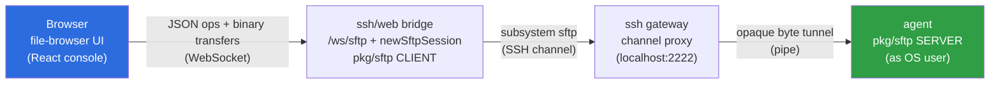

# Web SFTP Client for ShellHub — Implementation Plan

A visual, browser-based **SFTP file manager** for the ShellHub console: browse, upload,
download, rename, delete, and create folders on a device's filesystem — presented as a
**floating window**, exactly like the existing web SSH terminal.

This directory is the complete engineering plan. It is grounded in a first-hand reading of
the ShellHub codebase (gateway `ssh/`, agent `agent/`, console `ui/apps/console/`) and a
multi-agent codebase survey. **Nothing here has been implemented yet** — these documents
drive the implementation.

---

## TL;DR

The key realization: **SFTP already works end-to-end for native SSH clients.** The agent
runs an in-process `github.com/pkg/sftp` server (`agent/sftp.go`), and the gateway already
forwards the `sftp` subsystem transparently (`ssh/server/channels/session.go`). What is
missing is only:

1. A **browser-reachable file API** on the gateway — a new `/ws/sftp` WebSocket endpoint
   that opens the `sftp` subsystem and runs a Go `pkg/sftp` **client**, exposing high-level
   JSON file operations.
2. A **file-browser UI** in the React console, reusing the terminal's floating-window
   pattern, auth flow, and credential handshake.

**Architecture decision:** the gateway runs the SFTP client and speaks a high-level JSON
protocol to the browser (Option A) — **not** raw SFTP tunneled to a JS client (Option B),
because the inbound browser→gateway leg is JSON-only. See [`01-architecture.md`](./01-architecture.md).

---

## Document set

| Doc | What it covers |
|-----|----------------|
| [`01-architecture.md`](./01-architecture.md) | System context, Option A rationale, end-to-end data flow, sequence diagrams, concurrency model. |
| [`02-protocol.md`](./02-protocol.md) | The full WebSocket wire protocol: every `messageKind` (values 1–18), JSON payloads, transfer framing, chunk sizing. |
| [`03-backend.md`](./03-backend.md) | Gateway (`ssh/`) implementation plan: every file to add/modify, with Go code sketches and the `pkg/sftp` client cheat-sheet. |
| [`04-frontend.md`](./04-frontend.md) | Console (`ui/apps/console/`) implementation plan: floating-window UX, the SFTP client, store, components, and entry points. |
| [`05-milestones.md`](./05-milestones.md) | M1–M5 task breakdown, dependency order, acceptance criteria, PR breakdown. |
| [`06-security-and-sessions.md`](./06-security-and-sessions.md) | Auth reuse, authorization, sandboxing, connector gating, session typing, recording/auditing, billing. |
| [`07-testing.md`](./07-testing.md) | Go + UI + end-to-end test strategy, per-milestone verification. |
| [`08-risks-and-open-questions.md`](./08-risks-and-open-questions.md) | Risk register and the decisions that need a human call. |
| [`09-reconciliation.md`](./09-reconciliation.md) | **Authoritative** on conflicts — resolves cross-doc ambiguities against verified source code. |

Suggested reading order: this README → `01-architecture` → `02-protocol` → `03-backend` /
`04-frontend` → `05-milestones`. `06`/`07`/`08` are reference/cross-cutting.

> **On conflicts:** the docs were drafted in parallel; a few points were flagged as
> underspecified. [`09-reconciliation.md`](./09-reconciliation.md) resolves every one of
> them against the real code and **wins over any other doc** where they disagree.

---

## What already exists (do **not** re-build)

| Component | Where | Status |
|-----------|-------|--------|
| Agent SFTP server (`pkg/sftp` in-process, runs as the OS user) | `agent/sftp.go`, `agent/server/subsystem.go`, `agent/server/server.go` | ✅ works today |
| `pkg/sftp` dependency (v1.13.10) | `agent/go.mod` | ✅ pinned — reuse the same version in `ssh/go.mod` |
| Gateway subsystem forwarding + data pump | `ssh/server/channels/session.go`, `.../utils.go` | ✅ transparent for native clients |
| Web credential/token broker + auth (password + pubkey challenge) | `ssh/web/web.go`, `ssh/web/session.go`, `ssh/web/manager.go` | ✅ protocol-agnostic, reusable |
| Terminal floating-window pattern (manager, store, taskbar) | `ui/apps/console/src/components/terminal/`, `stores/terminalStore.ts` | ✅ template to mirror |
| `subsystem → sftp` session badge | `ui/apps/console/src/utils/session.ts`, `pages/sessions/SessionTypeBadge.tsx` | ✅ display already exists |

## What is genuinely new

- Gateway: `/ws/sftp` route, `newSftpSession`, a `pkg/sftp` **client** dispatch loop, new
  `messageKind`s (6–18). See [`03-backend.md`](./03-backend.md).
- Console: `sftpClient.ts`, `sftpStore.ts`, `SftpManager`/`SftpInstance` file-browser
  window + sub-components, `ConnectDrawer` mode, device-page entry points. See
  [`04-frontend.md`](./04-frontend.md).

---

## Milestones at a glance

| M | Deliverable | Gate |
|---|-------------|------|
| **M1** | Read-only listing + navigation (walking skeleton) | validates route + auth + subsystem + client + UI |
| **M2** | Download (binary streaming + progress) | large-file integrity; verify exec-close hack |
| **M3** | Upload (base64 chunking + progress) | chunk-boundary correctness |
| **M4** | mkdir / rename / delete (recursive) | permission-error UX |
| **M5** | Polish: first-class `"sftp"` session type, optional file-op auditing, taskbar/fullscreen parity | GA readiness |

Full detail and acceptance criteria in [`05-milestones.md`](./05-milestones.md).

---

## Glossary

- **Gateway** — the ShellHub SSH server in `ssh/`, listening on `:2222`; brokers browser
  and agent connections.
- **Agent** — the ShellHub process running on the managed device (`agent/`); serves the
  actual SFTP filesystem as the logged-in OS user.
- **`ssh/web` bridge** — the browser↔SSH WebSocket bridge (`/ws/ssh` today, `/ws/sftp` new).
- **Subsystem** — the SSH mechanism (RFC 4254 §6.5) SFTP rides on; requested via
  `RequestSubsystem("sftp")` instead of a shell/PTY.
- **`messageKind`** — the `uint8` discriminator on the `{kind,data}` WebSocket envelope
  (`ssh/web/messages.go`); values 1–5 exist, 6–18 are new for SFTP.
- **Host mode / Connector mode** — agent session modes; **connector mode does not support
  SFTP** and must be gated in the UI.
- **Seat** — a multiplexing slot for one channel within a gateway session.

---

> Design basis: Option A (gateway-side Go SFTP client + high-level JSON API), floating-window
> UI. The locked vocabulary shared by all these docs (routes, message kinds, file paths) is
> defined once and used consistently throughout.
